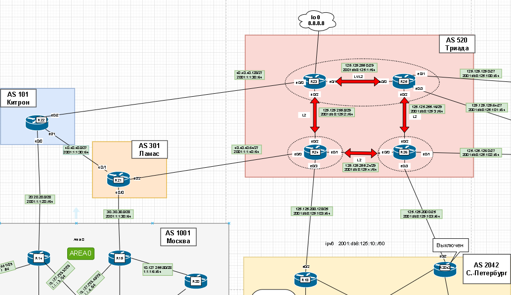
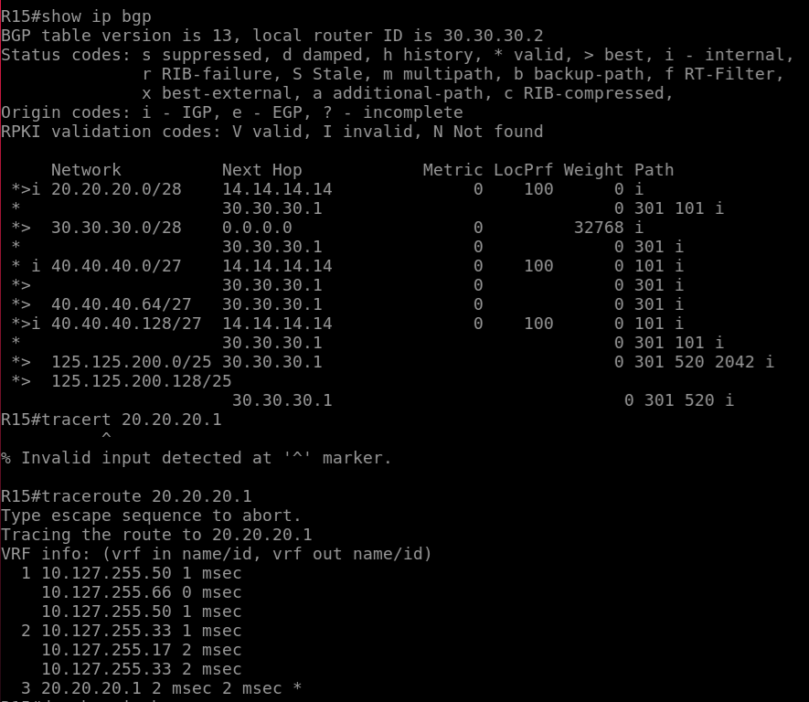
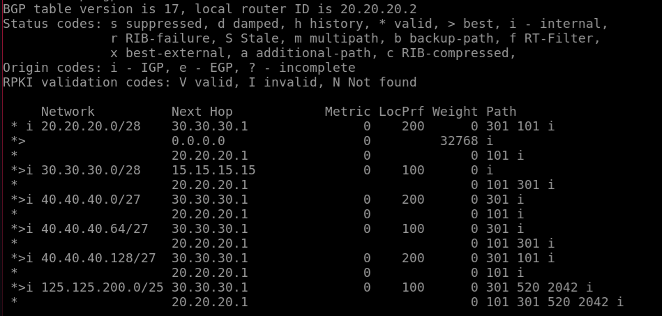

# iBGP


## Цель:

1. Настроить iBGP в офисе Москва; 
2. Настроить iBGP в сети провайдера Триада; 
3. Организовать полную IP связанность всех сетей.

В этой самостоятельной работе мы ожидаем, что вы самостоятельно:

+ Настроите iBGP в офисе Москва между маршрутизаторами R14 и R15;
+ Настройте офиса Москва так, чтобы приоритетным провайдером стал Ламас;
+ Настроите iBGP в провайдере Триада;
+ Настройте офиса С.-Петербург так, чтобы трафик до любого офиса распределялся по двум линкам одновременно;
+ Все сети в лабораторной работе должны иметь IP связность;


### Схема 

## 1. Настроить iBGP в офисе Москва; 

1.1. Настроите iBGP в офисе Москва между маршрутизаторами R14 и R15;

1.2. Настройте офиса Москва так, чтобы приоритетным провайдером стал Ламас;




### 1.1 Настроите iBGP в офисе Москва между маршрутизаторами R14 и R15;

В iBGP соседство организуют на Loopback интерфейсах. Чтобы поднялось соседство нужно указать что устанавливаться TCP сессия будет с Loopback интерфейса. И должен быть маршрут к этому интерфейсу. В нашем случае включаем ospf на lo 0

```
R14(config)# interface Loopback 0
R14(config-if)# ip add 14.14.14.14
R14(config-if)# ip ospf 4 area 0
R14(config)# router bgp 1001
R14(config-router)# neighbor 15.15.15.15 remote-as 1001
R14(config-router)# neighbor 15.15.15.15 update-source l0
R14(config-router)# neighbor 15.15.15.15 next-hop-self
```
Настроили iBGP в Москве  




### 1.2 Настройте офиса Москва так, чтобы приоритетным провайдером стал Ламас;

Нужно настроить атрибут Local Preferene 200 на R15

```
R14(config)# router bgp 1001
R15(config-router)# bgp default local-preference 200
```



## 2. Настроить iBGP в сети провайдера Триада; 


