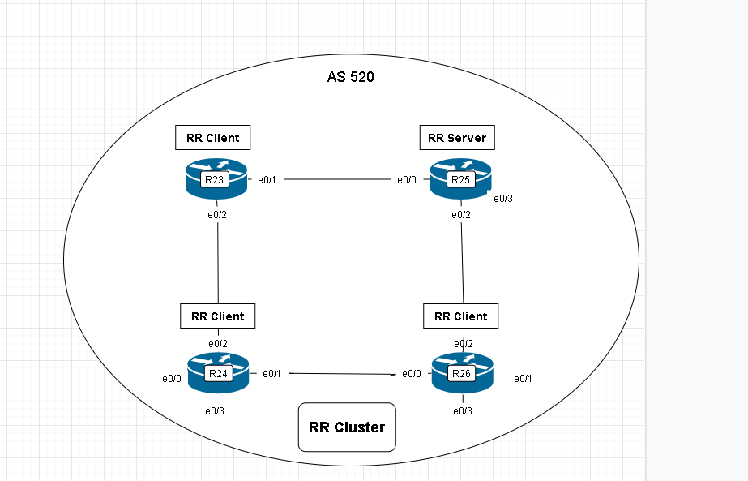
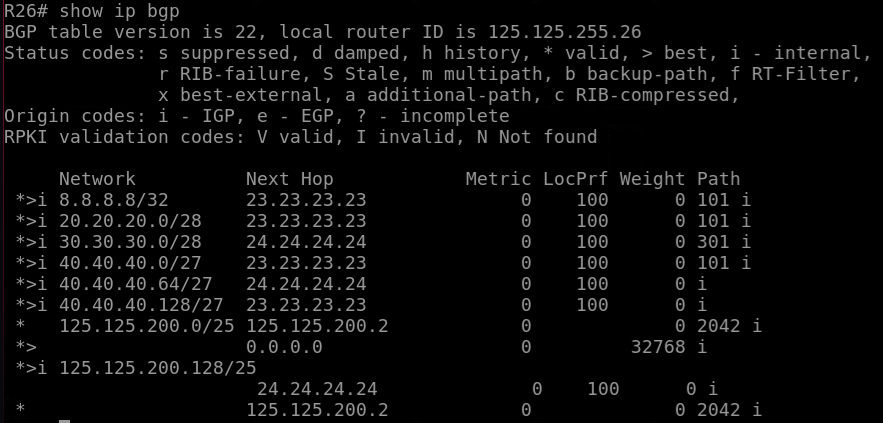
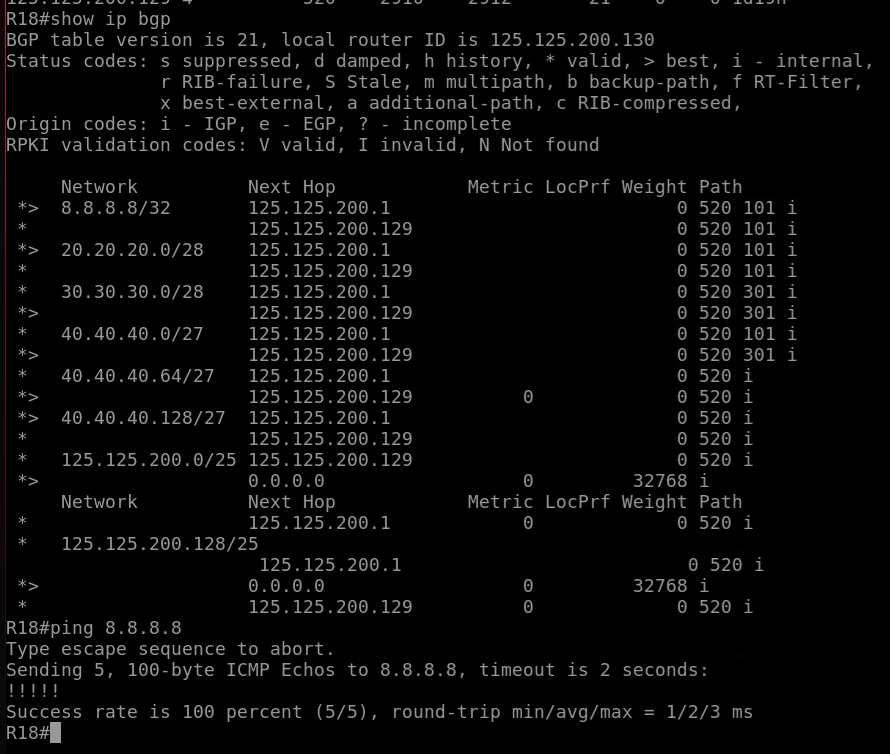
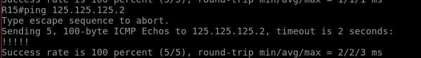
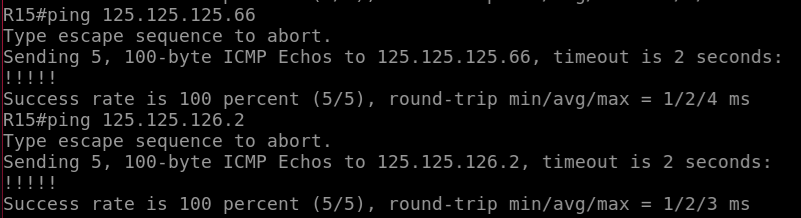
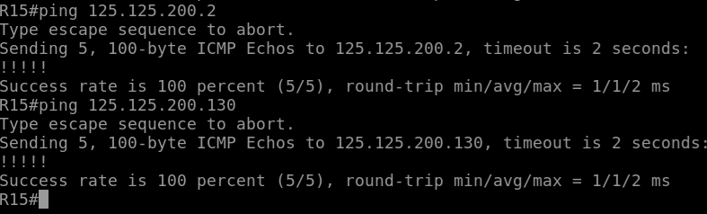
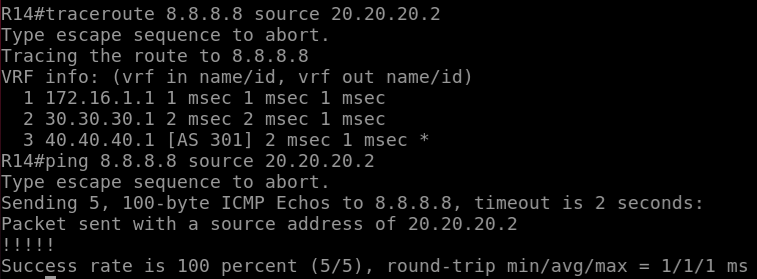

# iBGP


## Цель:

1. Настроить iBGP в офисе Москва; 
2. Настроить iBGP в сети провайдера Триада; 
3. Организовать полную IP связанность всех сетей.

В этой самостоятельной работе мы ожидаем, что вы самостоятельно:

+ Настроите iBGP в офисе Москва между маршрутизаторами R14 и R15;
+ Настройте офиса Москва так, чтобы приоритетным провайдером стал Ламас;
+ Настроите iBGP в провайдере Триада;
+ Настройте офиса С.-Петербург так, чтобы трафик до любого офиса распределялся по двум линкам одновременно;
+ Все сети в лабораторной работе должны иметь IP связность;


### Схема 

## 1. Настроить iBGP в офисе Москва; 

1.1. Настроите iBGP в офисе Москва между маршрутизаторами R14 и R15;

1.2. Настройте офиса Москва так, чтобы приоритетным провайдером стал Ламас;


### 1.1 Настроите iBGP в офисе Москва между маршрутизаторами R14 и R15;

В iBGP соседство организуют на Loopback интерфейсах. Чтобы поднялось соседство нужно указать что устанавливаться TCP сессия будет с Loopback интерфейса. И должен быть маршрут к этому интерфейсу. В нашем случае включаем ospf на lo 0

```
R14(config)# interface Loopback 0
R14(config-if)# ip add 14.14.14.14
R14(config-if)# ip ospf 4 area 0
R14(config)# router bgp 1001
R14(config-router)# neighbor 15.15.15.15 remote-as 1001
R14(config-router)# neighbor 15.15.15.15 update-source l0
R14(config-router)# neighbor 15.15.15.15 next-hop-self
```
Настроили iBGP в Москве  


### 1.2 Настройте офиса Москва так, чтобы приоритетным провайдером стал Ламас;

Нужно настроить атрибут Local Preferene 200 на R15

```
R14(config)# router bgp 1001
R15(config-router)# bgp default local-preference 200
```


## 2. Настроить iBGP в сети провайдера Триада; 

Настроим iBGP поверх ISIS.

Нужно настроить FullMesh iBGP со всеми соседями в AS 520.

Либо настроить router reflector.

Настроим на R25 сервер RouterReflector



```
R25(config)# int l0
R25(config-if)# ip add 25.25.25.25 255.255.255.255
R25(config-if)# ip router isis
R25(config)# router bgp 520
R25(config-router)# neighbor RRC peer-group
R25(config-router)# neighbor RRC route-reflector-client
R25(config-router)# neighbor RRC remote-as 520
R25(config-router)# neighbor RRC next-hop-self
R25(config-router)# neighbor RRC update-sourcel0
R25(config-router)# neighbor 23.23.23.23 peer-group RRC
R25(config-router)# neighbor 24.24.24.24 peer-group RRC
R25(config-router)# neighbor 25.25.25.25 RRC
```

Проверим работу:

на Киторне поднимим Loopback 8 c адресом 8.8.8.8

И посмотрим придут ли анонсына всех соседей iBGP в Триаде



С Офиса Петербурга доступ до 8.8.8.8 



## 3. Организовать полную IP связанность всех сетей.

Москва --> Лабытанги 125.125.125.2

  
Москва --> Чокурдах ISP1 125.125.125.66
Москва --> Чокурдах ISP2 125.125.126.2


Москва --> Петербург ISP1 125.125.200.2
Москва --> Петербург ISP2 125.125.200.130




связность есть до всехсетей смаршрутизатора Москва

Если проверять доступность от R14 то трафик закольцовывется Между R14 и R12.

Добавлю прямой линк между R14 и R15. Либо iBGP спустить на R12 и R13.




