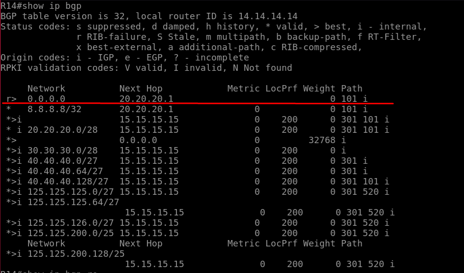

# BGP. Фильтрация

## Цель:  

1. Настроить фильтрацию для офиса в Москве;
2. Настроить фильтрацию для офиса в С.-Петербург.

В этой самостоятельной работе мы ожидаем, что вы самостоятельно: 

1.1 Настроите фильтрацию в офисе Москва так, чтобы не появилось транзитного трафика(As-path);
1.2 Настроите провайдера Киторн так, чтобы в офис Москва отдавался только маршрут по-умолчанию; 
1.3 Настроите провайдера Ламас так, чтобы в офис Москва отдавался только маршрут по-умолчанию и префикс офиса С.-Петербург;  

2.1 Настроите фильтрацию в офисе С.-Петербург так, чтобы не появилось транзитного трафика(Prefix-list);  

 
Все сети в лабораторной работе должны иметь IP связность;  

## 1. Настроить фильтрацию для офиса в Москве;

### 1.1 Настроите фильтрацию в офисе Москва так, чтобы не появилось транзитного трафика(As-path);

Чтобы через AS 1001 не мог пройти транзитный трафик настроить фильтр в "Outbound Route Policy" и повесить их на своих соседей, чтобы мы анонсировали в другие сети толко внутренние префиксы.

Эмулируем данную ситуацию у Киторн два разрыва канала. Киторн имеет доступ к 8.8.8.8. 


На R21 прилетел ананс с данной сетью через AS1001


Настроим ip as-path-access-list на R14
```
R14(config)# ip as-path access-list 1 permit ^$
R14(config)# ip as-path access-list 1 deny .*
R14(config)# router bgp 1001
R14(config-router)# neighbor 20.20.20.1 filter-list 1 out
```

Анонсируются только префиксы из AS 1001  


### 1.2 Настроите провайдера Киторн так, чтобы в офис Москва отдавался только маршрут по-умолчанию; 

Не уверен что правильно сделал. Почему статусмаршрута RIB failure



Создал префикс лист пропускающий только дефолт и анонсировал соседу дефолт

```
R22(config)# ip prtfix-list DefOUT seq 5 permit 0.0.0.0/0
R22(config)# router bgp 101
R22(config-router)# neighbor 20.20.20.2 prefix-list DefOUT out
R22(config-router)# neighbor 20.20.20.2 default-originate 
```

### 1.3 Настроите провайдера Ламас так, чтобы в офис Москва отдавался только маршрут по-умолчанию и префикс офиса С.-Петербург

Настройки идентичны предыдущим. Но нужно добавить в prefix-list сети Петербурга, через filter-list сделать нельзя он срабатывает позднее.
```
R22(config)# ip prtfix-list DefOUT seq 15 permit 125.125.200.128/25
R22(config)# ip prtfix-list DefOUT seq 10 permit 125.125.200.0/25
```
Screenshot_5.png


## 2. Настроить фильтрацию для офиса в С.-Петербург.


### 2.1 Настроите фильтрацию в офисе С.-Петербург так, чтобы не появилось транзитного трафика(Prefix-list);  

```
R18(config)# ip prtfix-list NOTRANS seq 15 permit 125.125.200.128/25
R18(config)# ip prtfix-list NOTRANS seq 10 permit 125.125.200.0/25
R18(config)# router bgp 2042
R18(config-router)# neighbor 125.125.200.0/25 prefix-list NOTRANS out
R18(config-router)# neighbor 125.125.200.128/25 prefix-list NOTRANS out
```


