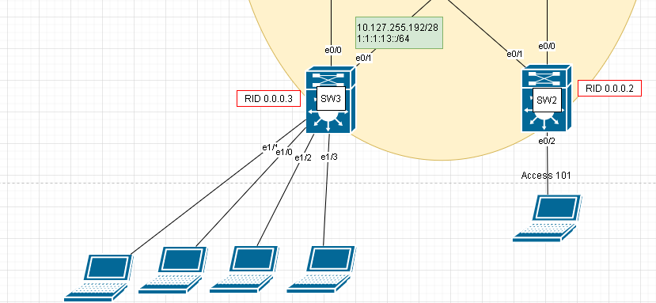
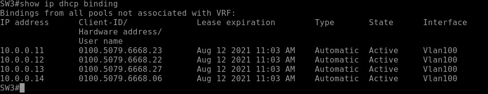
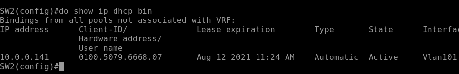
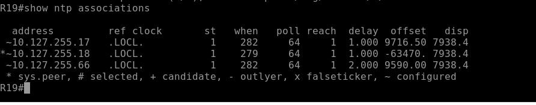
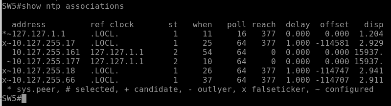
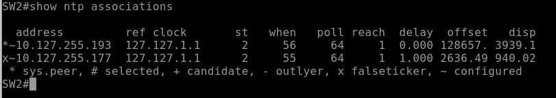

# __Основные протоколы сети интернет__
1. Настроить DHCP в офисе Москва   
1.1. Настроите DHCP сервер в офисе Москва на маршрутизаторах R12 и R13. VPC1 и VPC7 должны получать сетевые настройки по DHCP
2. Настроить синхронизацию времени в офисе Москва  
2.1 Настроите NTP сервер на R12 и R13. Все устройства в офисе Москва должны синхронизировать время с R12 и R13
Все офисы в лабораторной работе должны иметь IP связность
3. Настроить NAT в офисе Москва, C.-Перетбруг и Чокурдах
3.1. Настроите NAT(PAT) на R14 и R15. Трансляция должна осуществляться в адрес автономной системы AS1001  
3.2. Настроите NAT(PAT) на R18. Трансляция должна осуществляться в пул из 5 адресов автономной системы AS2042  
3.3. Настроите статический NAT для R20
Настроите NAT так, чтобы R19 был доступен с любого узла для удаленного управления  
3.4. Настроите статический NAT(PAT) для офиса Чокурдах


## __1. Настроить DHCP в офисе Москва__ 

### 1.1. Настроите DHCP сервер в офисе Москва на маршрутизаторах SW2, SW3





Настроим DHCP на SW3 аналагичные настройки сделаем на SW2

```
interface range e1/0-3
    switchport access vlan 100
    switchport mode access

ip dhcp excluded-address 10.0.0.1 10.0.0.10
ip dhcp pool VLAN100
    network 10.0.0.0 255.255.255.128
    domain-name ccna-lab.com
    default-router 10.0.0.1
    lease 2 12 30
```





## __2.1 Настроите NTP сервер на R12 и R13. Все устройства в офисе Москва должны синхронизировать время с R12 и R13 __

Настроим корректное время на всех устройствах(вручную) и включим NTP server и числовой слой. Добавим вкачестве NTP server R14, чтобы в случае отставания времени можно было найти false tickers.

Чтобы синхронизировать время с помощью протокола NTP, следует сначала вручную выставить ваше время. Недопустима разница между вашим точным временем и показаниями ваших часов более 1000 секунд. 

 stratum 1
### R12

```
clock set 23:07:40 9 August 2021
ntp master 1
ntp update-calendar
interface range e0/0-3, e1/0
ntp broadcast


```

Настроим клиентов R19, R15, R20

ntp server 10.127.255.18  
ntp server 10.127.255.66  
ntp server 10.127.255.17  



Видим, что NTP как точное время используют локальное время.


Настроим SW4, SW5 как stratum 2

```
SW4(config)#ntp master 2

SW4(config)#ntp update-calendar 
SW4(config)#interface range e0/0-1, e1/0-1
SW4(config-if-range)#ntp broadcast 
SW4(config-if-range)#exit
SW4(config)#ntp server 10.127.255.18  
SW4(config)#ntp server 10.127.255.66  
SW4(config)#ntp server 10.127.255.17
SW4(config)#ntp peer 10.127.255.193
```



Настроим SW2,SW3

ntp server 10.127.255.193 
ntp server 10.127.255.177 
 
 

## __3. Настроить NAT в офисе Москва, C.-Перетбруг и Чокурдах__


### __3.1. Настроите NAT(PAT) на R14 и R15. Трансляция должна осуществляться в адрес автономной системы AS1001__

Сеть 10.0.0.0/25 в адрес 5.5.5.10
Сеть 10.0.0.128/25 в адрес 5.5.5.11

Настроим NAT на R15 

```
ip nat inside source pool NAT-POOL-VLAN100 5.5.5.10 overload

```