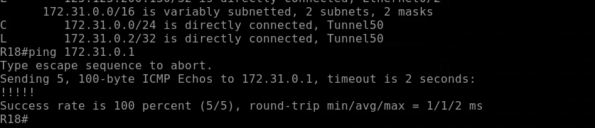
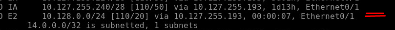
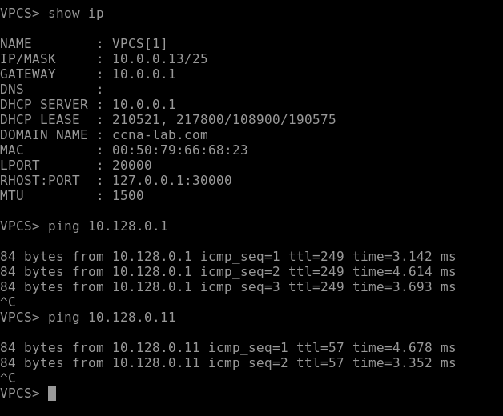
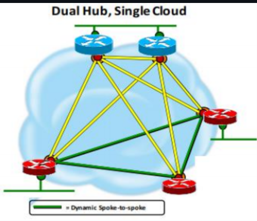
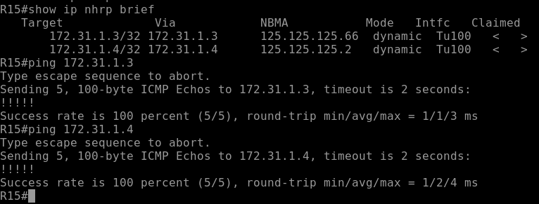
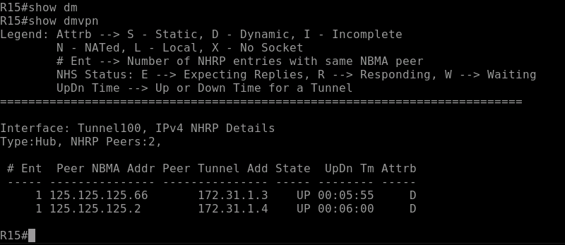
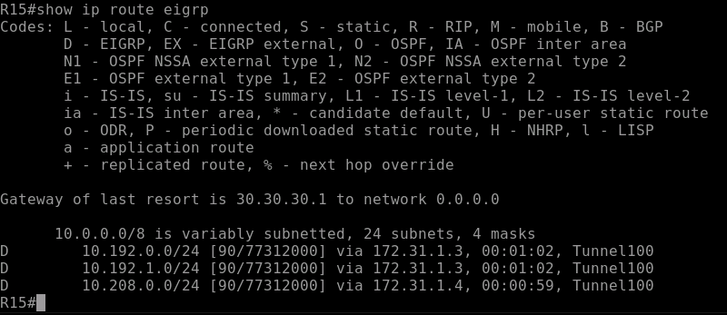
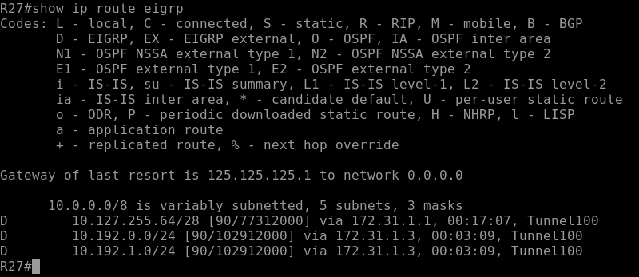
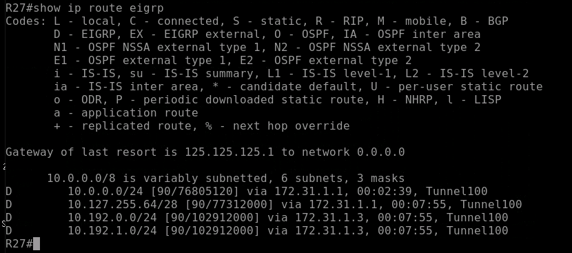
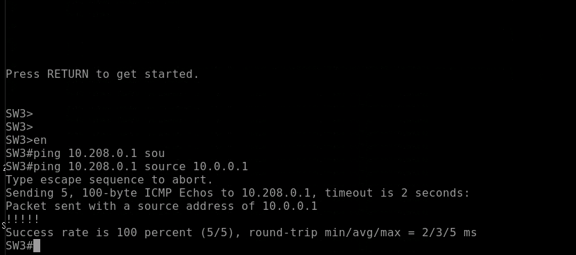

## VPN. GRE. DmVPN

Цель:    
1)Настроить GRE между офисами Москва и С.-Петербург  
2)Настроить DMVPN между офисами Москва и Чокурдах, Лабытнанги

## 1. Настроить GRE между офисами Москва и С.-Петербург 

GRE tunnel будем использовать между R15 и R18 на loopback интерфейсах.

План:
1) Выбрать адресацию  
2) Настроить Loopback    
3) Анонсировать peer BGP выбранные сети, если это небыло сделано до этого.  
4) Настроить interface Tunnel 50 на R15 и R18  
5) Настроить статический маршрут и редистрибьюцию.  
6) Проверить доступность  

Сеть туннелей 172.31.0.0/24

R15 ip адресс туннеля 172.31.0.1 255.255.255.0  
R18 ip адресс туннеля 172.31.0.2 255.255.255.0

Туннель виртуальный L3 интерфейс, через который будет происходить маршрутизаия.


ip адресс source/destination, с которого будет строиться виртуальный туннель.

R15 ip 5.5.5.50/24  
R18 ip 42.42.42.50/24

Приступим к настройке

R15

```
interface loopback 50
    ip address 5.5.5.50 255.255.255.255
    no sh
    exit
interface tunnel50
    tunnel mode gre ip
    ip address 172.31.0.1 255.255.255.0
    tunnel destination 42.42.42.50
    tunnel source 5.5.5.50
    ip mtu 1400
    ip tcp adjust-mss 1360
```

R18

```
interface loopback 50
    ip address 42.42.42.50 255.255.255.255
    no sh
    exit
interface tunnel50
    tunnel mode gre ip
    ip address 172.31.0.2 255.255.255.0
    tunnel destination 5.5.5.50 
    tunnel source 42.42.42.50
    keepalive 60
```




Доступ до туннельного адреса R15 мы имеем. И сеть туннеля непосредственно к нам подключена.

Перейдем к настройке маршрутизации. Предположим, что пользователи Москвы и Петербурга должны иметь с друг другом связь 

R15 redistribute статического маршрута в OSPF

```
ip route 10.128.0.0 255.255.255.0 172.31.0.2

route-map route-map-redistribute
    match ip address Peter
    exit
ip access-list standard Peter
    permit 10.128.0.0 0.0.0.255

router ospf 4
    redistribute static subnets route-map route-map-redistribute
```

SW3 Москва




R18 redistribute статического маршрута в EIGRP

```
ip route 10.0.0.0 255.255.255.128 172.31.0.1

route-map route-map-redistribute
    match ip address Moscow
    exit
ip access-list standard Moscow
    permit 10.0.0.0 0.0.0.127

router eigrp E
    address-family ipv4 unicast autonomous-system 1
    topology base

```

Из-за суммарног маршрута там ни чего не прилетает на R18.


Доступ от сотрудников Московы до сотрудников Петербурга есть.



## 2. Настроить DMVPN между офисами Москва и Чокурдах, Лабытнанги


План:

1. Выберем Архитектуру  сети  DMVPN и Фазу
2. Выбрать адресацию
3. Настроить Loopback/Интерфейсы
4. Анонсировать peer BGP выбранные сети, если это небыло сделано до этого.
5. Настроить interface Tunnel 
6. Выбрать протокол динамической маршрутизации
7. Проверить доступность


1. Используем 2 Фазу

В дальнейшем будет настроен 2 Hub




2. Адресация


Сеть туннелей 172.31.1.0/24

R15   
source 5.5.5.100  
адрес тунеля 172.31.1.1/24


R14  
source 5.5.5.101  
адрес тунеля 172.31.1.2/24


R28  
source 125.125.125.66  
адрес тунеля 172.31.1.3/24

R27  
source 125.125.125.2 
адрес тунеля 172.31.1.4/24

  3-5. Настроим mGRE и nhrp  


R15

```
interface loopback 100
    ip address 5.5.5.100 255.255.255.255
    no sh
    exit
interface tunnel100
    tunnel mode gre multipoint
    ip address 172.31.1.1 255.255.255.0
    ip mtu 1400
    ip tcp adjust-mss 1360
    ip nhrp network-id 100
    ip nhrp map multicast dynamic
    tunnel source loopback100

```

R28

```
interface tunnel100
    tunnel mode gre multipoint
    ip address 172.31.1.3 255.255.255.0
    ip mtu 1400
    ip tcp adjust-mss 1360
    ip nhrp network-id 100
    ip nhrp map 172.31.1.1 5.5.5.100
    ip nhrp map multicast 5.5.5.100
    ip nhrp nhs 172.31.1.1
    tunnel source Ethernet0/1
```
R27

```
interface tunnel100
    tunnel mode gre multipoint
    ip address 172.31.1.4 255.255.255.0
    ip mtu 1400
    ip tcp adjust-mss 1360
    ip nhrp network-id 100
    ip nhrp map 172.31.1.1 5.5.5.100
    ip nhrp map multicast 5.5.5.100
    ip nhrp nhs 172.31.1.1
    tunnel source Ethernet0/0
```

```
Команды проверки:  
sh ip int br  
__Sopke__  
sh ip nhrp nhs  
sh ip nhrp brief  
sh ip nhrp   
sh ip nhrp multicast  
sh ip nhrp summary  
sh ip nhrp traffic   
__HUB__  
sh ip nhrp brief  
sh ip nhrp  
sh ip nhrp multicast  
sh ip nhrp summary   
sh ip nhrp traffic  
```

Получили всю информацию от hub



6. Настроим динамическую маршрутизацию, будем использовать EIGRP

R15

```
router eigrp DMVPN
 !
 address-family ipv4 unicast autonomous-system 100
  !
  af-interface default
    no next-hop-self
  af-interface Loopback100
   no split-horizon
  exit-af-interface
  !
  topology base
    redistribute ospf 4 route-map OSPF-DMVPN
  exit-af-topology
  network 10.0.0.0 0.0.0.127
  network 10.0.0.128 0.0.0.127
  network 172.31.1.0 0.0.0.255
  eigrp router-id 0.0.1.15
 exit-address-family
!

ip access-list standard OSPF-DMVPN
 permit 10.0.0.0 0.0.0.127
 permit 10.0.0.128 0.0.0.127

route-map OSPF-DMVPN permit 10
 match ip address OSPF-DMVPN
```
R28

```
router eigrp DMVPN
 !
 address-family ipv4 unicast autonomous-system 100
  !
  af-interface default
    no next-hop-self
  af-interface Loopback100
   no split-horizon
  exit-af-interface
  !
  topology base
  no auto-summary
  exit-af-topology
  network 10.192.0.0 0.0.0.255
  network 10.192.1.0 0.0.0.255
  network 172.31.1.0 0.0.0.255
  eigrp router-id 0.0.1.28
 exit-address-family
 ```
R27
```
router eigrp DMVPN
 !
 address-family ipv4 unicast autonomous-system 100
  !
  af-interface default
    
    hold-time 35
  af-interface Tunnel100
   no split-horizon
   no next-hop-self
  exit-af-interface
  !
  topology base
  exit-af-topology
  network 10.208.0.0 0.0.0.255
  network 172.31.1.0 0.0.0.255
  eigrp router-id 0.0.1.27
 exit-address-family
```

Туннели поднялись со spoke
 

Получили cо spoke маршруты сетей пользоваелей




Spoke тоже смогли обеменятся маршрутами


Осталась проблема с редистрибьюцией маршрута 10.0.0.0/24 с hub.

Как было выше указано в конфигурации, будем перераспределять с помощью route-map определенные маршруты. 10.0.0.0/24.

Мы должны указать метрику, если мы этого не сделаем, перераспределение не удастся. EIGRP и OSPF используют разные метрики, и нет возможности преобразовать одну метрику в другую. Это означает, что мы должны сами настроить метрику.

R15
Все маршруты из EIGRP перераспределим в OSPF
```
router ospf 4
    redistribute eigrp 100 subnets
```
SW3


R16 теперь настроим перераспределение  из OSPF в EIGRP.

```
route-map OSPF-DMVPN permit 10
    match ip address OSPF-DMVPN
    set metric 1000000 1 255 1 1500 
ip access-list standard OSPF-DMVPN
    permit 10.0.0.0 0.0.0.127
    permit 10.0.0.128 0.0.0.127

```
 


Доступ из сети пользователей в Москве до сети в Лабытанге есть. У других тоже

 
