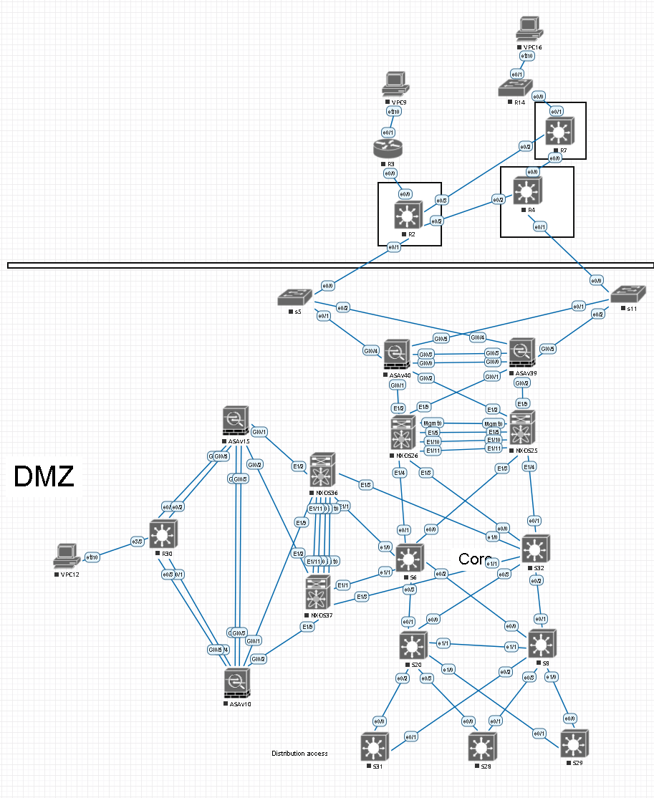
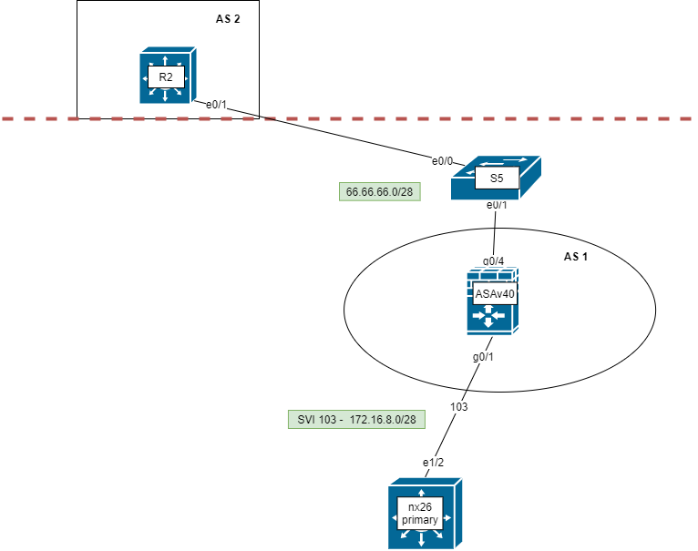
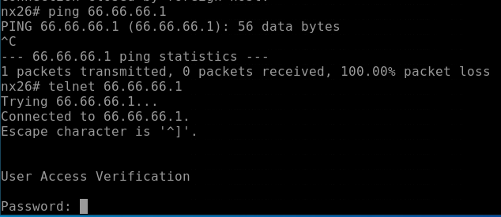
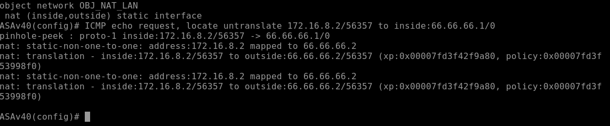
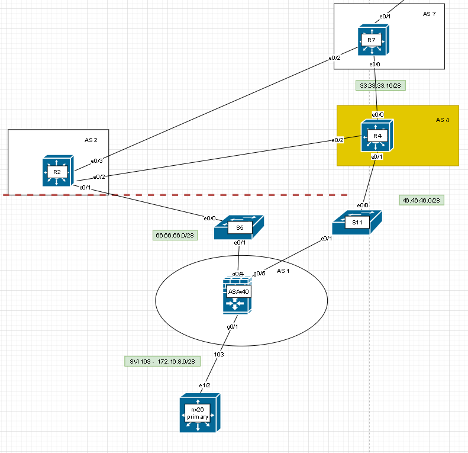
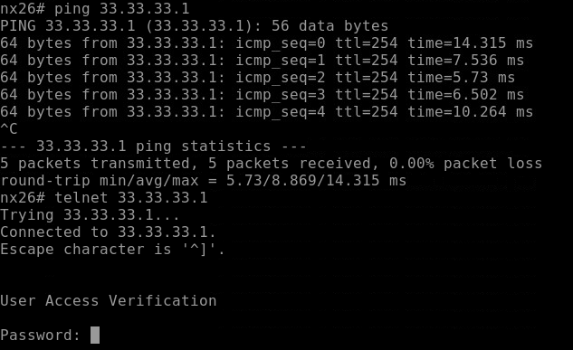
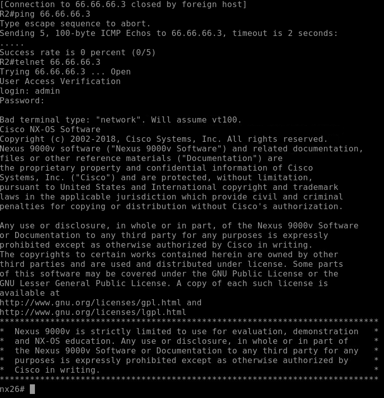
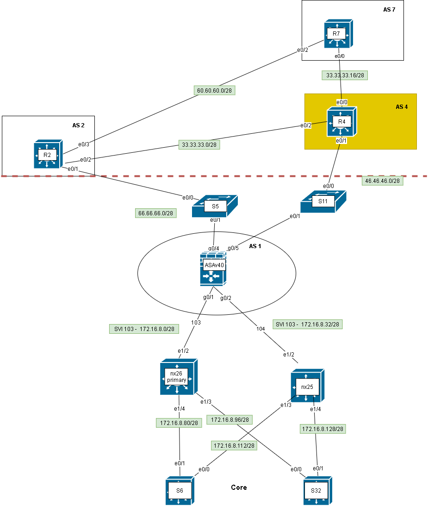

# **Проектная работа**
## **Тема: «Построение высоконадежной безопасной корпоративной сети»**

ТЗ:
1. Организация отказоустойчивой сети
2. Обеспечение безопасности пользователей и сервисов.
3. Организовать безопасное подключение филиалов и удаленных сотрудников
4. Подключение партнеров и пользователей к сервисам, которые располагаются в DMZ сегменте


На границе сети и DMZ стоят Cisco ASA Failover.
Организована избыточность оборудования, каналов. Маршрутизация EIGRP, BGP, static.
С филиалами построены тунели IPSec  

 

1.

Для обучения и прощупывания работы Cisco ASA создадим стенд 

Цели проверки стенда:
+  - 



Промежуточное оборудование настроено.
сбросили настройки с cisco asa

```
clear configure all
```

Перейдем к настройками Cisco ASA.  

```
show firewall
```

Настроим название интерфейса, уровень безопансости, ip адресс


зона
Списки контроля доступа (сокращенно «списки доступа» или ACL) являются методом, которым межсетевой экран ASA определяет, является ли трафик разрешенным или запрещенным. По умолчанию трафик, который проходит от более низкого к более высокому уровню безопасности, запрещен. Это можно переопределить в ACL, примененном к соответствующему интерфейсу безопасности нижнего уровня. Также ASA по умолчанию разрешает трафик от интерфейсов с более высоким к интерфейсам с более низким уровнем безопасности. Это поведение можно также переопределить в ACL.

```
interface GigabitEthernet0/1
 nameif inside
 security-level 100
 ip address 172.16.8.1 255.255.255.240 

interface GigabitEthernet0/4
 nameif outside
 security-level 0
 ip address 66.66.66.2 255.255.255.240 
!
```

Проверим доступ из локальной сети (обратные маршруты присутствуют)

```
packet-tracer input inside tcp 172.16.8.2 telnet 66.66.66.1 65$

Phase: 1
Type: ROUTE-LOOKUP
Subtype: Resolve Egress Interface
Result: ALLOW
Config:
Additional Information:
found next-hop 66.66.66.1 using egress ifc  outside

Phase: 2
Type: NAT
Subtype: per-session
Result: ALLOW
Config:
Additional Information:

Phase: 3
Type: IP-OPTIONS
Subtype: 
Result: ALLOW
Config:
Additional Information:

Phase: 4
Type: QOS     
Subtype: 
Result: ALLOW
Config:
Additional Information:

Phase: 5
Type: QOS
Subtype: 
Result: ALLOW
Config:
Additional Information:

Phase: 6
Type: NAT
Subtype: per-session
Result: ALLOW
Config:
Additional Information:

Phase: 7
Type: IP-OPTIONS
Subtype: 
Result: ALLOW 
Config:
Additional Information:

Phase: 8
Type: FLOW-CREATION
Subtype: 
Result: ALLOW
Config:
Additional Information:
New flow created with id 21, packet dispatched to next module

Phase: 9
Type: ROUTE-LOOKUP
Subtype: Resolve Egress Interface
Result: ALLOW
Config:
Additional Information:
found next-hop 66.66.66.1 using egress ifc  outside

Phase: 10
Type: ADJACENCY-LOOKUP
Subtype: next-hop and adjacency
Result: ALLOW 
Config:
Additional Information:
adjacency Active
next-hop mac address aabb.cc00.2410 hits 59 reference 2

Result:
input-interface: inside
input-status: up
input-line-status: up
output-interface: outside
output-status: up
output-line-status: up
Action: allow

ASAv40(config)# 
```



доступ из зоны inside в outside есть. Обратно нет.

Аля ZBF опирается на SPI для инспектирования трафика и фильтрации.
Для прохождения трафика icmp.
Необходимо добавить его в Стандартный трафик `` Default Inspection Traffic ``

```
ASAv40(config)# policy-map global_policy
ASAv40(config-pmap)#  class inspection_default
ASAv40(config-pmap-c)#   inspect icmp


nx26# ping 66.66.66.1
PING 66.66.66.1 (66.66.66.1): 56 data bytes
64 bytes from 66.66.66.1: icmp_seq=0 ttl=254 time=8.52 ms
64 bytes from 66.66.66.1: icmp_seq=1 ttl=254 time=10.795 ms
64 bytes from 66.66.66.1: icmp_seq=2 ttl=254 time=6.179 ms
64 bytes from 66.66.66.1: icmp_seq=3 ttl=254 time=6.012 ms
64 bytes from 66.66.66.1: icmp_seq=4 ttl=254 time=6.248 ms
```

Настроим static NAT 
NAT (Object NAT) и ручная NAT (Twice NAT)
```
object network PAT
    host 66.66.66.2
object network OBJ_NAT_LAN
    host 172.16.8.2
 nat (inside,outside) static interface
```
запросы со стороны ``inside`` зоны



outside zone не проходит.
```
ASAv40(config-network-object)# packet-tracer input outside icmp 66.66.66.1 0 0$

Phase: 1
Type: ACCESS-LIST
Subtype: 
Result: ALLOW
Config:
Implicit Rule
Additional Information:
MAC Access list

Phase: 2
Type: UN-NAT
Subtype: static
Result: ALLOW
Config:
object network OBJ_NAT_LAN
 nat (inside,outside) static interface
Additional Information:
NAT divert to egress interface inside
Untranslate 66.66.66.2/0 to 172.16.8.2/0

Phase: 3
Type: NAT
Subtype: per-session
<--- More --->ICMP echo reply, locate untranslate 66.66.66.1/0 to outside:66.66.66.2/0
nat: untranslation - outside:66.66.66.2/0 to inside:172.16.8.2/0 (xp:0x00007fd3f42f9880, policy:0x00007fd3f53998f0)
pinhole-peek : proto-1 outside:66.66.66.1/0 -> 66.66.66.2/0
nat: untranslation - outside:66.66.66.2/0 to inside:172.16.8.2/0 (xp:0x00007fd3f42f9880, policy:0x00007fd3f53998f0)
nat: untranslation - outside:66.66.66.2/0 to inside:172.16.8.2/0 (xp:0x00007fd3f42f9880, policy:0x00007fd3f53998f0)
Result: ALLOW 
Config:
Additional Information:

Phase: 4
Type: ACCESS-LIST
Subtype: 
Result: DROP
Config:
Implicit Rule
Additional Information:

Result:
input-interface: outside
input-status: up
input-line-status: up
output-interface: inside
output-status: up
output-line-status: up
Action: drop
Drop-reason: (acl-drop) Flow is denied by configured rule

```

Нужно настроить ACL позволяющие из OUTSIDE получать доступ к INSIDE.


```
ASAv40(config)# show run access-list                                     
access-list OUTSIDE_DMZ_TELNET extended permit tcp any host 172.16.8.2 eq telnet  
access-group OUTSIDE_DMZ_TELNET in interface outside
```

## Добавление 2 провайдера



Настроим статический нат для web server 

```
interface GigabitEthernet0/5
 nameif outside-AS4
 security-level 0
 ip address 46.46.46.2 255.255.255.240 

object network obj_172.16.8.2_AS4
host 172.16.8.2

object network obj_66.66.66.3
 host 66.66.66.3

nat (inside,any) source static obj_172.16.8.2 obj_66.66.66.3
```


Позволяет хостам из внешней сети обратиться к серверу по телнет


```
access-list OUTSIDE_DMZ_TELNET extended permit tcp any host 172.16.8.2 eq telnet

```
Для применения ACL к интерфейсу нужно создать access-group  для  outside и outside-AS4 


```
access-group OUTSIDE_DMZ_TELNET in interface outside-AS4

access-group OUTSIDE_DMZ_TELNET in interface outside
```


 **Тест**

Inside



Outside



Через другого провайдера тоже все работает.

_________________
``В случае жанного ната не происходит инспектирования 
nat (any,any) source static obj_172.16.8.2 obj_66.66.66.3 description "Static NAT Web-server"q``
____________________


## Добавим L3 коммутатор в уровень дистрибьют

По итогу у нас 2 inside интерфейса 2 outside. Cisco ASA имеет доступ до всех интерфейсов AS





```
interface GigabitEthernet0/2
 nameif inside-nx25
 security-level 100
 ip address 172.16.8.33 255.255.255.240 
 no shutdown
```
Поменяем ``object network obj_172.16.8.2_AS4``

```
object network obj_web
    host 10.0.0.10
    exit
nat (inside,any) source static obj_web obj_66.66.66.3
nat (inside-nx25,any) source static obj_web obj_66.66.66.3

access-list OUTSIDE_DMZ_TELNET extended permit tcp any obj_web eq telnet

```

Не удалось настроить, трафик не натировался.

Попробую натировать адреса в совершенно другой адрес 100.100.100.100 из сети 100.100.100.0/24.

Нужно будет еще анонсировать ее в BGP и сделать маршрут в эту сеть.

```
object network obj_66.66.66.3
    host 100.100.100.0
    exit
router bgp 1
    network 100.100.100.0 mask 255.255.255.0


prefix-list BGP_OUT seq 15 permit 100.100.100.0/24

route Null0 100.100.100.0 255.255.255.0
```


## Настройка EIGRP cisco asa

для анонсирования дефолта 
```
route Null0 0.0.0.0 0.0.0.0 

router eigrp 1
    network 0.0.0.0 0.0.0.0

```


Через 2 линка разные стоимости маршрута.
Возможно разные.