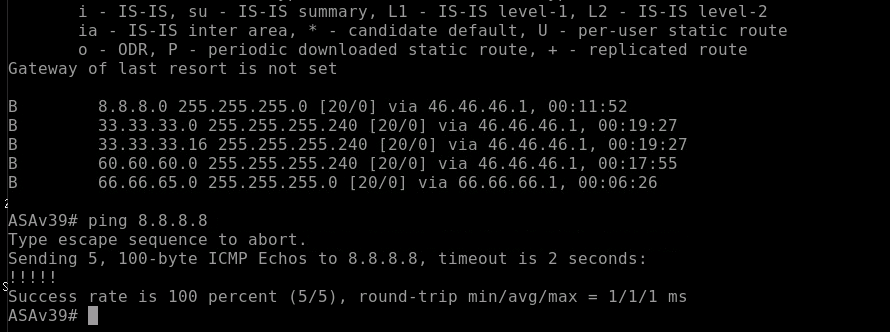
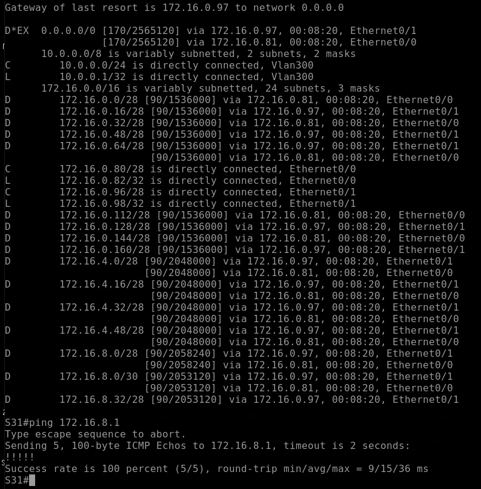
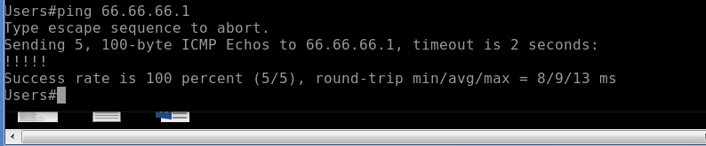
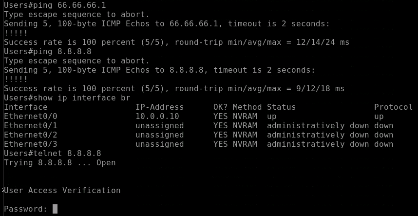
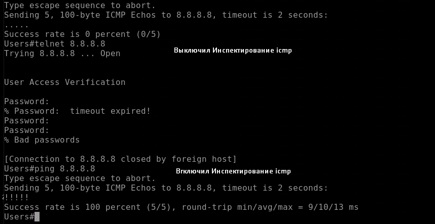
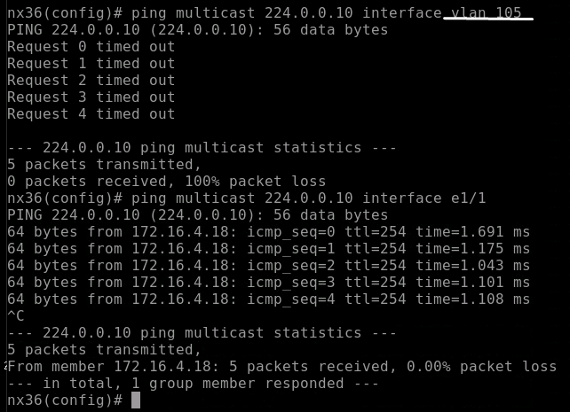
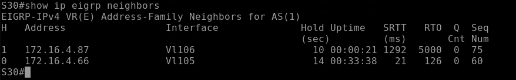
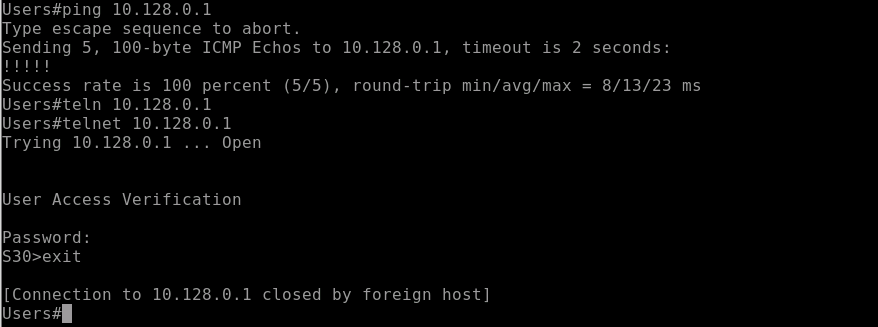

# **Проектная работа**

Курсовой проект

Цель: Настроить работоспособную сетевую инфраструктуру в сетях конечных клиентов Настроить работоспособную сетевую инфраструктуру в сети интернет сервис провайдера Настроить виртуальные сети между удаленными сетями поверх Интернет Защита сетевой инфраструктуры

Проектная работа включает в себя такие вещи как:

+ Планирование и распределение адресного пространства
+ Реализация статической маршрутизации на основе политик
+ Настройка VPN туннелей (статические и динамические) с шифрованием между удаленными офисами
+ Настройка протоколов маршрутизации (OSPF, EIGRP) внутри локальных сетей и поверх виртуальных каналов
+ Настройка протокола маршрутизации BGP внутри автономной системы и между ними
+ Шифрование VPN соединений
+ Настройка инфраструктурных сервисов (DHCP, NTP, NAT и т.п.)
+ Разработка и документирование производимых действий над лабораторной средой

## **Тема: «Построение высоконадежной безопасной корпоративной сети»**

ТЗ:
1. Организация отказоустойчивой сети
2. Обеспечение безопасности пользователей и сервисов.
3. Организовать безопасное подключение филиалов и удаленных сотрудников
4. Подключение партнеров и пользователей к сервисам, которые располагаются в DMZ сегменте


На границе сети и DMZ стоят Cisco ASA Failover.
Организована избыточность оборудования, каналов. Маршрутизация EIGRP, BGP, static.
С филиалами построены тунели IPSec  

 

Общая адресация расположана тут:  
https://github.com/rain360z/otus-networks/blob/main/15_lab_Project_course/IPv4.md

План работ:

1) Настроить Доступность Сisco ASA c внешней сети
2) Организовать доступность оборудования внутри сети
3) Настроить NAT для доступа пользоватлей в интернет на пограничном cisco Asa 
4) Настроить DMZ zone, провреить работу EIGRP
5) Настроить статический NAT для DMZ zone.
6) Для филиалов организовать IPSec


## Пункт 1.


 Промежуточное оборудование настроено. R7 анонсирует 8.8.8.8

 Cбросили настройки с cisco asa

```
clear configure all
```

Cisco asa работает в routed mode. Проверить это можно командо ``show firewall``

```


interface GigabitEthernet0/1
    nameif inside
    security-level 100
    ip address 172.16.8.1 255.255.255.240 

interface GigabitEthernet0/2
    nameif inside2
    security-level 100
    ip address 172.16.8.33 255.255.255.240 

interface GigabitEthernet0/4
    nameif outside
    security-level 0
    ip address 66.66.66.2 255.255.255.240 

interface GigabitEthernet0/5
    nameif outside2
    security-level 0
    ip address 46.46.46.2 255.255.255.240 

```
__Настроим ASA Active/Standby failover__  
Принцип работы failvoer.
Основной межсетевой экран всегда находится в активном состоянии и выполняет свою функциональную работу до тех пор, пока не выйдет из строя например или не упадет

Настройка первой(primary) cisco asa


```
!
interface Redundant1
 description LAN Failover Interface
 member-interface GigabitEthernet0/0
 member-interface GigabitEthernet0/3
```
Пара физических интерфейсов может быть объединена в один Redundant интерфейс. При работе Redundant интерфейса один из его членов в состоянии active, второй - standby

```
failover
failover lan unit primary
failover lan interface FAILOVER Redundant1
failover interface ip FAILOVER 192.168.1.1 255.255.255.0 standby 192.168.1.2
```

Настройка второй (secondary) cisco asa

```
failover
failover lan unit secondary
failover lan interface FAILOVER Redundant1
failover interface ip FAILOVER 192.168.1.1 255.255.255.0 standby 192.168.1.2
```

Failover настроили, когда будем вносить изменения в конфигурацию, они будут переноситься на standby ноду.


```
router bgp 1
 bgp log-neighbor-changes
 address-family ipv4 unicast
  neighbor 46.46.46.1 remote-as 4
  neighbor 46.46.46.1 activate
  neighbor 46.46.46.1 filter-list 1 out
  neighbor 66.66.66.1 remote-as 2
  neighbor 66.66.66.1 activate
  neighbor 66.66.66.1 filter-list 1 out
  network 46.46.46.0 mask 255.255.255.240
  network 66.66.66.0 mask 255.255.255.240
  network 100.100.100.0 mask 255.255.255.0
  no auto-summary
  no synchronization
```

Соседство с провайдерами установлено


8.8.8.8 доступны



Перейдем к настройками Cisco ASA.  

Настроим название интерфейса, уровень безопансости, ip адресс

Списки контроля доступа (сокращенно «списки доступа» или ACL) являются методом, которым межсетевой экран ASA определяет, является ли трафик разрешенным или запрещенным. По умолчанию трафик, который проходит от более низкого к более высокому уровню безопасности, запрещен. Это можно переопределить в ACL, примененном к соответствующему интерфейсу безопасности нижнего уровня. Также ASA по умолчанию разрешает трафик от интерфейсов с более высоким к интерфейсам с более низким уровнем безопасности. Это поведение можно также переопределить в ACL.

```
interface GigabitEthernet0/1
    nameif inside
    security-level 100
    ip address 172.16.8.1 255.255.255.240 

interface GigabitEthernet0/2
    nameif inside2
    security-level 100
    ip address 172.16.8.33 255.255.255.240 

interface GigabitEthernet0/4
    nameif outside
    security-level 0
    ip address 66.66.66.2 255.255.255.240 

interface GigabitEthernet0/5
    nameif outside2
    security-level 0
    ip address 46.46.46.2 255.255.255.240 

```


## __Пункт 2__


Настроили EIGRP внутри организации. Настроили redistribute static на cisco ASA.  

Настройки EIGRP на Cisco ASA, у остальных маршрутизаторов настройки аналогичные. 

```
На Active node

access-list DEF standard permit any4 

router eigrp 1
    router eigrp 1
 eigrp router-id 0.0.0.40
    network 172.16.8.0 255.255.255.240
    network 172.16.8.32 255.255.255.240
    passive-interface default
    no passive-interface inside
    no passive-interface inside2
    redistribute static route-map DEF
```

На l3 switch прилетел дефолт. Доступ до сежсетевого экрана Cisco ASA есть.




Разрешим взаимодейстиве между интерфейсами с одинаковыми уровнями безопасности.

```
same-security-traffic permit inter-interface
```

## Пункт 3.

 Проверим проходит ли трафик без NAT до провайдера. Предварительно настроив на провайдере маршрут в сеть 10.0.0.0/24. Доступа до 66.66.66.1 нет. 

В 1 пункте мы настраивали security level. По умолчанию трафик разрешен из зоны с большим доверием в зону с меньшим доверием. В данном случае трафик идет из 100 в 0 уровень.  
Вместе с Security level отрабатывает и технология SPI, для инспектирования трафика и фильтрации.

При работе инспектирования ASA фактически "подглядывает" за трафиком инспектируемых протоколов и приложений. Т.е. разбирает сессия на уровне приложений (application layer), и динамически разрешает необходимые порты. По умолчанию уже заданы стандартные параметры Инспектирования, там нет ICMP.  

Для прохождения трафика icmp.
Необходимо добавить его в Инспетирование Стандартного трафик `` Default Inspection Traffic ``

```
ASAv40(config)# policy-map global_policy
ASAv40(config-pmap)#  class inspection_default
ASAv40(config-pmap-c)#   inspect icmp
```
Доступ есть из внутренней сети во внешнюю есть.
Из outside зоны в inside нету.




Настроим PAT во внешнюю сеть.

```
router bgp 1
    network 100.100.100.0 mask 255.255.255.0

route Null0 100.100.100.0 255.255.255.0

```

Перейдем непосредственно к настройке NAT

```
object network inside_lan
    subnet 10.0.0.0 255.255.255.0

object network outside_lan
    host 100.100.100.100

nat (any,any) source dynamic inside_lan outside_lan
```

Доступ из сети пользователей в интернет есть. telnet работает.



Проверим инспектируется и фильтруется ли трафик при натировании. Как мы видим на скриншоте, да.



## __Пункт 4.__ 

Настроить DMZ zone, провреить работу EIGRP.


На S30 работает EIGRP и Анонсирует серые адреса Серверов которые торчат наружу.

Cisco asa работает в прозрачном режиме и так же настроен cisco ASA Active/Standby failover.

```
ASA-FAILOVER# show firewall   
Firewall mode: Transparent
```

Настройки интерфейсов
```

interface GigabitEthernet0/1
 bridge-group 1
 nameif inside
 security-level 100
!
interface GigabitEthernet0/2
 bridge-group 1
 nameif inside2
 security-level 100

interface GigabitEthernet0/4
 bridge-group 1
 nameif outside
 security-level 0
!
interface GigabitEthernet0/5
 bridge-group 1
 nameif outside2
 security-level 0
!
interface GigabitEthernet0/6
 shutdown
 no nameif
 no security-level

interface BVI1
 ip address 172.16.4.67 255.255.255.240 
!
```

```
same-security-traffic permit inter-interface
```

Чтобы поднялось соседство нужно добавить инспектирование ip c протоколом 88 и multicast 224.0.0.10

В данный момент мултикаст фильруется.


Сделаем ACL на все интерфейсы для поднятия EIGRP соседства.
```
access-list LAN_EIGRP line 1 extended permit eigrp 172.16.4.64 255.255.255.240 172.16.4.64 255.255.255.240 
access-list LAN_EIGRP line 3 extended permit eigrp 172.16.4.80 255.255.255.240 172.16.4.80 255.255.255.240 
access-list LAN_EIGRP line 5 extended permit ip any host 224.0.0.10 

! применим LAN_EIGRP 
access-group LAN_EIGRP outside
access-group LAN_EIGRP outside2
``` 




Доступ из сетей пользователей в DMZ есть.


Из DMZ в сеть пользователей нет доступа.


## __Пункт 5.__

Настроить статический NAT для DMZ zone.

Настроим статический нат для web server
```
object network SERVER_REAL
host 10.128.0.1

object network SERVER_SOURCE
 host 100.100.100.128

nat source static SERVER_REAL SERVER_SOURCE
```
Позволяет хостам из внешней сети обратиться к серверу по телнет
```
access-list OUTSIDE_DMZ_TELNET extended permit tcp any host 10.128.0.1 eq telnet
```
Для применения ACL к интерфейсу нужно 
создать access-group для outside и outside2
```
access-group OUTSIDE_DMZ_TELNET in interface outside

access-group OUTSIDE_DMZ_TELNET in interface outside2
```

Доступ с сети AS 7 до серверав DMZ zone есть.


## __Пункт 6.__ 

 До филиалов организовать IPSec.  
 Планировал организовать DMVPN с Cisco ASA. Но Cisco ASA не поддерживает DMVPN. В дальнейшем будет прорабатываться другие решения.

_________________________

Сохраним конфигурацию


## Вывод и планы по развитию

Выводы:  
+ В данный работе мы организовали коркас высоконадежной безопасной корпоративной сети. В дальнейшем можно ее развивать, не мешая сотрудникам компании выполнять свои фунции.  
+ Не удалось настроить DMVPN. Можно настроить DMVPN поверх IPSec   static NAT на cisco ASA настроить исопользуя как hub NXOS26/NXOS25 или эти два маршрутизатора добавить в AS 1 используя iBGP. 
Планы по развитию:
+ Настроить управление сетью используя VRF или паралелльную сеть
+ Внедрить сервис по сбору логов, настроить NTP
+ Вместо ASA Active/Standby failover настроить ASA Cluster используя cisco nexus 9000

