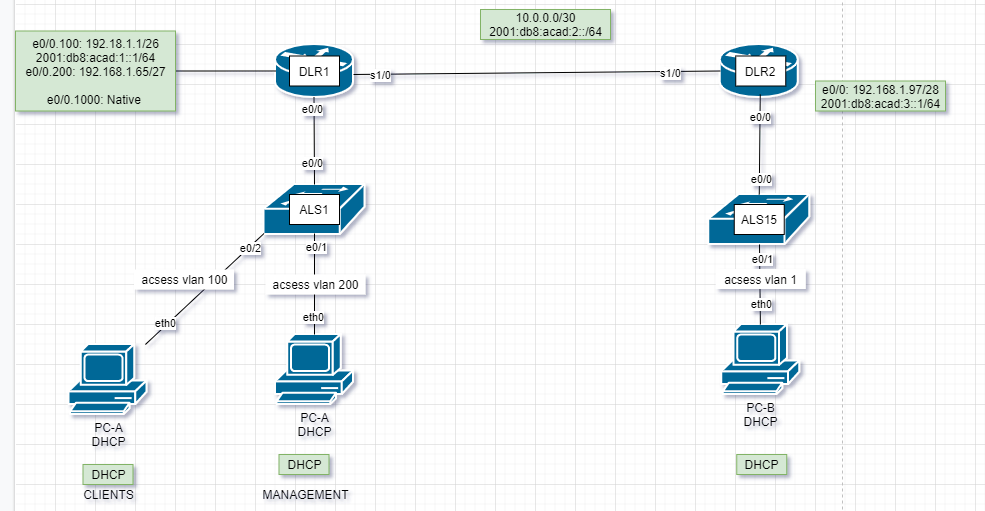

# Настроить DHCPv4



| VLAN	| Name	| Interface Assigned|
|-------|-------|-------------------|
| 1	|N/A	| S2: F0/18| 
| 100	|Clients	|S1: F0/6|
| 200	|Management|	S1: VLAN 200 |
| 999|	Parking_Lot|	S1: F0/1-4, F0/7-24, G0/1-2|
| 1000	|Native	|N/A|


###Задание

###1 . Создание стенда, базовое конфигурирование оборудования.

#### Шаг 1. Создадим схему адресов и запишем их в таблицу
     Разделим подсеть 192.168.1.0/24 на 3 подсети.  
     +  Subnet A поддерживает 58 узлов  192.168.1.0/26
     +  Subnet B поддерживает 28 узлов  192.168.1.64/27
     +  Subnet C поддерживает 12 узлов  192.168.1.96/28

#### Шаг 2. Подключим сетево оборудование как показанно на схеме.


#### Шаг 3. Базовое конфигурирование маршрутизаторов.

Все файлы изменений приведены здесь.

#### Шаг 4. Настройка межвлановой маршрутизации на R1

 + Включение интерфейса E0/0  
 + Настройка сабынтерфейсов для каждого VLAN всоответствии с таблицей.
#### Шаг 5. Настройка E0/0 На R2, затем маршрутизацию на обоих роутерах
 + Настроим на R1 интерфейс s1/0 в соответствии таблицей адресов и добавим 
маршрут по умолчанию.
  


Аналогичные настройки добавим на R2

#### Шаг 6. Настройка базовой конфигурации на каждом коммутаторе

#### Шаг 7. Создание VLANs на S1.
 + Создать и назначить требуемые VLANs на S1 
 + Настроить и включить SVI порт S1 и на S2
 + Назначить на неиспользуемых портах S1 VlAN и выключить их. На S2 Не используемые порты отлкючить  


 

  

  

  


#### Шаг 8. 

Это стандартный VlAN на любом порту. Где все кадры идут без тэга.

#### Шаг 9. Вручную назначить на S1 интерфейс e0/0 настроить 802.1Q trunk

Нужно выбрать протокол инкапсляции вручную и так же  настроить native vlan

  (config-if)# switchport trunk encapsulation dot1q
  (config-if)#switchport trunk native vlan 1000

### Часть 2 Конфигурирование и проверка 2 DHCPv4 серверов на R1

#### Шаг 1. Настроить R1 с DHCPv4 пулом для 2 поддерживаемых сабынтерфейсов.
+ Исключить первые 5 используемыъ адресов для кажлого пула адресов.


+ Создать DHCP пул
+ Установть сеть которую поддерживать DHCP сервер
+ Настроить доменное имя
+ Настроить шлюз пол умолчанию для каждого DHCP пула
+ Назначить время аренды 2 дня 12 часов 30 минут


#### Шаг 2. Проверить конфигурацию DHCP сервера следующими командами:
```show ip dhcp pool```   


```show ip dhcp bindings ```  
  Так как ни кто адрес не получил, привязок нету, то таблица пустая  


```show ip dhcp server statistics```


 

#### Шаг 3. Попробовать получить ip адрес от DHCP на PC-A
``` ipconfig /renew```  
```ipconfig ```

На VPCS: ```dhcp -r```


### Часть 3.  Настроить DHCP reley(трансляцию) на 

#### Шаг 1. Настройка R2 как агента трасляции DHCP для локльной сети на интерфейсе e0/0
+ Настроить r``` ip helper-address ``` 


#### Шаг 2. Попытаться запросить адрес IP адрес от DHCP для PC-B
+ Запросим IP адрес


```show ip dhcp bindings ```  
```show ip dhcp server statistics```


# Настроить DHCPv6


Топология  
Рис 1

| Device|	Interface|	IPv6 Address|
|-------|----------------|------------------|
| R1|	G0/0/0|	2001:db8:acad:2::1 /64|
| R1|	G0/0/0| fe80::1|
| R1	|G0/0/1|	2001:db8:acad:1::1/64|
| R1	|G0/0/1	|fe80::1|
| R2	|G0/0/0|	2001:db8:acad:2::2/64|
| R2	|G0/0/0	fe80::2|
| R2	|G0/0/1|	2001:db8:acad:3::1 /64|
| R2	|G0/0/1|	fe80::1|
| PC-A	|	NIC|	DHCP|
| PC-B	|	NIC|	DHCP|


#### Шаг 4. Настроить интерфейсы и маршруты на обоих роутерах
Часть 1
 
+ Настроить на роутере и коммутаторах базовые настройки
+ Настроить на интерфейсах роутеров в соответствии с таблицей
+ Проверить доступность


### Часть 2 Проверить назначение адреса с помощью службы SLAAC

После включения компьютера, были сформированны следующие адреса.


Where did the host-id portion of the address come from?

Был сгенирирован c помощью метода Extended Unique Identifier (EUI-64) или случайно сгенерированный

#### Часть 3 Настройка и проверка службы DHCPv6 без сохранения состояния.
Создадим DHCPv6 pool на R1. И добавить информациюкоторую будет передавать DHCPv6
```
R1(config)# ipv6 dhcp pool R1-STATELESS  
R1(config-dhcp)# dns-server 2001:db8:acad::254  
R1(config-dhcp)# domain-name STATELESS.com 
 
```

Настроим на e0/0 SLAAC DHCPv6 без сохронения. И добавим DHCP pool.

```
R1(config)# interface e0/0
R1(config-if)# ipv6 nd other-config-flag
R1(config-if)# ipv6 dhcp server R1-STATELESS

``` 


