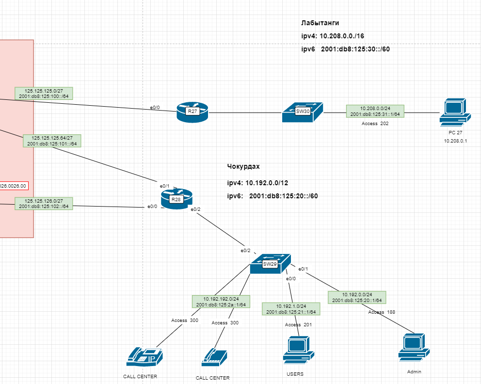

# Маршрутизация на основе политик (PBR)

## Цель:
Настроить политику маршрутизации в офисе Чокурдах Распределить трафик между 2 линками

В этой самостоятельной работе мы ожидаем, что вы самостоятельно:

1. Настройте для офиса Лабытнанги маршрут по-умолчанию

2. Настроить политику маршрутизации в офисе Чокурдах Распределить трафик между 2 линками
    + Настроите политику маршрутизации для сетей офиса
    + Распределите трафик между двумя линками с провайдером
    + Настроите отслеживание линка через технологию IP SLA


## Решение


## Схема



1. Настройте для офиса Лабытнанги маршрут по-умолчанию
Настроил адресацию. DHCP
Остановился на NAT

Настроим DHCP и PAT on R27

```
     R27(config)# ip dhcp excluded-address 10.208.0.1 10.208.0.10
     R27(config)# ip dhcp pool Client
     R27(config-config)# network 10.208.0.0 255.255.255.0
     R27(config-config)# domain-name hello.com
     R27(config-config)# default-router 10.208.0.1
     R27(config)# ip nat pool NAT-POOL2 209.165.200.226 209.165.200.240 netmask 255.255.255.224
     R2(config)# ip nat inside source list 1 interface e0/0 overload
     R27(config)# access-list 1 permit 10.208.0.0 0.0.0.255
     R27(config)# interface e0/1.202
     R27(config-if)# ip nat inside
     R27(config-if)# exit
     R27(config)# interface int e0/0
     R27(config-if)# ip nat outside
```

Дефолтный маршрут настроили.

2.  Настроить политику маршрутизации в офисе Чокурдах Распределить трафик между 2 линками

