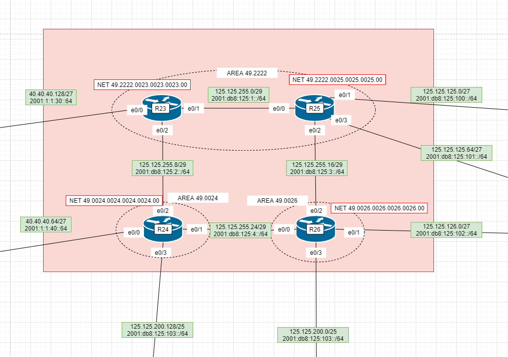
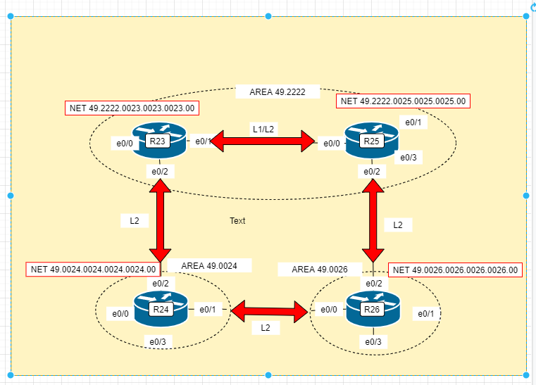
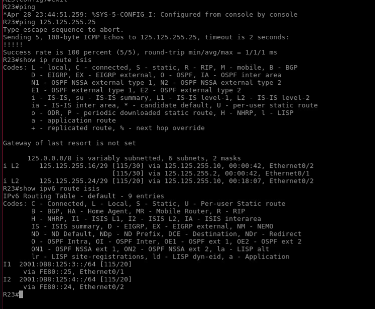

## IS-IS

Цель:
Настроить IS-IS офисе Триада

Настроите IS-IS в ISP Триада
R23 и R25 находятся в зоне 2222
R24 находится в зоне 24
R26 находится в зоне 26
Настройка осуществляется одновременно для IPv4 и IPv6

###  Задание: 

1. Настроите IS-IS в ISP Триада

###  Решение:

IP/v6 Адреса внесены в таблицу тут   




Выделим зону Backbone


Настроим R23

```  
(config)# router isis
(config-router)# net 49.2222.0023.0023.0023.00
(config-if)int e0/1
(config-if)# ip router isis
(config-if)# ipv6 router isis
(config-is)#isis circuit-type level-1-2
(config-if)int e0/2
(config-is)#isis circuit-type level-2-only

```    



Все файлы изменений приведены здесь.