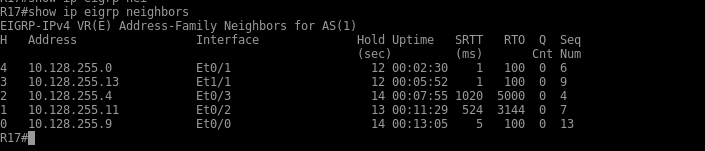
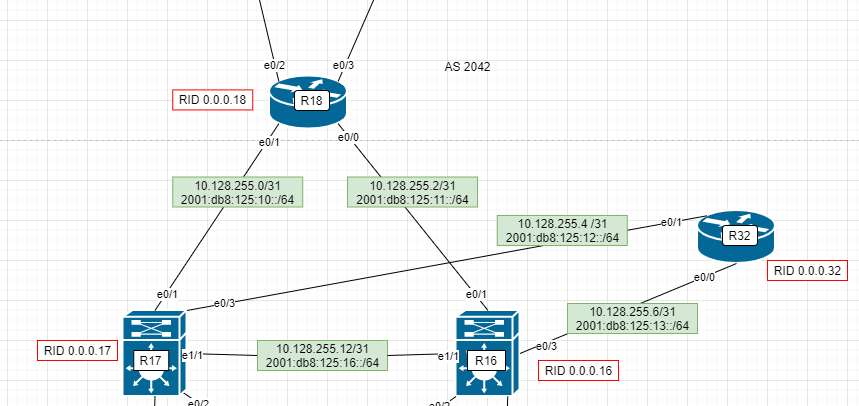
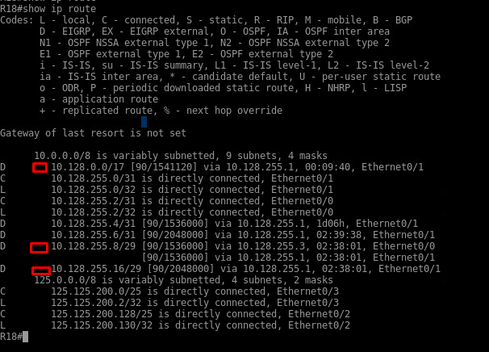
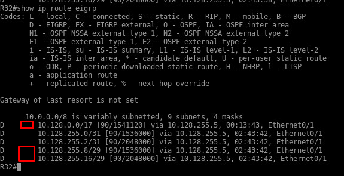
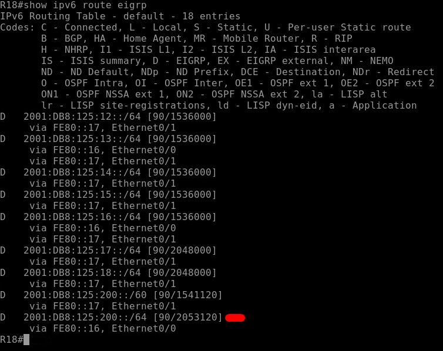
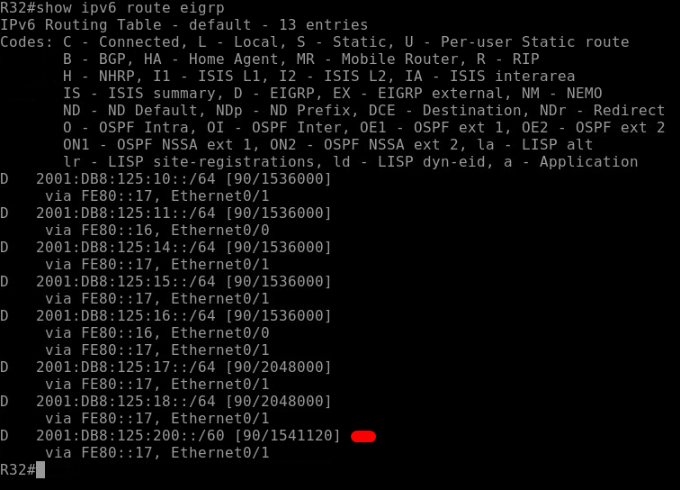
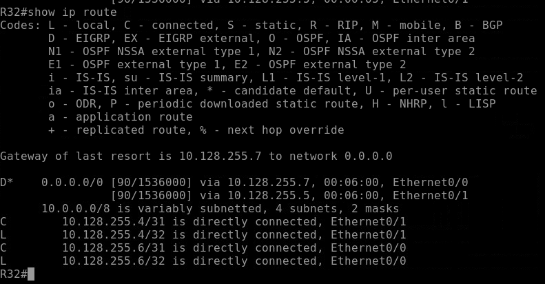
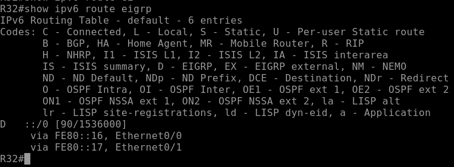

# EIGRP

Задание:
Настроить EIGRP в С.-Петербург; 
Использовать named EIGRP


1. Настроим named EIGRP ipv4 на R17.
1.1.  Использовать EIGRP named-mode для настройки сети
1.2 Настройка осуществляется одновременно для IPv4 и IPv6

2. В офисе С.-Петербург настроить дополнительные параметры протокола EIGRP
2.1 R16-17 анонсируют только суммарные префиксы
2.2 R32 получает только маршрут по-умолчанию


## 1. В офисе С.-Петербург настроить EIGRP 

Будут настроены следующие настройки:
+ включим настройки процесс eigrp;
+ все интерфейсы переведем в пассивный режим, для того чтобы небыли отправлены hello пакеты, на интерфейсах где будет включен eigrp;
+ назначим router-id
+ включим на интерфейсах eigrp


Настроим named EIGRP  на R17.

### **ipv4/ipv6**
```
R17(config)# router eigrp E
R17(config-router)# shutdown
R17(config-router)# address-family ipv4 unicast autonomus-system 1
R17(config-router-af)# af-interface default 
R17(config-router-af-interface)# passive interface
R17(config-router-af-interface)# exit
R17(config-router-af)# eigrp router-id 0.0.0.17
R17(config-router-af)# network 10.128.255.0 0.0.0.1
R17(config-router-af)# network 10.128.255.4 0.0.0.1
R17(config-router-af)# network 10.128.255.8 0.0.0.1
R17(config-router-af)# network 10.128.255.10 0.0.0.1
R17(config-router-af)# network 10.128.255.12 0.0.0.1
R17(config-router-af)# af-interface e0/0
R17(config-router-af-interface)# no passive-interface
R17(config-router-af)# af-interface e0/1
R17(config-router-af-interface)# no passive-interface
R17(config-router-af)# af-interface e0/2
R17(config-router-af-interface)# no passive-interface
R17(config-router-af)# af-interface e0/3
R17(config-router-af-interface)# no passive-interface
R17(config-router-af)# af-interface e1/1
R17(config-router-af-interface)# no passive-interface
R17(config-router-af-interface)# exit
R17(config-router-af)# exit
R17(config-router)# no shutdown

R17(config-router)# address-family ipv6 unicast autonomus-system 1

R17(config-router-af)# eigrp router-id 0.0.0.17
R17(config-router-af)# af-interface default
R17(config-router-af-interface)# passive-interface

 R17(config-router-af)# af-interface Ethernet0/0
 R17(config-router-af-interface)#  no passive-interface


 R17(config-router-af)# af-interface Ethernet0/2
 R17(config-router-af-interface)#  no passive-interface


  R17(config-router-af)#af-interface Ethernet1/1
 R17(config-router-af-interface)#  no passive-interface


 R17(config-router-af)# af-interface Ethernet0/3
 R17(config-router-af-interface)#  no passive-interface

 R17(config-router-af)# af-interface Ethernet0/1
 R17(config-router-af-interface)#  no passive-interface

```

Соседство установили со всеми соседями eigrp.


### **ipv6**


## 2. В офисе С.-Петербург настроить дополнительные параметры протокола EIGRP^

2.1. R16-17 анонсируют только суммарные префиксы

Для этого нужно настроить на R16, R17 ручную суммаризацию в сторону соседа R18: R32.
Для суммаризаци ipv4 сети пользователей: 
+ 10.128.0.0 - 10.128.127.255(10.128.0.0/17)
+ 10.128.255.8- 10.128.255.15(10.128.255.8/29)
Для суммаризаци ipv6 сети пользователей:
+ 2001:0db8:0125:0200:: - 2001:0db8:0125:020f:ffff:ffff:ffff:ffff(	2001:0db8:0125:0200::/60)



### ipv4

```
R17(config)# router eigrp E
R17(config-router)# address-family ipv4 unicast autonomous-system 1
R17(config-router-af)# af-interface Ethernet0/3
R17(config-router-af-interface)# summary-address 10.128.0.0 255.255.128.0
R17(config-router-af-interface)# summary-address 10.128.255.8 255.255.255.248
R17(config-router-af-interface)# summary-address 10.128.255.16 255.255.255.248
R17(config-router-af)# af-interface Ethernet0/1
R17(config-router-af-interface)# summary-address 10.128.0.0 255.255.128.0
R17(config-router-af-interface)# summary-address 10.128.255.8 255.255.255.248
R17(config-router-af-interface)# summary-address 10.128.255.16 255.255.255.248
```

Проверим работу суммаризации на R18



Проверим работу суммаризации на R32



## pv6

```
R17(config-router)# address-family ipv6 unicast autonomous-system 1

 R17(config-router-af)# af-interface Ethernet0/1
 R17(config-router-af-interface)#  summary-address 2001:db8:125:200::0/60  leak-map LEAK-USERS
! Если leak-map настроена и указывает на !route-map, которая не существует, то  анонсируется только суммарный маршрут, без  специфических маршрутов.
 R17(config-router-af)# af-interface Ethernet0/3
 R17(config-router-af-interface)#  summary-address 2001:db8:125:200::0/60

```
Проверим работу суммаризации на R18



Проверим работу суммаризации на R32



## 2.2 R32 получает только маршрут по-умолчанию

Приведем пример настройки на R17 на R16 они будут аналогичными

## ipv4

```
R17(config)# router eigrp E
R17(config-router)# address-family ipv4 unicast autonomous-system 1
R17(config-router-af)# af-interface Ethernet0/3
R17(config-router-af-interface)#summary-address 0.0.0.0 0.0.0.0
```



## ipv6 
```
R17(config)# router eigrp E
R17(config-router)# address-family ipv6 unicast autonomous-system 1
R17(config-router-af)# af-interface Ethernet0/3
R17(config-router-af-interface)#summary-address 0.0.0.0 0.0.0.0 leak-map LEAK-GW
```



