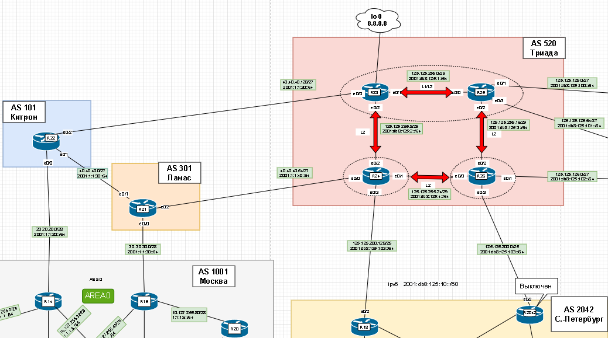
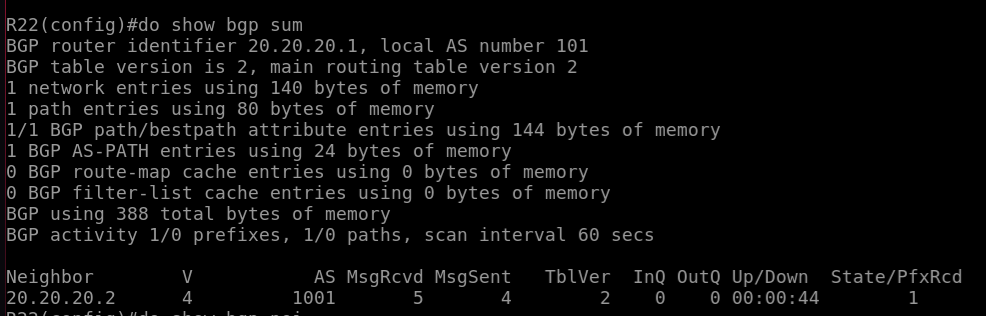
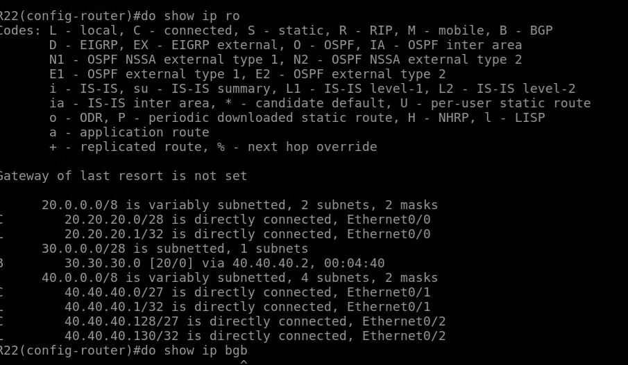
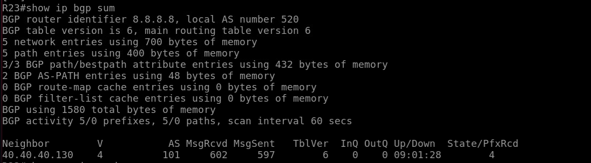
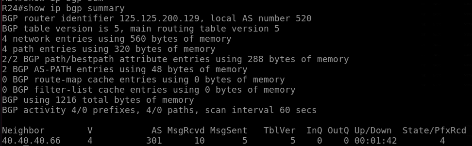
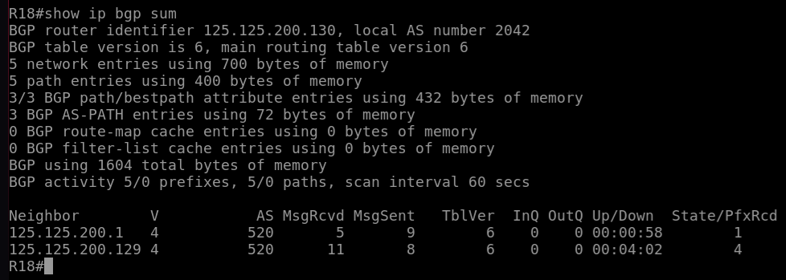
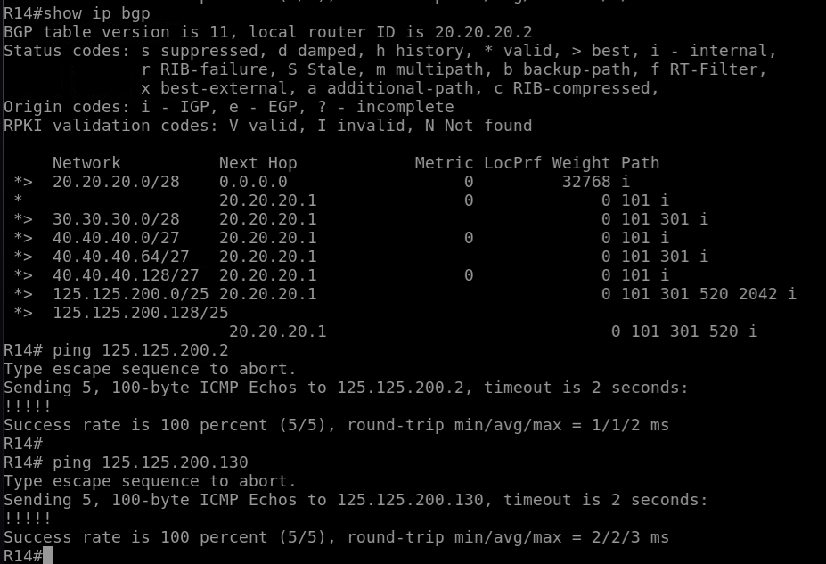

# BGP. Основы

## Цель:

Настроить BGP между автономными системами Организовать доступность между офисами Москва и С.-Петербург

В этой самостоятельной работе мы ожидаем, что вы самостоятельно:

1. Настроите eBGP между офисом Москва и двумя провайдерами - Киторн и Ламас;  
2. Настроите eBGP между провайдерами Киторн и Ламас;  
3. Настроите eBGP между Ламас, Китрон и Триада;  
4. eBGP между офисом С.-Петербург и провайдером Триада;  
5. Организуете IP доступность между офисами Москва и С.-Петербург;  

## Схема
На данной лобораторной нас интересуют данная часть схемы.



*Если я правильно понял то, настраиваем только BGP*

### __1. Настроите eBGP между офисом Москва и двумя провайдерами - Киторн и Ламас;__

Если я правильно понял то, настраиваем только BGP 

eBGP настраивается на физических линках, чтобы быстрее выяснить пробелему

```
R14(config)# router bgp 1001
R14(config-router)# neighbor 20.20.20.1 remote-as 101
```
R 22
```
R22(config)# router bgp 101
R22(config-router)# neighbor 20.20.20.2 remote-as 101
R22(config-router)# network 20.20.20.0 mask 255.255.255.240
```
Соседство поднялось



### __2. Настроите eBGP между провайдерами Киторн и Ламас__ 

Аналогично настроим на R15 и R21. Китрон и Ламас. И проверим пришли ли анонсы.



### __3. Настроите eBGP между Ламас, Китрон и Триада;__
R23 

  
R24



### __4. eBGP между офисом С.-Петербург и провайдером Триада__




### __5. Организуете IP доступность между офисами Москва и С.-Петербург; 

