# Проект 
## Организация геораспределённой сети для предоставления услуг безопасности как сервис.

Цель.


План работ:
1) Распределение адресного пространства.
2) Пстроение Underlay 
3) Построить Overlay поверх Underlay
4) Оргнизация Multi-pod
5) Внедрение внешних маршрутов в фабрику
6) Организация работы VRRP поверх VXLAN.
7) Проверка работоспособности
 
## 1. Распределение ip адресов.

### ЦОД-1
Таблица адресов  
|Уровень| Оборудование | Интерфейс  | ip-адрес | Маска |
|-------|--------------|------------|----------|-------|
|Leaf|C1_P1_L_NX9500_1|e1/1    |172.16.1.1|255.255.255.254|
|    |           |e1/2    |172.16.1.13|255.255.255.254|
|Leaf|C1_P1_L_NX9500_2 |e1/1    |172.16.1.3|255.255.255.254|
|    |           |e1/2    |172.16.1.15|255.255.255.254|
|Leaf|C1_P1_L_NX9500_3 |e1/1    |172.16.1.5|255.255.255.254|
|    |           |e1/2    |172.16.1.17|255.255.255.254|
|Leaf|C1_P1_L_NX9500_4|e1/1    |172.16.1.7 |255.255.255.254|
|     |          |e1/2    |172.16.1.19|255.255.255.254|
|Leaf|C1_P1_L_NX9500_5|e1/1    |172.16.1.9|255.255.255.254|
|     |          |e1/2    |172.16.1.21|255.255.255.254|
|Leaf|C1_P1_L_NX9500_6|e1/1 |172.16.1.11|255.255.255.254|
|     |          |e1/2    |172.16.1.23|255.255.255.254|
|Leaf|C1_P2_L_NX9500_1|e1/1    |172.16.2.3|255.255.255.254|
|    |           |e1/2    |172.16.2.1|255.255.255.254|
|Leaf|C1_P2_BL_NX9500_2|e1/1    |172.16.2.7|255.255.255.254|
|    |           |e1/2    |172.16.2.5|255.255.255.254|
|Leaf|C1_P1_S_NX9500_1|e1/1    |172.16.128.1|255.255.255.254|
|     |          |e1/2    |172.16.128.9|255.255.255.254|
|     |          |e1/3    |172.16.1.0|255.255.255.254|
|     |          |e1/4    |172.16.1.2|255.255.255.254|
|     |          |e1/5    |172.16.1.4|255.255.255.254|
|     |          |e1/6    |172.16.1.6|255.255.255.254|
|     |          |e1/7   |172.16.1.8|255.255.255.254|  
|     |          |e1/8    |172.16.1.10|255.255.255.254|
|Leaf|C1_P1_S_NX9500_2 |e1/1    |172.16.128.3|255.255.255.254|
|     |          |e1/2    |172.16.128.11|255.255.255.254|
|     |          |e1/3    |172.16.1.12|255.255.255.254|
|     |          |e1/4    |172.16.1.14|255.255.255.254|
|     |          |e1/5    |172.16.1.16|255.255.255.254|
|     |          |e1/6    |172.16.1.18|255.255.255.254|
|     |          |e1/7   |172.16.1.20|255.255.255.254|  
|     |          |e1/8    |172.16.1.22|255.255.255.254|
|Leaf|C1_P2_S_NX9500_1 |e1/1    |172.16.128.5|255.255.255.254|
|     |          |e1/2    |172.16.128.13|255.255.255.254|
|     |          |e1/3    |172.16.2.0|255.255.255.254| 
|     |          |e1/4    |172.16.2.4|255.255.255.254|
|Leaf|C1_P2_S_NX9500_2|e1/1    |172.16.128.7|255.255.255.254|
|     |          |e1/2    |172.16.128.15|255.255.255.254|
|     |          |e1/3    |172.16.2.0|255.255.255.254|
|     |          |e1/4    |172.16.2.4|255.255.255.254
|Leaf|C1_SS_NX9500_1 |e1/1    |172.16.128.0|255.255.255.254|
|     |          |e1/2    |172.16.128.2|255.255.255.254|
|     |          |e1/3    |172.16.128.4|255.255.255.254|
|     |          |e1/4    |172.16.128.6|255.255.255.254|
|Leaf|C1_SS_NX9500_2|e1/1    |172.16.128.8|255.255.255.254|
|     |          |e1/2    |172.16.128.10|255.255.255.254|
|     |          |e1/3    |172.16.128.12|255.255.255.254|
|     |          |e1/4    |172.16.128.14|255.255.255.254|

### ЦОД-2
Таблица адресов  
|Уровень| Оборудование | Интерфейс  | ip-адрес | Маска |
|-------|--------------|------------|----------|-------|
|Leaf|C1_P1_L_NX9500_1|e1/1    |172.17.1.1|255.255.255.254|
|    |           |e1/2    |172.17.1.13|255.255.255.254|
|Leaf|C1_P1_L_NX9500_2 |e1/1    |172.17.1.3|255.255.255.254|
|    |           |e1/2    |172.17.1.15|255.255.255.254|
|Leaf|C1_P1_L_NX9500_3 |e1/1    |172.17.1.5|255.255.255.254|
|    |           |e1/2    |172.17.1.17|255.255.255.254|
|Leaf|C1_P1_L_NX9500_4|e1/1    |172.17.1.7 |255.255.255.254|
|     |          |e1/2    |172.17.1.19|255.255.255.254|
|Leaf|C1_P1_L_NX9500_5|e1/1    |172.17.1.9|255.255.255.254|
|     |          |e1/2    |172.17.1.21|255.255.255.254|
|Leaf|C1_P1_L_NX9500_6|e1/1 |172.17.1.11|255.255.255.254|
|     |          |e1/2    |172.17.1.23|255.255.255.254|
|Leaf|C1_P2_L_NX9500_1|e1/1    |172.17.2.3|255.255.255.254|
|    |           |e1/2    |172.17.2.1|255.255.255.254|
|Leaf|C1_P2_BL_NX9500_2|e1/1    |172.17.2.7|255.255.255.254|
|    |           |e1/2    |172.17.2.5|255.255.255.254|
|Leaf|C1_P1_S_NX9500_1|e1/1    |172.17.128.1|255.255.255.254|
|     |          |e1/2    |172.17.128.9|255.255.255.254|
|     |          |e1/3    |172.17.1.0|255.255.255.254|
|     |          |e1/4    |172.17.1.2|255.255.255.254|
|     |          |e1/5    |172.17.1.4|255.255.255.254|
|     |          |e1/6    |172.17.1.6|255.255.255.254|
|     |          |e1/7   |172.17.1.8|255.255.255.254|  
|     |          |e1/8    |172.17.1.10|255.255.255.254|
|Leaf|C1_P1_S_NX9500_2 |e1/1    |172.17.128.3|255.255.255.254|
|     |          |e1/2    |172.17.128.11|255.255.255.254|
|     |          |e1/3    |172.17.1.12|255.255.255.254|
|     |          |e1/4    |172.17.1.14|255.255.255.254|
|     |          |e1/5    |172.17.1.16|255.255.255.254|
|     |          |e1/6    |172.17.1.18|255.255.255.254|
|     |          |e1/7   |172.17.1.20|255.255.255.254|  
|     |          |e1/8    |172.17.1.22|255.255.255.254|
|Leaf|C1_P2_S_NX9500_1 |e1/1    |172.17.128.5|255.255.255.254|
|     |          |e1/2    |172.17.128.13|255.255.255.254|
|     |          |e1/3    |172.17.2.0|255.255.255.254|
|     |          |e1/4    |172.17.2.4|255.255.255.254|
|Leaf|C1_P2_S_NX9500_2|e1/1    |172.17.128.7|255.255.255.254|
|     |          |e1/2    |172.17.128.15|255.255.255.254|
|     |          |e1/3    |172.17.2.0|255.255.255.254|
|     |          |e1/4    |172.17.2.4|255.255.255.254|
|Leaf|C1_SS_NX9500_1 |e1/1    |172.17.128.0|255.255.255.254|
|     |          |e1/2    |172.17.128.2|255.255.255.254|
|     |          |e1/3    |172.17.128.4|255.255.255.254|
|     |          |e1/4    |172.17.128.6|255.255.255.254|
|Leaf|C1_SS_NX9500_2|e1/1    |172.17.128.8|255.255.255.254|
|     |          |e1/2    |172.17.128.10|255.255.255.254|
|     |          |e1/3    |172.17.128.12|255.255.255.254|
|     |          |e1/4    |172.17.128.14|255.255.255.254|


### Распределение loopback 0 

DC- номер DC
n - нумерация роутера  
SuperSpine ID 3.[DC].[p].[n]  
Spine ID 2.[DC].[p].[n]  
Leaf ID 1.[DC].[p].[n]

| Hostname        |loopback 0        |
|-----------------|-----------------|
|C1_SS_NX9500_1 |3.1.1.1  |
|C1_SS_NX9500_2 |3.1.1.2  |
|C1_P2_S_NX9500_1 |2.1.1.1|
|C1_P2_S_NX9500_2 |2.1.1.2|
|C1_P2_S_NX9500_1| 2.1.2.1|
|C1_P2_S_NX9500_2| 2.1.2.2|
|C1_P1_L-NX9500_1| 1.1.1.1|
|C1_P1_L-NX9500_2| 1.1.1.2|
|C1_P1_L-NX9500_3| 1.1.1.3|
|C1_P1_L-NX9500_4| 1.1.1.4|
|C1_P1_L-NX9500_5| 1.1.1.5|
|C1_P1_L-NX9500_6| 1.1.1.6|
|C1-P2-L-NX9500_1| 1.1.2.1|
|C1_P2_BL-NX9300_2| 1.1.2.2|
|C1_P2_B_SWITCH_1 | 4.1.2.1|
|C2_SS_NX9500_1 |3.2.1.1|
|C2_SS_NX9500_2 |3.2.1.2|
|C2_P2_S_NX9500_1 |2.2.1.1|
|C2_P2_S_NX9500_2 |2.2.1.2|
|C2_P2_S_NX9500_1| 2.2.2.1|
|C2_P2_S_NX9500_2| 2.2.2.2|
|C2_P1_L-NX9500_1| 1.2.1.1|
|C2_P1_L-NX9500_2| 1.2.1.2|
|C2_P1_L-NX9500_3| 1.2.1.3|
|C2_P1_L-NX9500_4| 1.2.1.4|
|C2_P1_L-NX9500_5| 1.2.1.5|
|C2_P1_L-NX9500_6| 1.2.1.6|
|C2-P2-L-NX9500_1| 1.2.2.1|
|C2_P2_BL-NX9300_2| 1.2.2.2|
|C2_P2_B_SWITCH_1 | 4.2.2.1|


### Распределение ASN и NVE 1
Leaf DC1 ASN 65000-65127  
Leaf DC2 ASN 65128-65255  
Spine DC1 64800-64849  
Spine DC2 64850-64899  
SuperSpine DC1 64900-64949  
SuperSpine DC2 64950-6499  


NVE1(loopback 100)  
ip address [DC].[L].[P].[N]  
DC:     
DC1=100; DC2=200  
L:  
SuperSPINE=3  
SPINE=2  
LEAF=1  
P: POD=N1  
N: host=N

| Hostname        | ASN   | NVE1|
|-----------------|-------|-----|
|C1_SS_NX9500_1| 64900 ||
|C1_SS_NX9500_2 |64900 ||
|C1_P1_S_NX9500_1 |64800||
|C1_P1_S_NX9500_2 |64800||
|C1_P2_S_NX9500_1| 64801||
|C1_P2_S_NX9500_2| 64801||
|C1_P1_L-NX9500_1| 65001|100.1.1.1|
|C1_P1_L-NX9500_2| 65002|100.1.1.2|
|C1_P1_L-NX9500_3| 65003|100.1.1.3|
|C1_P1_L-NX9500_4| 65004|100.1.1.4|
|C1_P1_L-NX9500_5| 65005|100.1.1.5|
|C1_P1_L-NX9500_6| 65006|100.1.1.6|
|C1-P2-L-NX9500_1| 65007|100.1.2.1|
|C1_P2_BL-NX9300_2| 65008|100.1.2.2|
|C1_P2_B_SWITCH_1 | 64000||
|C2_SS_NX9500_1 |64950||
|C2_SS_NX9500_2 |64950||
|C2_P1_S_NX9500_1 |64850||
|C2_P1_S_NX9500_2 |64850||
|C2_P2_S_NX9500_1| 64851||
|C2_P2_S_NX9500_2| 64851||
|C2_P1_L-NX9500_1| 65128|200.1.1.1|
|C2_P1_L-NX9500_2| 65129|200.1.1.2|
|C2_P1_L-NX9500_3| 65130|200.1.1.3|
|C2_P1_L-NX9500_4| 65131|200.1.1.4|
|C2_P1_L-NX9500_5| 65132|200.1.1.5|
|C2_P1_L-NX9500_6| 65133|200.1.1.6|
|C2-P2-L-NX9500_1| 65134|200.1.2.1|
|C2_P2_BL-NX9300_2| 65135|200.1.2.2|
|C2_P2_B_SWITCH_1 | 64000||


## 2. Пстроение Underlay

Underlay сеть нам нужна, чтобы организовать связность и обменятся маршрутами loopback 0 и NVE1 интерфейсах с  сетевым оборудованием участвующем в фабрике.    
loopback 0 - нужен для ораганизации  BGP пиринга  address-family l2vpn evpn.   
NVE1(loopback 100) - интерфейс с которого строиться туннель.

В качестве протокола динамической маршрутизации в Underlay будем использовать OSPF. 

Для этого нужно: 
 - Распределить сеть по зонам.
 - Указать Router ID
 - Указать Lo интерфейсы
 - включить и настроить OSPF на интерфейсах.

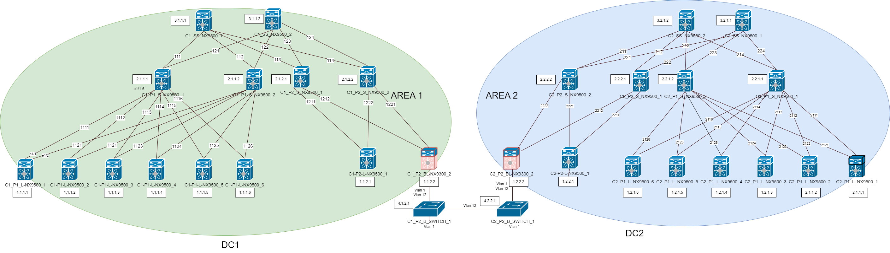

В DC1 area 1  
В DC2 area 2  

Внесём изменения в конфигурацию.

```
feature ospf

router ospf [process-id]
    router-id [x.x.x.x]
    passive-interface default
    auto-cost reference-bandwidth 1000

int e[./.]
    ip router ospf 10 area 0
    no ip ospf passive-interface

int lo[]
   ip router ospf 10 area 0
   no ip ospf passive-interface  
``````

Настроим BFD

```
feature bfd
bfd ipv4 interval 100 min_rx 100 multiplier 3
router ospf [process-id]
bfd
int e[x/y]
no ip redirects

```

## 3. Построение Overlay поверх Underlay

Выберем тип VXLAN:
- для  организации L2/L3 VPN будем использовать EVPN VxLAN 

EVPN VxLAN обеспечивает автоматический поиском VTEP и позволяет изучить MAC и IP адреса.

Для организации связи между клентам и организации доступа в интернет будем использовать модель Symmetric Integrated Routing and Briging. 

|VRF |vlan|  L3 VNI|
|----|----|--|
|VRF OTUS|1111 |101111|

|VRF | vlan |L2  VNI|
|----|----|--|
|VRF OTUS| 55 | 555555|


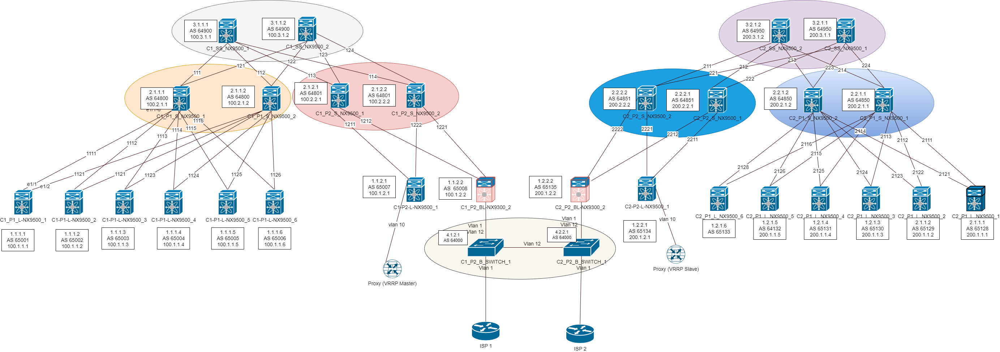

Ниже будут указаны основные настройки для устройств учавствующих в VXLAN взаимодействии.

### LEAF

Рассмотрим как пример необходимые настройки EVPN VxLAN на C2-P2-L-NX9500_1

```
# Включим необходимые функции
nv overlay evpn
feature interface-vlan
feature vn-segment-vlan-based
feature nv overlay

fabric forwarding anycast-gateway-mac 0000.0000.0001
vlan 55
  name VLAN55
  vn-segment 555555

vlan 1111
  name L3_VNI
  vn-segment 101111

vrf context OTUS
  vni 101111
  rd auto
  address-family ipv4 unicast
    route-target both auto
    route-target both auto evpn

interface Vlan55
  no shutdown
  vrf member OTUS
  ip address 55.55.55.1/24
  fabric forwarding mode anycast-gateway

interface Vlan1111
  no shutdown
  vrf member OTUS
  ip forward

interface nve1
  no shutdown
  host-reachability protocol bgp
  source-interface loopback200
  member vni 101111 associate-vrf
  member vni 555555
    suppress-arp
    ingress-replication protocol bgp

interface Ethernet1/7
  switchport access vlan 55

interface loopback200
  ip address 200.1.2.1/32
  ip router ospf 10 area 0.0.0.2

  router bgp 65134
  router-id 1.2.2.1
  timers bgp 3 9
  bestpath as-path multipath-relax
  reconnect-interval 10
  log-neighbor-changes
  address-family l2vpn evpn
    maximum-paths 10
  template peer SPINES
    bfd
    remote-as 64851
    update-source loopback0
    ebgp-multihop 5
    timers 3 9
    address-family l2vpn evpn
      send-community
      send-community extended
      rewrite-evpn-rt-asn
  neighbor 2.2.2.2
    inherit peer SPINES
evpn
  vni 555555 l2
    rd auto
    route-target import auto
    route-target export auto

```


### Border LEAF

Рассмотрим как пример необходимые настройки EVPN VxLAN на C2-P2-BL-NX9500_1
```
nv overlay evpn
feature interface-vlan
feature vn-segment-vlan-based
feature nv overlay

vlan 1111
  name L3_VNI
  vn-segment 101111

vrf context OTUS
  vni 101111
  rd auto
  address-family ipv4 unicast
    route-target both auto
    route-target both auto evpn

interface Vlan1111
  no shutdown
  vrf member OTUS
  ip forward

interface nve1
  no shutdown
  host-reachability protocol bgp
  source-interface loopback100
  member vni 101111 associate-vrf

interface Ethernet1/7
  no switchport
  no shutdown

interface Ethernet1/7.2
  encapsulation dot1q 2
  ip address 172.31.254.4/31
  no ip ospf passive-interface
  ip router ospf 10 area 0.0.0.0
  no shutdown

interface Ethernet1/7.10
  encapsulation dot1q 10
  vrf member OTUS
  ip address 172.31.201.0/31
  no shutdown

interface loopback100
  ip address 200.1.2.2/32
  ip router ospf 10 area 0.0.0.2

router bgp 65135
  router-id 1.2.2.2
  timers bgp 3 9
  bestpath as-path multipath-relax
  reconnect-interval 10
  log-neighbor-changes
  address-family l2vpn evpn
    maximum-paths 10
  template peer SPINES
    bfd
    update-source loopback0
    ebgp-multihop 5
    timers 3 9
    address-family l2vpn evpn
      send-community
      send-community extended
      rewrite-evpn-rt-asn
  neighbor 2.2.2.2
    inherit peer SPINES
    remote-as 64851

```


### Spine/SuperSpine
Рассмотрим как пример необходимые настройки EVPN VxLAN на C2_P2_S_NX9500_2
```
nv overlay evpn
feature bgp

route-map NH_UNCHANGED permit 10
  set ip next-hop unchanged

  router bgp 64851
  router-id 2.2.2.2
  timers bgp 3 9
  reconnect-interval 12
  log-neighbor-changes
  address-family l2vpn evpn
    maximum-paths 10
    retain route-target all
  neighbor 1.2.2.1
    remote-as 65134
    update-source loopback0
    ebgp-multihop 5
    address-family l2vpn evpn
      send-community
      send-community extended
      route-map NH_UNCHANGED out
      rewrite-evpn-rt-asn
  neighbor 1.2.2.2
    remote-as 65135
    update-source loopback0
    ebgp-multihop 5
    address-family l2vpn evpn
      send-community
      send-community extended
      route-map NH_UNCHANGED out
      rewrite-evpn-rt-asn

```

# 4 Оргнизация Multi-pod

Для объединения двух ЦОДов используем метод Multi-pod. Он наиболее понятен и прост в обслуживании. В данном методе Underlay и Overlay общий. 


Для организации общего Underlay соединим AREA 1 и AREA 2 через AREA 0.
Для этого выделен канал от одного ЦОДа до другого.

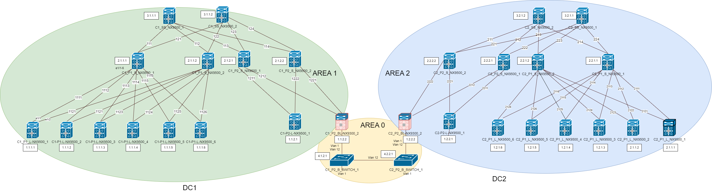

Для организации общего Overlay Control-Plane скорректируем  настройки на Boarder LEAF. Для возможности передавать EVPN маршруты.  
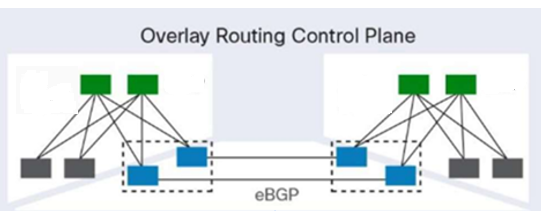

Рассмотрим необходимые настройки на C2_P2_BL-NX9300_2, для использования его как Boarder LEAF для DCI 

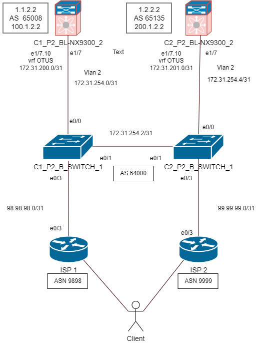

```
vlan 2
  name VLAN2

route-map NH_UNCHANGED permit 10
  set ip next-hop unchanged

interface Ethernet1/7
  no switchport
  no shutdown

interface Ethernet1/7.2
  encapsulation dot1q 2
  ip address 172.31.254.4/31
  no ip ospf passive-interface
  ip router ospf 10 area 0.0.0.0
  no shutdown

  router bgp 65135
  template peer SPINES
    address-family l2vpn evpn
      route-map NH_UNCHANGED out
  neighbor 1.1.2.2
    inherit peer SPINES
    remote-as 65008

```

## 5. Внедрение внешних маршрутов в фабрику

Для доступа во внешнюю сеть и организации DCI выделены отдельные Boarder LEAF. C1_P2_BL-NX9300_2 и C2_P2_BL-NX9300_2 

Анонсирование внешних адресов в фабрику осуществляется type-5 маршрутами.
Каждый клиент находится в своём VRF. Underlay от Overlay отделён VRF. Для того, чтобы анонсировать сеть в VRF нужно для каждого VRF организовать VRF Peering BGP.


Рассмотрим необходимые настройки на C2_P2_BL-NX9300_2 и C2_P2_B_SWITCH_1, ISP2  для внедрение внешних маршрутов в фабрику


### C2_P2_BL-NX9300_2
```

vlan 10
name VLAN10

interface Ethernet1/7
  no switchport
  no shutdown

interface Ethernet1/7.10
  encapsulation dot1q 10
  vrf member OTUS 
  ip address 172.31.201.0/31
  no shutdown

router bgp 65135
vrf OTUS
    router-id 1.2.2.2
    timers bgp 3 9
    address-family ipv4 unicast
      advertise l2vpn evpn
    neighbor 172.31.201.1
      remote-as 64000
      address-family ipv4 unicast
```

### C2_P2_B_SWITCH_1


```
feature bgp
feature interface-vlan


vlan 10
name VLAN10

interface Ethernet1/1
  no switchport

interface Ethernet1/1.10
  encapsulation dot1q 10
  ip address 172.31.201.1/31
  no shutdown

interface Ethernet1/3
  no switchport
  ip address 99.99.99.0/31
  no shutdown

router bgp 64000
  address-family ipv4 unicast
  neighbor 99.99.99.1
    remote-as 9999
    address-family ipv4 unicast
  neighbor 172.31.201.0
    remote-as 65135
    address-family ipv4 unicast

```
### ISP2

```
interface Loopback0
 ip address 10.10.10.10 255.255.255.255

interface Ethernet0/3
 ip address 99.99.99.1 255.255.255.254
!
router bgp 9999
 bgp log-neighbor-changes
 network 10.10.10.10 mask 255.255.255.255
 neighbor 99.99.99.0 remote-as 64000
```

# 6.  Организация работы VRRP поверх VXLAN. 

Настройка VRRP на Proxy
```
int e0/0
ip address 55.55.55.2 255.255.255.0
vrrp 10 ip 55.55.55.254
vrrp 10 priority 110


int e0/0
ip address 55.55.55.10 255.255.255.0
vrrp 10 priority 120
vrrp 10 ip 55.55.55.254
```

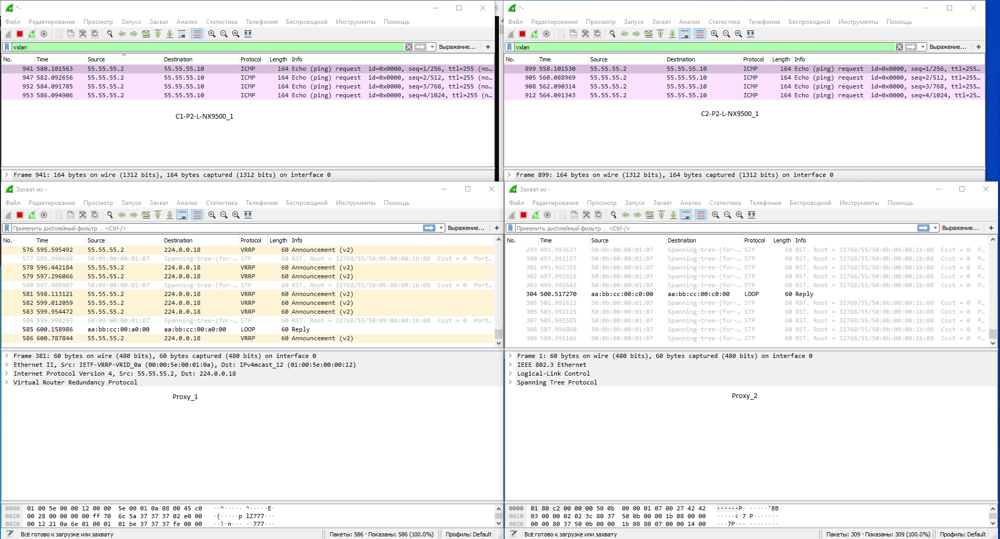

К сожелению, с версией Cisco Nexus version 9.3(10) не удалось настроить VRRP так как не проходили пакеты на Multicast адрес 224.0.0.18. Возможно из-за того, что до этого настраивал arp suppression.
На версии 9.3.8 работает.

## 7. Проверка работоспособности
Так как у нас сервера находcя за LEAF во втором POD-е. Для проверки будет достаточно части сети в обоих ЦОДах

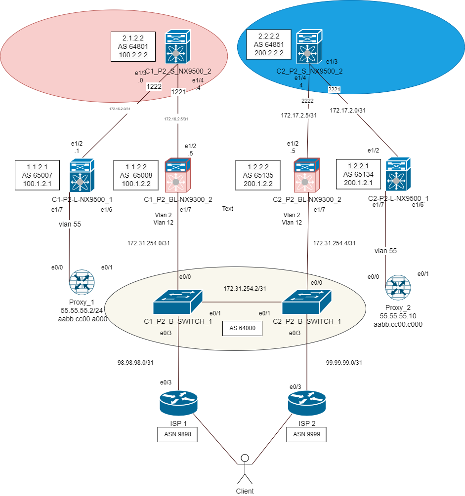

### Underlay
Проверим, что мы получили на LEAF все маршруты NVE1 интерфейсов в Underlay. Проверим доступность.

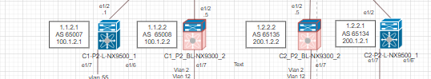
Проверять будет с NVE интерфейса на C1_P2_L_NX9500_1

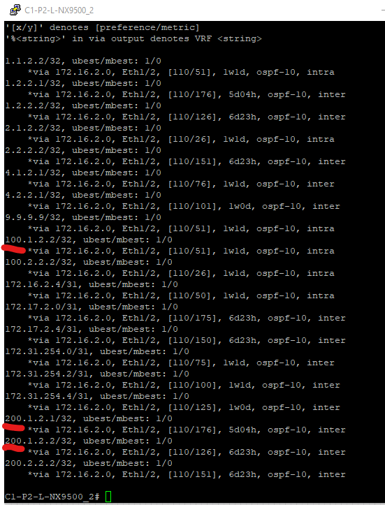

Адреса доступны из обоих ЦОДов.  
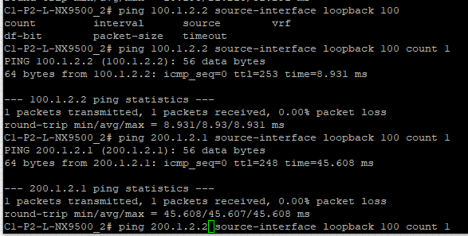

### Overlay l2 evpn

Проверим, что в таблице MAC адресов есть информация о 2 хостах VRF OTUS vlan 55. Они доступны через NVE1 интерфейс

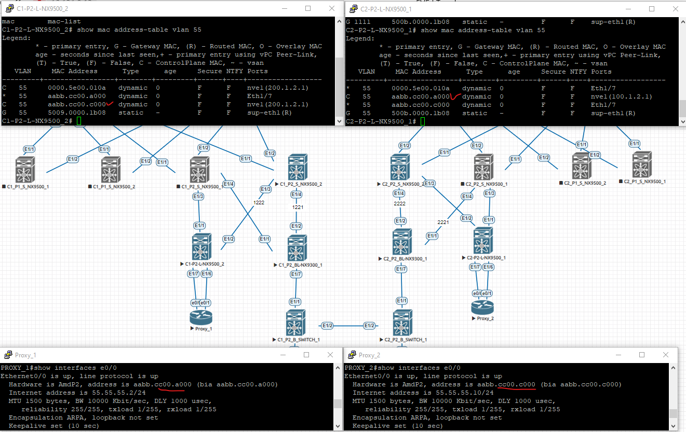

### Внедрение внешних маршрутов в фабрику(Type-5 маршрут) 

После анонсирования ISP1 адреса 8.8.8.8. Получили BGP update с маршрутом type 5, который был добавлен в VRF OTUS.
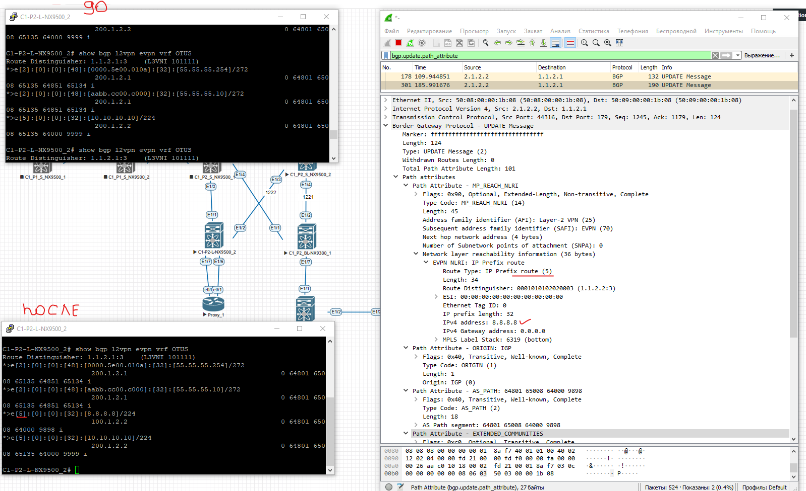

Проверим доступность 8.8.8.8 с Proxy_1

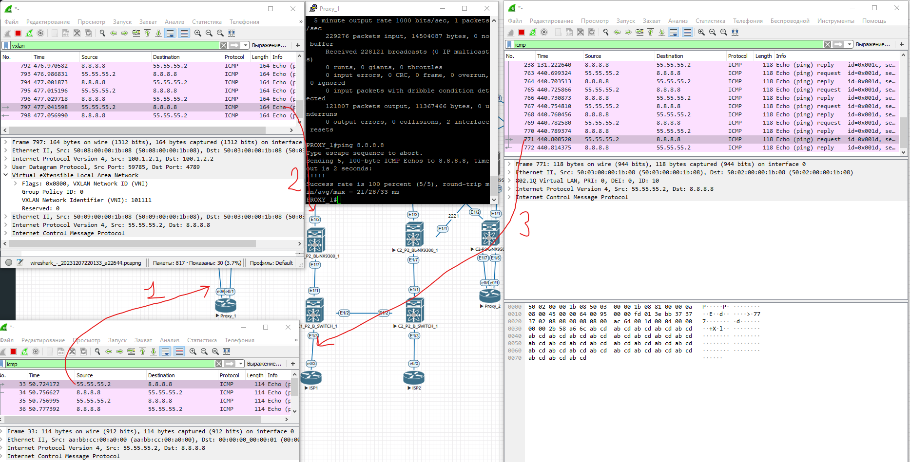
На данном скрине мы видим: 
1) ICMP трафик к 8.8.8./8
2) Инкапсуляция ICMP в VXLAN и 
3) Деинкапсуляция ICMP из VXLAN

Так же отметим, что трафик от клиента Передаётся в L3 VNI.  VNI=101111 используяь модель Symmetric Integrated Routing and Briging.

Проверка доступности 8.8.8.8 с хостов подключённых в фабрику.
Клиенская сеть ограничена от Underlay сети VRF OTUS. Проверим, чтобы маршруты до 8.8.8.8 были только в VRF OTUS. Адрес доступен.

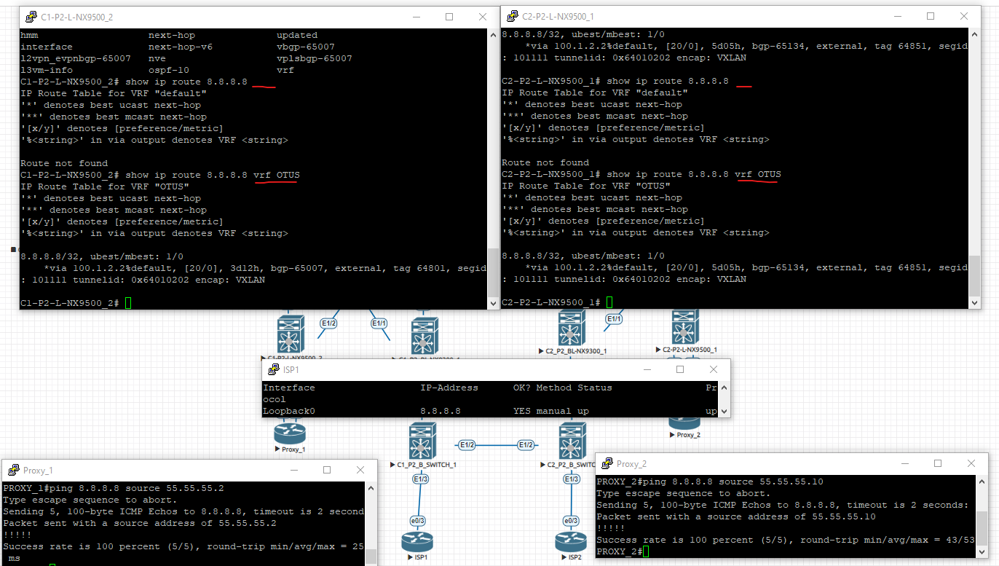

