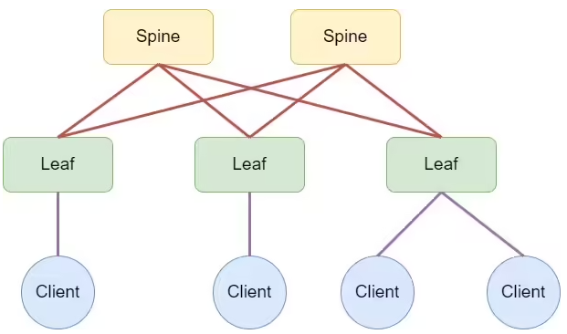
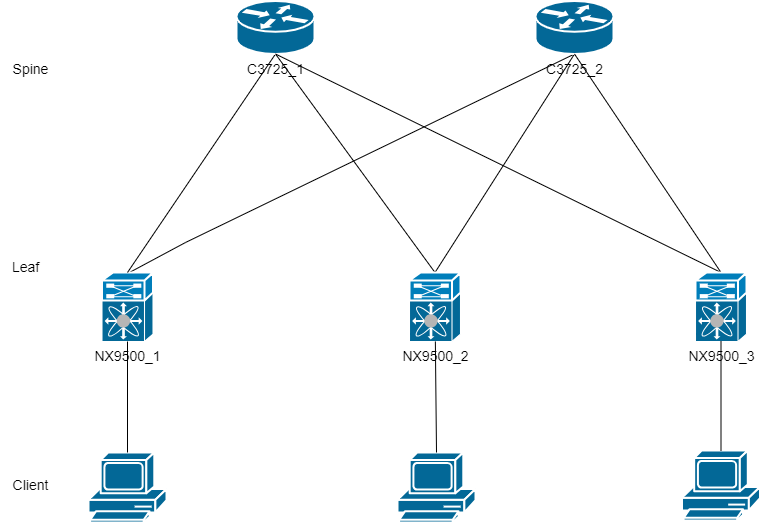
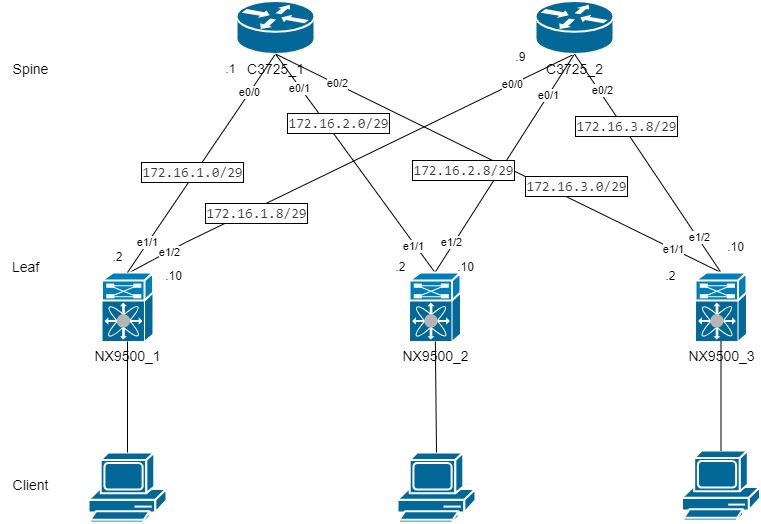
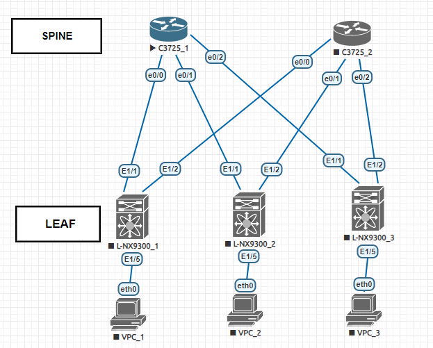

# DesignNetworkDataCenter

Лабораторная работа 1.  
Цель:
- Собрать схему CLOS;
- Распределить адресное пространство;
- План работы, адресное пространство, схема сети, настройки - зафиксировать в документации



План работ.
1. Нарисуем схему сети.
2. Выберем оборудование, распределим адресное пространство, укажем ip-адреса интерфейсов. 
3. Подготовим виртуальных стенд.
4. Настроить базовую конфигурацию на оборудовании.
5. Настроить интерфейсы на оборудовании согласно таблице адресов.


## 1. Сбор схемы CLOS





Резервирование адресов.
|Hostname|network     |velue Spine|
|--------|------------|-----------|
|L-NX9300_1|172.16.1.0/24|6|
|L-NX9300_2|172.16.2.0/24|6|
|L-NX9300_3|172.16.3.0/24|6|
## 2. Выбор оборудования
SPINE будем использовать C3725 для экономии ресурсов. Т.к для SPINE  требуется не функциональное, но оборудование быстро обрабатывающее трафик с портами большой пропускной способности. В лабораторной работе большая пропускная способность не требуется.  
LEAF используем Cisco Nexus 9300 позволяет работать с VXLAN.

Таблица адресов  
|Уровень| Оборудование | Интерфейс  | ip-адрес | Маска |  Маршрут по умолчанию |
|-------|--------------|------------|----------|-------|-----------------------|
|Leaf|NX9300_1|e1/1|172.16.1.2|255.255.255.252|N/A|
|    |        |e1/2|172.16.1.10|255.255.255.252|N/A|
|Leaf|NX9300_2|e1/1|172.16.2.2|255.255.255.252|N/A|
|    |        |e1/2|172.16.2.10|255.255.255.252|N/A|
|Leaf|NX9300_3|e1/1|172.16.3.2|255.255.255.252|N/A|
|    |        |e1/2|172.16.3.10|255.255.255.252|N/A|
|Spine|C3725_1|e0/0|172.16.1.1|255.255.255.252|N/A|
|     |       |e0/1|172.16.2.1|255.255.255.252|N/A|
|     |       |e0/2|172.16.3.1|255.255.255.252|N/A|
|Spine|C3725_2|e0/0|172.16.1.9|255.255.255.252|N/A|
|     |       |e0/1|172.16.2.9|255.255.255.252|N/A|
|     |       |e0/2|172.16.3.9|255.255.255.252|N/A|





## 3. Подготовим виртуальный стенд в EVE-NG.

Загрузим необходимые образы ОС в EVE-NG и подключим оборудование согласно выбранной схеме.




### 4. Конфигурируем базовые настройки на оборудовании
#### Cisco Nexus 9300 

Данне команды нужны для того, чтобы при запуске не слетала прошивка.

```
conf t
boot nxos bootflash:/nxos.9.3.7.bin sup-1
end
copy run start
``` 


```
hostname [hostname]
no ip domain-lookup
username admin password [password]
```


### Cisco C3275


```
enable
  conf terminal
  hostname [hostname]
  no ip domain-lookup
  enable password class
  
  line console 0
    password class
    login
  
    line vty 0 4
    password class
    login
  
  service password-encryption
  
  banner login "anyone unauthorized access is prohibited."
  
  
  
 copy running-config startup-config
 ```


## 5. Настройка интерфесов на оборудовании.

### Cisco Nexus 9300 

Настроим на интерфейсах ip адреса которые соответствуют таблице

```
interface [EthernetX/X]
no switchport
ip address [ip] [mask]
no shutdown
```  


### Cisco C3275

```
interface [EthernetX/X]
 ip address [ip] [mask]
 no shutdown

```
