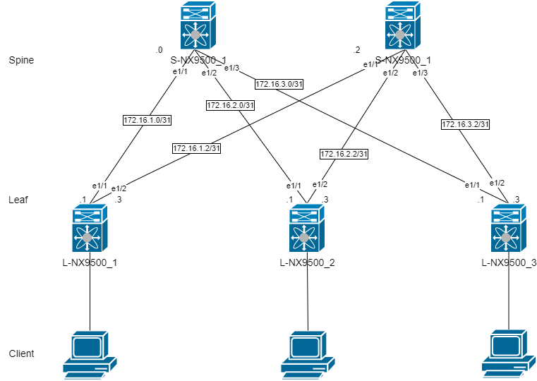
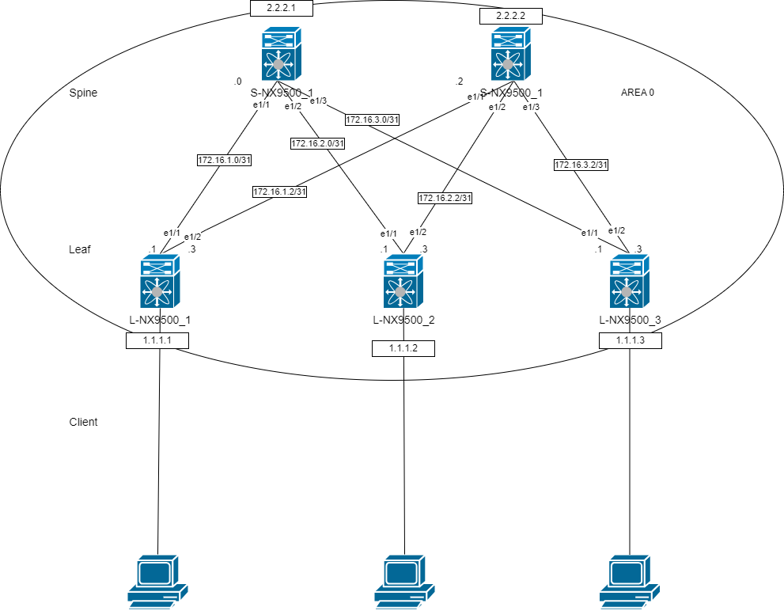
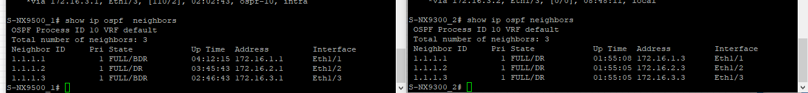
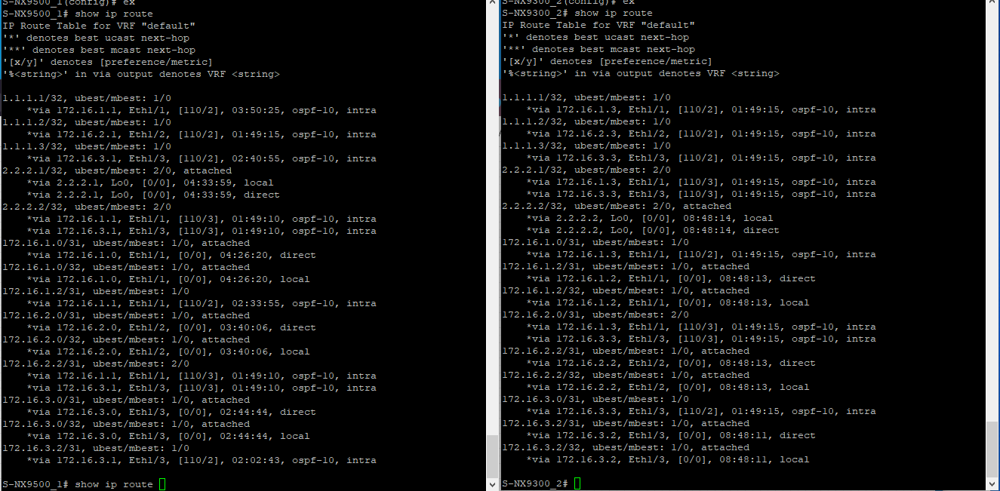
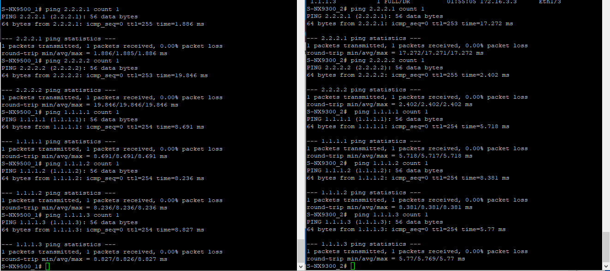

# Лабораторная работ 2.


1) Адресное пространство, настройку оборудования используем из первой лабы. Предварительно клонируем проект лабораторной работы 1. 
2) Корректировка схемы
3) Внесём изменения на роутерах
4) Проверить работоспособность.

## 1. Корректировка адресного пространоства.

Резервирование адресов.
|Hostname|network     |velue Spine|
|--------|------------|-----------|
|L-NX9300_1|172.16.1.0/24|6|
|L-NX9300_2|172.16.2.0/24|6|
|L-NX9300_3|172.16.3.0/24|6|

Скорректируем таблицу адресов, с учётом замечаний и добавим L0 интерфейсы.

Таблица адресов  
|Уровень| Оборудование | Интерфейс  | ip-адрес | Маска |  Маршрут по умолчанию |
|-------|--------------|------------|----------|-------|-----------------------|
|Leaf|L-NX9300_1 |e1/1|172.16.1.1|255.255.255.254|N/A|
|    |           |e1/2|172.16.1.3|255.255.255.254|N/A|
|    |           |lo  |1.1.1.1   |255.255.255.255|N/A|
|Leaf|L-NX9300_2 |e1/1|172.16.2.1|255.255.255.254|N/A|
|    |           |e1/2|172.16.2.3|255.255.255.254|N/A|
|    |           |lo  |1.1.1.2   |255.255.255.255|N/A|
|Leaf|L-NX9300_3 |e1/1|172.16.3.1|255.255.255.254|N/A|
|    |           |e1/2|172.16.3.3|255.255.255.254|N/A|
|    |           |lo  |1.1.1.3   |255.255.255.255|N/A|
|Spine|S-NX9300_1|e1/1|172.16.1.0|255.255.255.254|N/A|
|     |          |e1/2|172.16.2.0|255.255.255.254|N/A|
|     |          |e1/3|172.16.3.0|255.255.255.254|N/A|
|     |          |lo  |2.2.2.1   |255.255.255.255|N/A|
|Spine|S-NX9300_2|e1/1|172.16.1.2|255.255.255.254|N/A|
|     |          |e1/2|172.16.2.2|255.255.255.254|N/A|
|     |          |e1/3|172.16.3.2|255.255.255.254|N/A|  
|     |          |lo  |2.2.2.2   |255.255.255.255|N/A|



## 2 Корректировка схемы

 - Распределить сеть по зонам.
 - укажем Router ID
 - Lo интерфейсы

Все роутеры в одной зоне.

n - нумерация роутера  
Spine ID 2.2.2.[n]  
Leaf ID 1.1.1.[n]  



## 3 Внесём изменения на роутерах

Включим функицю ospf  
```
feature ospf

router ospf [process-id]
    router-id [x.x.x.y]
    passive-interface default
    auto-cost reference-bandwidth 1000

int e[x/y]
    ip router ospf 10 area 0
    no ip ospf passive-interface
    ip ospf authentication message-digest
    ip ospf message-digest-key 1 md5 [password]
``````
Настроим BFD

```
feature bfd
bfd ipv4 interval 100 min_rx 100 multiplier 3
router ospf [process-id]
bfd
int e[x/y]
no ip redirects

```

4) Проверить работоспособность.

Со всех роутеров должны быть доступны Loopback интерфейсы

```
show ip route
```





Все Loopback интерфейсы доступны с Spine

