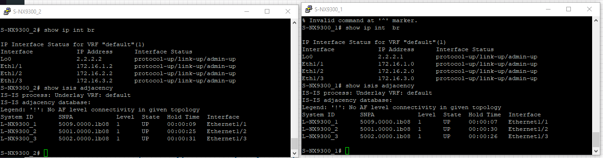
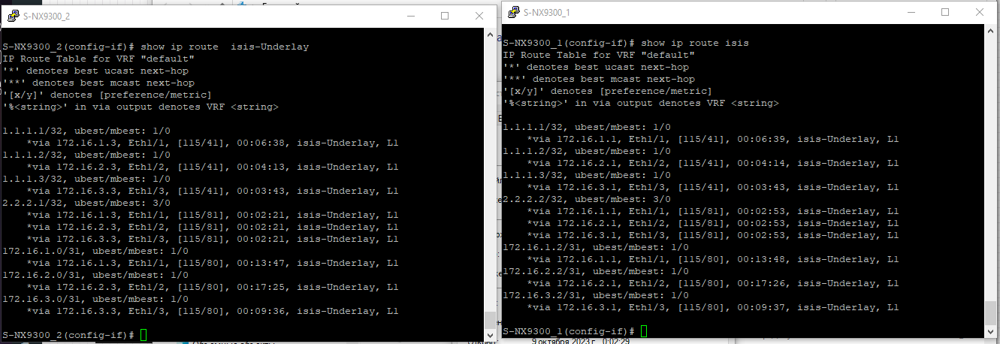
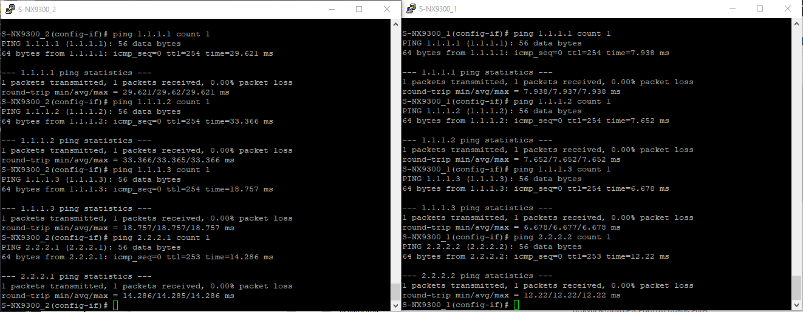

# Лабораторная работ 3.
## Underlay. IS-IS.

Цель.
- Настроить IS-IS в Underlay сети, для IP связанности между всеми устройствами NXOS
- План работы, адресное пространство, схема сети, настройки - зафиксированы в документации


План работ:
1) Адресное пространство, настройку оборудования используем из второй лабораторной. Предварительно клонируем проект лабораторной работы 2. 
2) Внесём изменения в схему: 
 - Если это необходимо добавить зоны.
 - укажем Router ID
3) Включим ISIS, сконфигурируем оборудование.
4) Проверка работоспособности.

 
## 1. Распределение ip адресов.

Адресация из 2 лабораторной

Таблица адресов  
|Уровень| Оборудование | Интерфейс  | ip-адрес | Маска |  Маршрут по умолчанию |
|-------|--------------|------------|----------|-------|-----------------------|
|Leaf|L-NX9300_1 |e1/1|172.16.1.1|255.255.255.254|N/A|
|    |           |e1/2|172.16.1.3|255.255.255.254|N/A|
|    |           |lo  |1.1.1.1   |255.255.255.255|N/A|
|Leaf|L-NX9300_2 |e1/1|172.16.2.1|255.255.255.254|N/A|
|    |           |e1/2|172.16.2.3|255.255.255.254|N/A|
|    |           |lo  |1.1.1.2   |255.255.255.255|N/A|
|Leaf|L-NX9300_3 |e1/1|172.16.3.1|255.255.255.254|N/A|
|    |           |e1/2|172.16.3.3|255.255.255.254|N/A|
|    |           |lo  |1.1.1.3   |255.255.255.255|N/A|
|Spine|S-NX9300_1|e1/1|172.16.1.0|255.255.255.254|N/A|
|     |          |e1/2|172.16.2.0|255.255.255.254|N/A|
|     |          |e1/3|172.16.3.0|255.255.255.254|N/A|
|     |          |lo  |2.2.2.1   |255.255.255.255|N/A|
|Spine|S-NX9300_2|e1/1|172.16.1.2|255.255.255.254|N/A|
|     |          |e1/2|172.16.2.2|255.255.255.254|N/A|
|     |          |e1/3|172.16.3.2|255.255.255.254|N/A|  
|     |          |lo  |2.2.2.2   |255.255.255.255|N/A|

## 2. Внесём изменения в схему

AFI 49  
Номер зоны 0010  
SysID - адрес loopback 2.2.2.1 - SysID:0002.0002.0201

| Hostname | NET                     |
|----------|-------------------------|
|S-NX9500_1|49.0010.0002.0002.0201.00|
|S-NX9500_2|49.0010.0002.0002.0202.00|
|L-NX9500_1|49.0010.0001.0001.0101.00|
|L-NX9500_2|49.0010.0001.0001.0102.00|
|L-NX9500_3|49.0010.0001.0001.0103.00|


## 3 Включим ISIS, сконфигурируем оборудование.

Приведём дефолтные настройки

```
feature isis

router isis Underlay
net 49.0010[xxxx.xxxx.xxxx].00
address-family ipv4 unicast
log-adjacency-changes
is-type level-1


interface e1/[x]
ip router isis Underlay
```

Настроим BFD

```
feature bfd
bfd ipv4 interval 100 min_rx 100 multiplier 3
router isis [process-id]
bfd
int e[x/y]
no ip redirects


## 4 Проверка работоспособности.

Проверим установилось ли соседство у Spine с Leaf

```
show isis adjacency
```



Посмотрим маршруты полученные по процессом isis-Underlay

```
show ip route  isis-Underlay
```


Проверим доступность доступность хостом с помощью утилиты ping 




