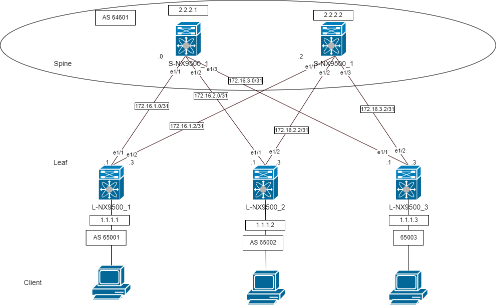
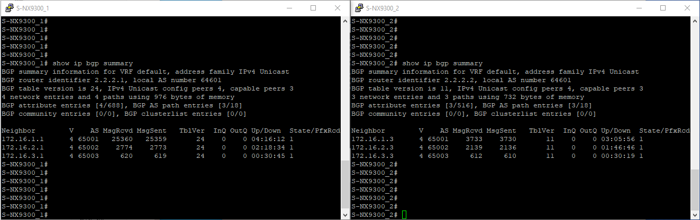
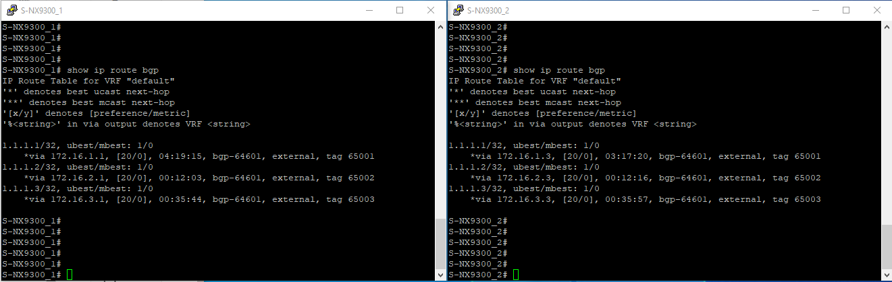
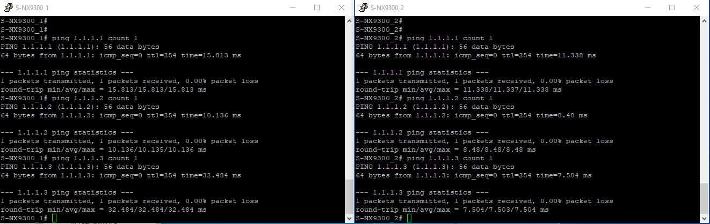

# Лабораторная работ 4.
## Построение Underlay сети(eBGP) .

Цель.
- Настроить eBGP в Underlay сети, для IP связанности между всеми устройствами NXOS
- План работы, адресное пространство, схема сети, настройки - зафиксированы в документации


План работ:
1) Адресное пространство, настройку оборудования используем из второй лабораторной. Предварительно клонируем проект лабораторной работы 2. 
2) Внесём изменения в схему: 
3) Сконфигурируем оборудование.
4) Проверка работоспособности.

 
## 1. Распределение ip адресов.

Адресация из 2 лабораторной

Таблица адресов  
|Уровень| Оборудование | Интерфейс  | ip-адрес | Маска |  Маршрут по умолчанию |
|-------|--------------|------------|----------|-------|-----------------------|
|Leaf|L-NX9500_1 |e1/1|172.16.1.1|255.255.255.254|N/A|
|    |           |e1/2|172.16.1.3|255.255.255.254|N/A|
|    |           |lo  |1.1.1.1   |255.255.255.255|N/A|
|Leaf|L-NX9500_2 |e1/1|172.16.2.1|255.255.255.254|N/A|
|    |           |e1/2|172.16.2.3|255.255.255.254|N/A|
|    |           |lo  |1.1.1.2   |255.255.255.255|N/A|
|Leaf|L-NX9500_3 |e1/1|172.16.3.1|255.255.255.254|N/A|
|    |           |e1/2|172.16.3.3|255.255.255.254|N/A|
|    |           |lo  |1.1.1.3   |255.255.255.255|N/A|
|Spine|S-NX9500_1|e1/1|172.16.1.0|255.255.255.254|N/A|
|     |          |e1/2|172.16.2.0|255.255.255.254|N/A|
|     |          |e1/3|172.16.3.0|255.255.255.254|N/A|
|     |          |lo  |2.2.2.1   |255.255.255.255|N/A|
|Spine|S-NX9500_2|e1/1|172.16.1.2|255.255.255.254|N/A|
|     |          |e1/2|172.16.2.2|255.255.255.254|N/A|
|     |          |e1/3|172.16.3.2|255.255.255.254|N/A|  
|     |          |lo  |2.2.2.2   |255.255.255.255|N/A|

## 2. Внесём изменения в схему


У Spine Одинаковые ASN, чтобы избежать Valley Routing.


| Hostname | ASN   |router-id        |
|----------|-------|-----------------|
|S-NX9500_1|64601  |2.2.2.1          |
|S-NX9500_2|64601  |2.2.2.2          |
|L-NX9500_1|65001  |1.1.1.1          |
|L-NX9500_2|65002  |1.1.1.2          |
|L-NX9500_3|65003  |1.1.1.3          |



## 3 Сконфигурируем оборудование.

Приведём дефолтные настройки

Leaf

```
!

ip prefix-list network seq 5 permit [A.B.C.D/LEN]
route-map REDIRECT_DIRECT permit 10
  match ip address prefix-list network

router bgp [LOCAL_ASN]
  router-id [ROUTER_ID]
  reconnect-interval 12
  log-neighbor-changes
  address-family ipv4 unicast
    redistribute direct route-map REDIRECT_DIRECT
    maximum-paths 10
  template peer SPINES
    bfd
    remote-as [SPINES_ASN]
    timers 3 9
    address-family ipv4 unicast
  neighbor [NEIGHBOR_IP_ADDRESS]
    inherit peer SPINES
  neighbor [NEIGHBOR_IP_ADDRESS]
    inherit peer SPINES	!
```

Spine
```
!

route-map RM_Leaves_BGP permit 10
  match as-number [LEAVES_ASN_RANGE]
!
ip prefix-list network seq 5 permit [A.B.C.D/LEN]
route-map REDIRECT_DIRECT permit 10
  match ip address prefix-list network
!
router bgp [LOCAL_ASN]
  router-id [ROUTER_ID]
  reconnect-interval 12
  log-neighbor-changes
  address-family ipv4 unicast
    redistribute direct route-map REDIRECT_DIRECT
    maximum-paths 10
  neighbor [NEIGHBORS_PREFIX] remote-as route-map RM_Leaves_BGP
    bfd
    address-family ipv4 unicast
```
Настроим BFD

```
feature bfd
bfd ipv4 interval 100 min_rx 100 multiplier 3
int e[x/y]
no ip redirects

```

## 4 Проверка работоспособности.

Проверим установилось ли соседство

```
show ip bgp summary
```



Мы анонсировали loopback интерфейсы. На SPINE роутерах есть маршруты только LEAF роутеров. Маршруты с SPINE отбрасываются так как получается петля в as-path.

```
show ip route bgp
```




Проверим доступность loopback с SPINE
 


