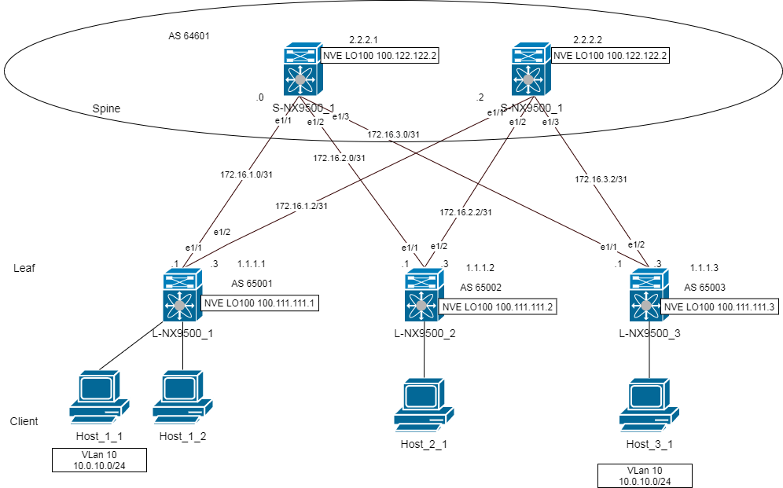
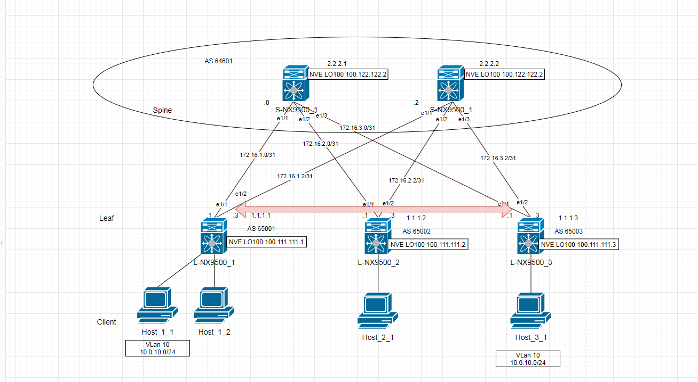
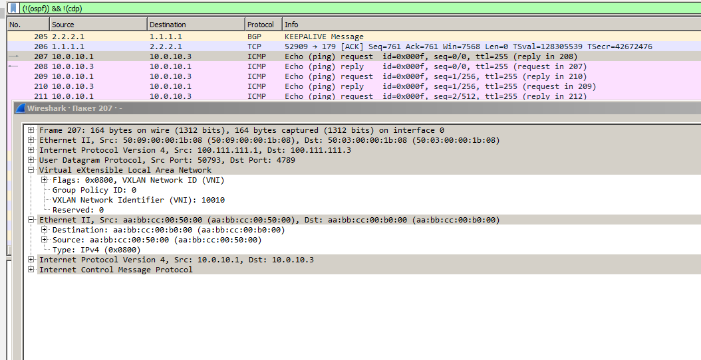
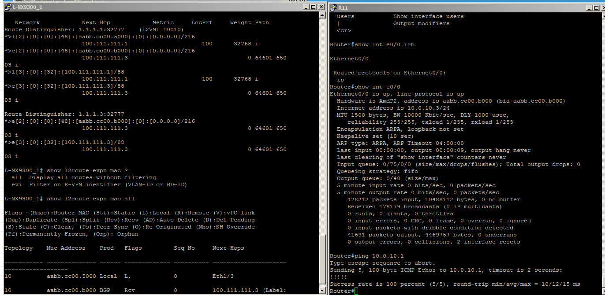

# Лабораторная работ 4.
## Построение Overlay на основе VxLAN EVPN для L2 связанности между клиентами .

Цель.
- Настроить BGP peering между Leaf и Spine в AF l2vpn evpn
- Настроить связанность между клиентами в первой зоне
- План работы, адресное пространство, схема сети, настройки - зафиксированы в документации


План работ:
1) Адресное пространство, настройку оборудования используем из четвёртой лабораторной.
2) Внесём изменения в схему.
3) Сконфигурируем оборудование.
4) Проверка работоспособности.

 
## 1. Распределение ip адресов.

Адресация из 2 лабораторной

Таблица адресов  
|Уровень| Оборудование | Интерфейс  | ip-адрес | Маска |  Маршрут по умолчанию |
|-------|--------------|------------|----------|-------|-----------------------|
|Leaf|L-NX9500_1 |e1/1|172.16.1.1|255.255.255.254|N/A|
|    |           |e1/2|172.16.1.3|255.255.255.254|N/A|
|    |           |lo  |1.1.1.1   |255.255.255.255|N/A|
|Leaf|L-NX9500_2 |e1/1|172.16.2.1|255.255.255.254|N/A|
|    |           |e1/2|172.16.2.3|255.255.255.254|N/A|
|    |           |lo  |1.1.1.2   |255.255.255.255|N/A|
|Leaf|L-NX9500_3 |e1/1|172.16.3.1|255.255.255.254|N/A|
|    |           |e1/2|172.16.3.3|255.255.255.254|N/A|
|    |           |lo  |1.1.1.3   |255.255.255.255|N/A|
|Spine|S-NX9500_1|e1/1|172.16.1.0|255.255.255.254|N/A|
|     |          |e1/2|172.16.2.0|255.255.255.254|N/A|
|     |          |e1/3|172.16.3.0|255.255.255.254|N/A|
|     |          |lo  |2.2.2.1   |255.255.255.255|N/A|
|Spine|S-NX9500_2|e1/1|172.16.1.2|255.255.255.254|N/A|
|     |          |e1/2|172.16.2.2|255.255.255.254|N/A|
|     |          |e1/3|172.16.3.2|255.255.255.254|N/A|  
|     |          |lo  |2.2.2.2   |255.255.255.255|N/A|

## 2. Внесём изменения в схему

Настроить loopback интерфесы для NVE интерфейсов.


| Hostname | ASN   |router-id        |  LO NVE       |
|----------|-------|-----------------|---------------|
|S-NX9500_1|64601  |2.2.2.1          |100.122.122.1  |
|S-NX9500_2|64601  |2.2.2.2          |100.122.122.2  |
|L-NX9500_1|65001  |1.1.1.1          |100.111.111.1  |
|L-NX9500_2|65002  |1.1.1.2          |100.111.111.2  |
|L-NX9500_3|65003  |1.1.1.3          |100.111.111.3  |





## 3 Сконфигурируем оборудование.

Кратко, что нужно настроить на LEAF(VTEP):

1) Включить VXLAN и EVPN
2) Настроим VLAN и VXLAN VNI  
+ Приявзка vlan к vni
+ Укажем принцип формирования RD для уникальности MAC и параметрты RT для импорта/экспорта MAC VRF
3) Создадим NVE интерфейса для инкапсуляции VLAN в VXLAN
+ Укажем какой протокол будет использовать для анонсов MAC адресов.
+ Указать протокол обмена BUM трафиком
4) Настром BGP на VTEP
+ Сконфигурируем address family l2 vpn evpn.
+ укажем возможность раширенной отправки comunity и функцию перезаписи RT. 


Настройка на LEAF

```
## Включить VXLAN и EVPN
feature vn-segment-vlan-based
feature nv overlay
nv overlay evpn
!

router bgp [number-asn]
  router-id [x.y.z.w]
  timers bgp 3 9
  bestpath as-path multipath-relax
  reconnect-interval 10
  log-neighbor-changes
  address-family l2vpn evpn
    maximum-paths 10
  template peer SPINES
    bfd
    remote-as [number-AS]
    update-source loopback [number]
    ebgp-multihop 5
    timers 3 9
    address-family l2vpn evpn
      send-community
      send-community extended
      rewrite-evpn-rt-asn
  neighbor [adress]
    inherit peer SPINES
  neighbor [adress]
    inherit peer SPINES


# Mapping VLAN to VXLAN VNI

vlan [number_vlan]
name [name_bvan]
vn-segment [number-vni]
!
evpn
vni [number-vni]
rd auto
route-target import auto
route-target export auto

## Создание и конфигурация NVE интерфейса и анонс VNI
interface nve1
no shutdown
host-reachability protocol bgp
source-interface loopback100
member vni 10010
ingress-replication protocol bgp
```

SPINE 

Кратко, что нужно настроить на SPINE:

1) Включить возможнолсть EVPN в качестве contral plane для VXLAN
2) Настройка BGP для EVPN на SPENE
+ Настроим route map для сохранения next hop
+ Сконфигурируем address family l2 vpn evpn.
+ Укажем что нужно сохранять/не удалять RT для l2vpn, про который не знает SPINE
+ При автоматическом назначение RT, перезаписывать RT ASN


```
nv overlay evpn
!
route-map NH_UNCHANGED permit 10
set ip next-hop unchanged
!
router bgp [number-asn]
  router-id [x.y.z.w]
  timers bgp 3 9
  reconnect-interval 12
  log-neighbor-changes
  address-family l2vpn evpn
    maximum-paths 10
    retain route-target all
  neighbor [adress]
    remote-as 65001
    update-source loopback0
    ebgp-multihop 5
    address-family l2vpn evpn
      send-community
      send-community extended
      route-map NH_UNCHANGED out
      rewrite-evpn-rt-asn
  neighbor [adress]
    remote-as 65003
    update-source loopback0
    ebgp-multihop 5
    address-family l2vpn evpn
      send-community
      send-community extended
      route-map NH_UNCHANGED out
      rewrite-evpn-rt-asn

```

## 4 Проверка работоспособности.

Пустим пинг с HOST_1_3=>HOST_3_1
Поднялся туннель Между VTEP





Проверим l2 маршрутнюую инормацию

```
show l2route evpn mac all
```





