# Лабораторная работ 4.
## Настройка маршрутизации в рамках Overlay между клиентам.

Цель.
Настроить маршрутизацию в рамках Overlay между клиентами
 - Настроите каждого клиента в своем VNI
 - Настроите маршрутизацию между клиентами


План работ:
1) Адресное пространство, настройка оборудования. 
2) Внесём изменения в схему.
3) Сконфигурируем оборудование.
4) Проверка работоспособности.

 
## 1. Распределение ip адресов.

Таблица адресов  
|Уровень| Оборудование | Интерфейс  | ip-адрес | Маска |  Маршрут по умолчанию |
|-------|--------------|------------|----------|-------|-----------------------|
|Leaf|L-NX9500_1 |e1/1    |172.16.1.1|255.255.255.254|N/A|
|    |           |e1/2    |172.16.1.3|255.255.255.254|N/A|
|    |           |lo      |1.1.1.1   |255.255.255.255|N/A|
|    |           |lo 100  |100.111.111.1   |255.255.255.255|N/A|
|Leaf|L-NX9500_2 |e1/1    |172.16.2.1|255.255.255.254|N/A|
|    |           |e1/2    |172.16.2.3|255.255.255.254|N/A|
|    |           |lo      |1.1.1.2   |255.255.255.255|N/A|
|    |           |lo 100  |100.111.111.1   |255.255.255.255|N/A|
|Leaf|L-NX9500_3 |e1/1    |172.16.3.1|255.255.255.254|N/A|
|    |           |e1/2    |172.16.3.3|255.255.255.254|N/A|
|    |           |lo      |1.1.1.3   |255.255.255.255|N/A|
|Spine|S-NX9500_1|e1/1    |172.16.1.0|255.255.255.254|N/A|
|     |          |e1/2    |172.16.2.0|255.255.255.254|N/A|
|     |          |e1/3    |172.16.3.0|255.255.255.254|N/A|
|     |          |lo      |2.2.2.1   |255.255.255.255|N/A|
|    |           |lo 100  |100.122.122.1   |255.255.255.255|N/A|
|Spine|S-NX9500_2|e1/1    |172.16.1.2|255.255.255.254|N/A|
|     |          |e1/2    |172.16.2.2|255.255.255.254|N/A|
|     |          |e1/3    |172.16.3.2|255.255.255.254|N/A|  
|     |          |lo      |2.2.2.2   |255.255.255.255|N/A|
|    |           |lo 100  |100.122.122.2   |255.255.255.255|N/A|


| Hostname | ASN   |router-id        |
|----------|-------|-----------------|
|S-NX9500_1|64601  |2.2.2.1          |
|S-NX9500_2|64601  |2.2.2.2          |
|L-NX9500_1|65001  |1.1.1.1          |
|L-NX9500_2|65002  |1.1.1.2          |
|L-NX9500_3|65003  |1.1.1.3          |  


## 2. Внесём изменения в схему

Подключим клиентов к LEAF c разными VNI и изолируем от Underlay клиентов используя VRF.


|VLAN   |   Network   |    Hostname  |VRF   |
|-------|-------------|--------------|------|
|10     | 10.0.10.4/24|L-NX9500_1    |OTUS  |
|11     | 10.0.11.1/24|L-NX9500_3    |OTUS  |
|11     | 10.0.11.2/24|L-NX9500_1    |OTUS  |

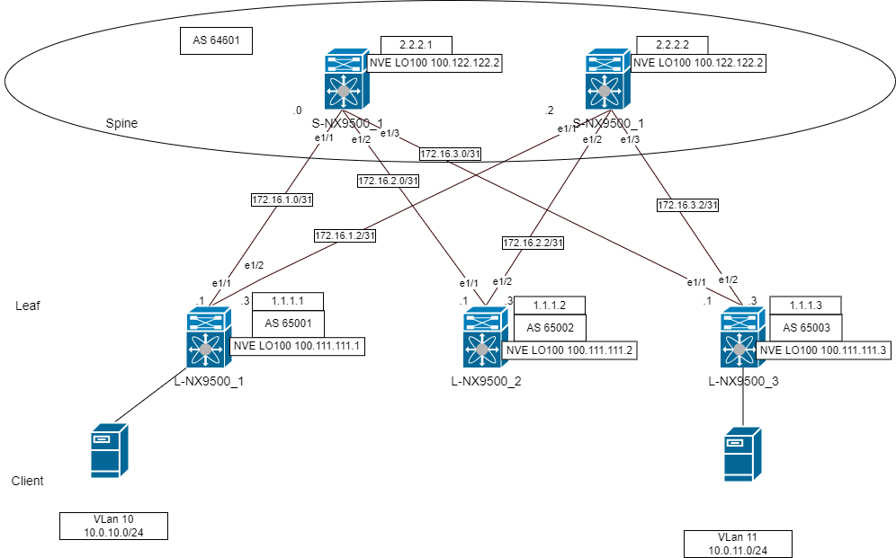

## 3. Сконфигурируем оборудование.

Для организации связи между клентам будем использовать модель Symmetric Integrated Routing and Briging

Сократим конфигурацию добавив tamplates 

на примере 64601

```
router bgp 64601
  router-id 2.2.2.1
  timers bgp 3 9
  reconnect-interval 12
  log-neighbor-changes
  address-family l2vpn evpn
    maximum-paths 10
    retain route-target all
  template peer LEAF
    update-source loopback0
    ebgp-multihop 5
    address-family l2vpn evpn
      send-community
      send-community extended
      route-map NH_UNCHANGED out
      rewrite-evpn-rt-asn
  neighbor 1.1.1.1
    inherit peer LEAF
    remote-as 65001
  neighbor 1.1.1.2
    inherit peer LEAF
    remote-as 65001
  neighbor 1.1.1.3
    inherit peer LEAF
    remote-as 65003
```


Настроим общий L3VNI через который будет организована связь между клиентами VLAN 10 и VLAN 11.

Создадим vlan 1111 и SVI. 

```
VLAN 1111
  name L3_VNI
  vn-segment 101111
```
ip forward - позволет передавать пакет не используя ip адреса.
```
Interface Vlan 1111
  no shutdown
  vrf member OTUS
  ip forward 
```
Ассоциируем vlan 1111 с vni 101111
```
interface nve1
member vni 101111 associate-vrf
```

Настройка VRF и привязка VNI к VRF OTUS. Разрешаем экспортировать и импортировать маршруты.

```
vrf context OTUS
vni 101111
rd auto
address-family ipv4 unicast
  route-target both auto
  route-target both auto evpn
```

Укажем виртуальный мак для для общего SVI

```
fabric forwarding anycast-gateway-mac 0000.0000.0001
```
```
interface Vlan10
no shutdown
vrf member OTUS
ip address 10.0.10.1/24
fabric forwarding mode anycast-gateway
```

```
interface Vlan11
no shutdown
vrf member OTUS
ip address 10.0.11.1/24
fabric forwarding mode anycast-gateway
```

Для настройки ARP suppresion нужно настраивать TCAM
```
interface nve 1
member vni 100010
suppress-arp
member vni 100011
suppress-arp
```
suppress-arp ERROR: Please configure TCAM region for Ingress ARP-Ether ACL before configuring ARP supression.``


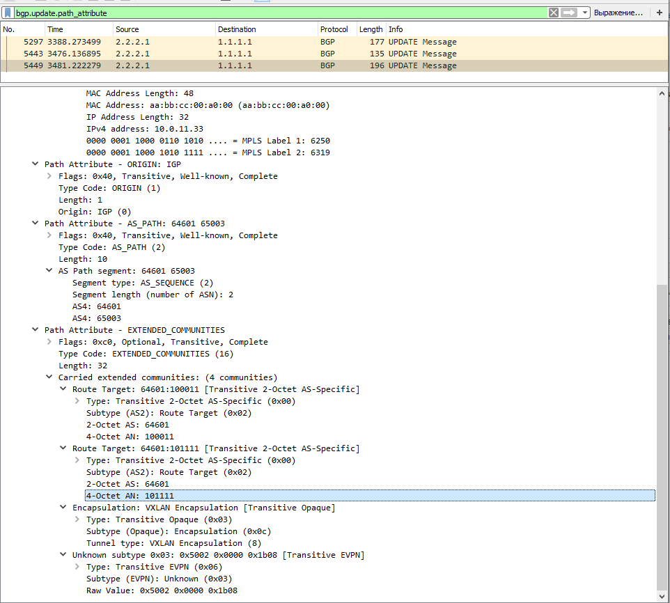

После настройки получили BGP UPDATE двумя Type-2 маршрутами.


## 4. Проверка работоспособности.

Проверим установлено ли соседство по l2 evpn
```
show bgp l2 evpn summary
```
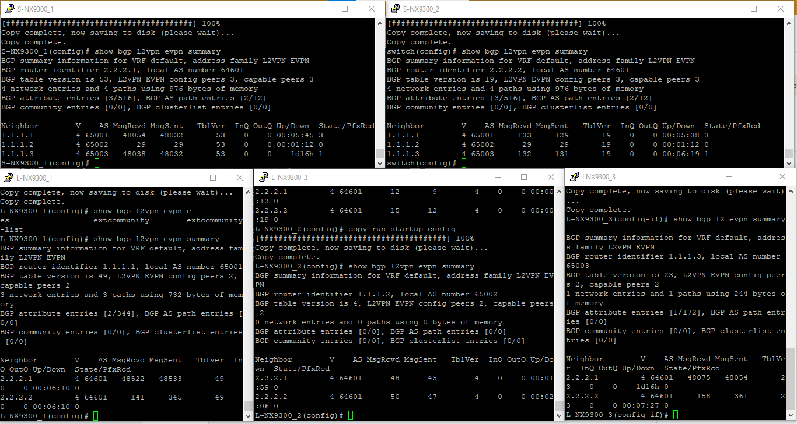


Проверяем доступность с R5 Vlan 10 до R10 Vlan 11.

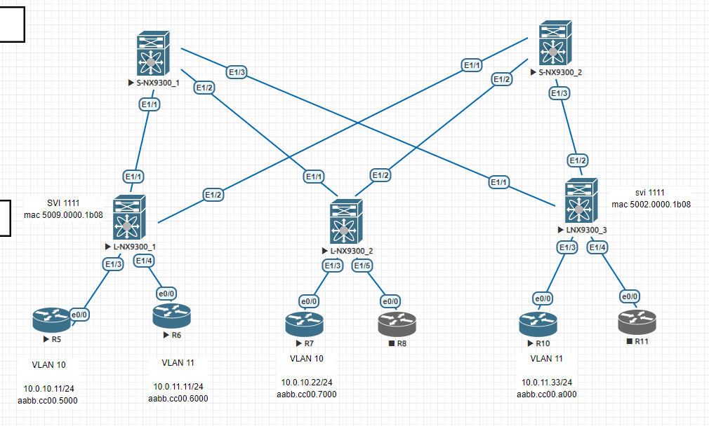

Получили маршрут L3 VNI маршрут адрес + MAC доступны через L-NX9500_3(nve1 100.111.111.3)
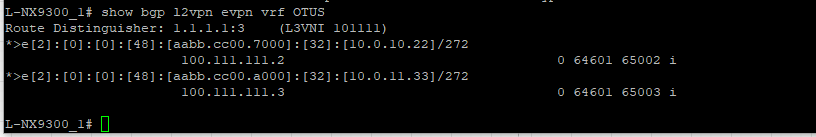


Доступность есть. 
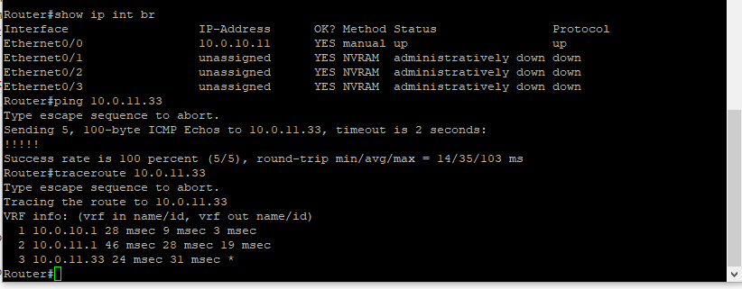

Рассмотрим поподробнее прохождение пакета.
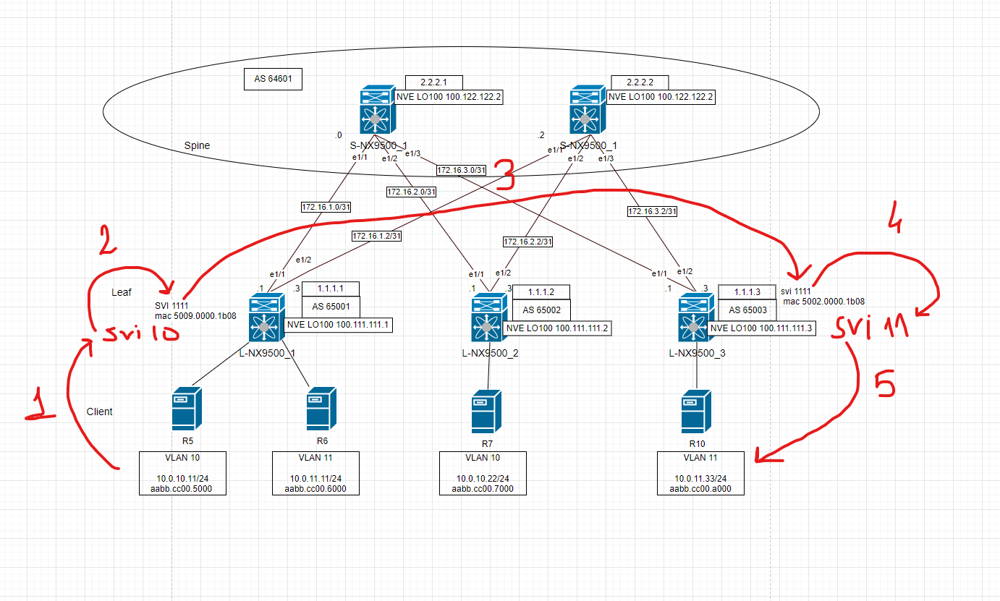
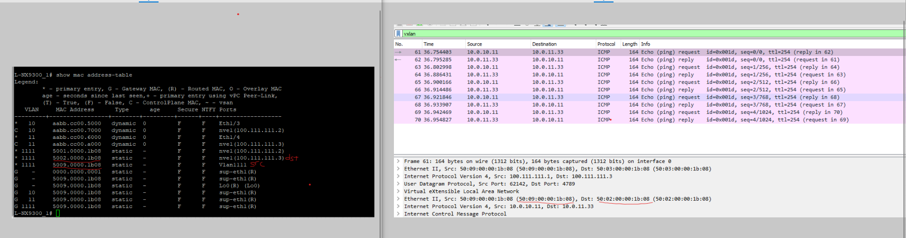
1)Трафик направляется на SVI 10 - Anycast Gateway.  
2)Маршрутизируется в SVI 1111, далее  перенаправляется через IP форвард в качестве dst указывается SVI 1111     
3)Инкапсулируется в VXLAN 10111 и передаётся на L-NX9500_3(nve1 100.111.111.3).   
4)Передаётся трафик на SVI 11  
5)От SVI 11 на R10   

Обратно симметрично.


Cравнить с проверкой доступности R6 до R10 используя  L2VNI

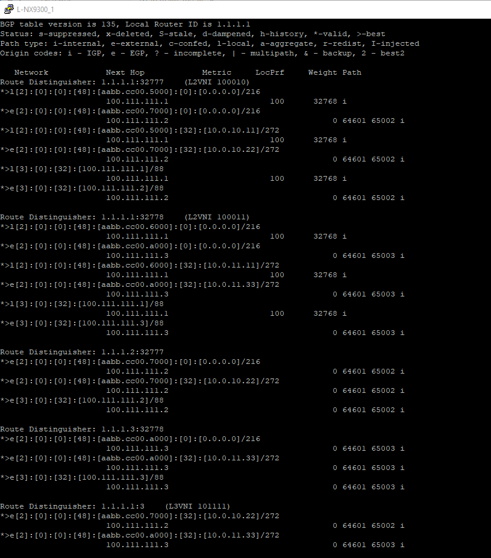
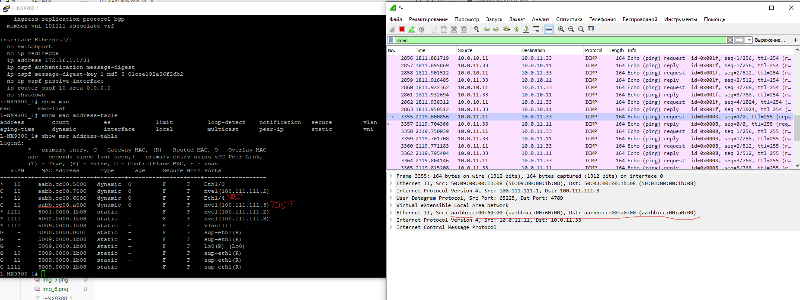
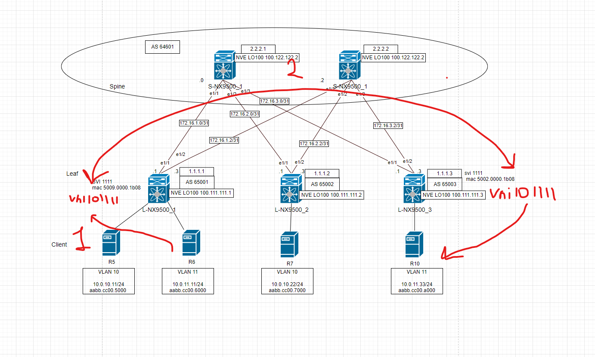

1) R6 отправит пакет MAC
2) Данные инкапсулируются в VXLAN и с VNI 101111 будут переданы на соовтетствуюший NVE интнрфейс.
3) R10 получит пакет с MAC адресов R6
Отправит так же назад.


