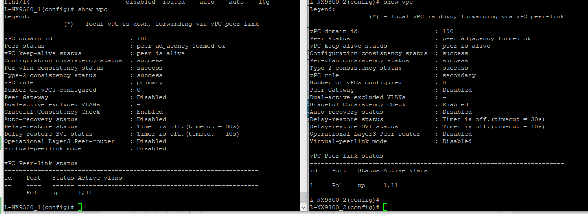

# Лабораторная работ 7.
## Настройка маршрутизации в рамках Overlay между клиентам.

Цель.

Настроить отказоустойчивое подключение клиентов с использованием VPC
  - Подключите клиентов 2-я линками к различным Leaf
  - Настроите агрегированный канал со стороны клиента
  - Настроите VPC для работы в Overlay сети

План работ:


 
## 1. Распределение ip адресов.

Таблица адресов  
|Уровень| Оборудование | Интерфейс  | ip-адрес | Маска |  Маршрут по умолчанию |
|-------|--------------|------------|----------|-------|-----------------------|
|Leaf|L-NX9500_1 |e1/1    |172.16.1.1|255.255.255.254|N/A|
|    |           |e1/2    |172.16.1.3|255.255.255.254|N/A|
|    |           |lo      |1.1.1.1   |255.255.255.255|N/A|
|    |           |lo 100  |100.111.111.1   |255.255.255.255|N/A|
|Leaf|L-NX9500_2 |e1/1    |172.16.2.1|255.255.255.254|N/A|
|    |           |e1/2    |172.16.2.3|255.255.255.254|N/A|
|    |           |lo      |1.1.1.2   |255.255.255.255|N/A|
|    |           |lo 100  |100.111.111.1   |255.255.255.255|N/A|
|Leaf|L-NX9500_3 |e1/1    |172.16.3.1|255.255.255.254|N/A|
|    |           |e1/2    |172.16.3.3|255.255.255.254|N/A|
|    |           |lo      |1.1.1.3   |255.255.255.255|N/A|
|Spine|S-NX9500_1|e1/1    |172.16.1.0|255.255.255.254|N/A|
|     |          |e1/2    |172.16.2.0|255.255.255.254|N/A|
|     |          |e1/3    |172.16.3.0|255.255.255.254|N/A|
|     |          |lo      |2.2.2.1   |255.255.255.255|N/A|
|    |           |lo 100  |100.122.122.1   |255.255.255.255|N/A|
|Spine|S-NX9500_2|e1/1    |172.16.1.2|255.255.255.254|N/A|
|     |          |e1/2    |172.16.2.2|255.255.255.254|N/A|
|     |          |e1/3    |172.16.3.2|255.255.255.254|N/A|  
|     |          |lo      |2.2.2.2   |255.255.255.255|N/A|
|    |           |lo 100  |100.122.122.2   |255.255.255.255|N/A|


| Hostname | ASN   |router-id        |
|----------|-------|-----------------|
|S-NX9500_1|64601  |2.2.2.1          |
|S-NX9500_2|64601  |2.2.2.2          |
|L-NX9500_1|65001  |1.1.1.1          |
|L-NX9500_2|65002  |1.1.1.2          |
|L-NX9500_3|65003  |1.1.1.3          |  


## 2. Внесём изменения в схему

Подключим клиентов к LEAF c разными VNI и изолируем от Underlay клиентов используя VRF.


|VLAN   |   Network   |    Hostname  |VRF   |
|-------|-------------|--------------|------|
|10     | 10.0.10.4/24|L-NX9500_1    |OTUS  |
|11     | 10.0.11.1/24|L-NX9500_3    |OTUS  |
|11     | 10.0.11.2/24|L-NX9500_1    |OTUS  |


Скорректируем схему, соединим L-NX9500_1 и L-NX9500_2 через 1 порт vPC Keepalive, 2 порта vPC Peer-link.
Добавим общий Anycast VTEP(vip) NVE LO100 100.111.111.254


## 3. Сконфигурируем оборудование.


L-NX9500_1
```
feature vpc
feature lacp

vrf context VPC-PKA

vpc domain 100
  peer-keepalive destination 192.168.0.2 source  192.168.0.1 vrf VPC-PKA
  ip arp synchronize

int e1/7
 no sw
 vrf member VPC-PKA   
 no sh
 ip address 192.168.0.1/30

int e1/5-6
 sw
 no sh
 channel-group 1 mode active

int po 1
vpc peer-link
switchport mode trunk

int e1/3
channel-group 10

int po 10
switchport
switchport mode trunk
vpc 10

int lo 100
 ip address 100.111.111.254/32 secondary
```
L-NX9300_2

```
feature vpc
feature lacp


vpc domain 100
  peer-keepalive destination 192.168.0.1 source  192.168.0.2 vrf VPC-PKA
  ip arp synchronize

vrf context VPC-PKA

int e1/7
 no sw  
 vrf member VPC-PKA   
 no sh
 ip address 192.168.0.2/30

 int e1/5-6
 sw
 no sh
 channel-group 1 mode active

int po 1
vpc peer-link
switchport mode trunk


int e1/3
channel-group 10

int po 10
switchport
switchport mode trunk
vpc 10

int lo 100
 ip address 100.111.111.254/32 secondary
 ```


Server VPC

```
int e0/0-1
no sh
channel-group 10 mode active
```

После настроек проверим, что в статусе success Configuration consistencu status.
Определились роли vPC. L-NX9500_1 - primary , L-NX9300_2 - secondary



## 4. Проверка работоспособности.

show vpc


show vpc peer-keepalive

show lacp peer

show lacp neighbor
show port-channel summary


Cata
sh etherchannel port-channel
show etherchannel summary


