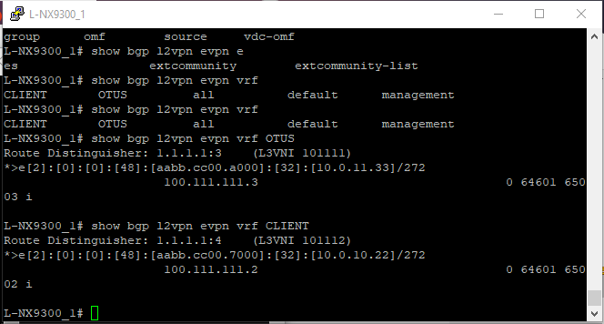
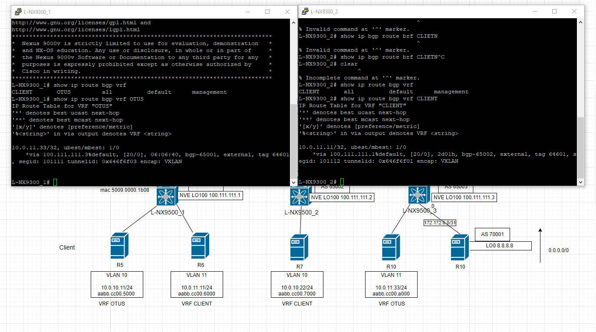

# Лабораторная работ 8.
## Реализовать передачу суммарных префиксов через EVPN route-type 5

Цель:
Анонсировать суммарные префиксы клиентов в Overlay сеть
Настроить маршрутизацию между клиентами через суммарный префикс


План работ:
1) Адресное пространство 
2) Внесём изменения в схему.
3) Сконфигурируем оборудование.
4) Проверка работоспособности.

 
## 1. Распределение ip адресов.

Таблица адресов  
|Уровень| Оборудование | Интерфейс  | ip-адрес | Маска |  Маршрут по умолчанию |
|-------|--------------|------------|----------|-------|-----------------------|
|Leaf|L-NX9500_1 |e1/1    |172.16.1.1|255.255.255.254|N/A|
|    |           |e1/2    |172.16.1.3|255.255.255.254|N/A|
|    |           |lo      |1.1.1.1   |255.255.255.255|N/A|
|    |           |lo 100  |100.111.111.1   |255.255.255.255|N/A|
|Leaf|L-NX9500_2 |e1/1    |172.16.2.1|255.255.255.254|N/A|
|    |           |e1/2    |172.16.2.3|255.255.255.254|N/A|
|    |           |lo      |1.1.1.2   |255.255.255.255|N/A|
|    |           |lo 100  |100.111.111.1   |255.255.255.255|N/A|
|Boarder Leaf|L-NX9500_3 |e1/1    |172.16.3.1|255.255.255.254|N/A|
|    |           |e1/2    |172.16.3.3|255.255.255.254|N/A|
|    |           |e1/4    |172.172.0.0|255.255.255.254|N/A|
|    |           |lo      |1.1.1.3   |255.255.255.255|N/A|
|Spine|S-NX9500_1|e1/1    |172.16.1.0|255.255.255.254|N/A|
|     |          |e1/2    |172.16.2.0|255.255.255.254|N/A|
|     |          |e1/3    |172.16.3.0|255.255.255.254|N/A|
|     |          |lo      |2.2.2.1   |255.255.255.255|N/A|
|    |           |lo 100  |100.122.122.1   |255.255.255.255|N/A|
|Spine|S-NX9500_2|e1/1    |172.16.1.2|255.255.255.254|N/A|
|     |          |e1/2    |172.16.2.2|255.255.255.254|N/A|
|     |          |e1/3    |172.16.3.2|255.255.255.254|N/A|  
|     |          |lo      |2.2.2.2   |255.255.255.255|N/A|
|     |          |lo 100  |100.122.122.2   |255.255.255.255|N/A|
|BGW  |R11       |e1/1    |172.16.0.1|255.255.255.254|N/A|


| Hostname | ASN   |router-id        |
|----------|-------|-----------------|
|S-NX9500_1|64601  |2.2.2.1          |
|S-NX9500_2|64601  |2.2.2.2          |
|L-NX9500_1|65001  |1.1.1.1          |
|L-NX9500_2|65002  |1.1.1.2          |
|L-NX9500_3|65003  |1.1.1.3          |  
|R11|65011  |0.0.0.3 W         |  


## 2. Внесём изменения в схему

Анонсируем 0.0.0.0 с BGW.

|VLAN   |  VNI| Network   |  Hostname  |VRF   |
|-------|-----|--------|--------------|-------|
|10     |100010 | 10.0.10.0/24|L-NX9500_1   |OTUS   |
|11     |100011 | 10.0.11.0/24|L-NX9500_3   |OTUS   |
|1111   |101111 |ip forward  |All leaf with VRF CLIENT|CLIENT |
|11     |100011 |10.0.11.0/24|L-NX9500_1    |CLIENT |
|10     |100010 |10.0.10.0/24|L-NX9500_2    |CLIENT |
|1112   |101112 |ip forward  |All leaf with VRF CLIENT|CLIENT |


## 3. Сконфигурируем оборудование.

Настроим 2 VRF CLIENT и OTUS. Для каждого VRF свой L3_VNI.

Создадим vlan 1111 и SVI. 

```
VLAN 1111
  name L3_VNI_OTUS
  vn-segment 101111
```
```
VLAN 1112
  name L3_VNI_CLIENT
  vn-segment 101112  
```
```
Interface Vlan 1111
  no shutdown
  vrf member OTUS
  ip forward 
```
```
Interface Vlan 1112
  no shutdown
  vrf member CLIENT
  ip forward 
```
      
Ассоциируем vlan 1111 с vni 101111
Ассоциируем vlan 1112 с vni 101112
```
interface nve1
member vni 101111 associate-vrf
member vni 101112 associate-vrf
```

Настройка VRF и привязка VNI к VRF. Разрешаем экспортировать и импортировать маршруты.

```
vrf context OTUS
vni 101111
rd auto
address-family ipv4 unicast
  route-target both auto
  route-target both auto evpn
```
```
vrf context CLIENT
vni 101112
rd auto
address-family ipv4 unicast
  route-target both auto
  route-target both auto evpn
```

Укажем виртуальный мак для для общего SVI

```
fabric forwarding anycast-gateway-mac 0000.0000.0001
```
```
interface Vlan10
no shutdown
vrf member OTUS
ip address 10.0.10.1/24
fabric forwarding mode anycast-gateway
```

```
interface Vlan11
no shutdown
vrf member CLIENT
ip address 10.0.11.1/24
fabric forwarding mode anycast-gateway
```
Теже самын настройки на остальных VTEP.

При данных настройках выполняется изолирование хостов в разных VRF Друг от друга так как vni у VLAN 10 и VLAN 11 в разных VRF одинаковы. Скорее всего доступны сети из за l2VNI.

Настроим EVPN 
```
evpn
  vni 10010 l2
    rd auto
    route-target import auto
    route-target export auto
  vni 10011 l2
    rd auto
    route-target import auto
    route-target export auto
```

Адреса внутри VRF доступны 




### Настроим Централизованный VRF Route-Leaking между VRF

Настроим VRF Context на VTEP, который будет маршрутизировать трафик между двумя VRF.

configure terminal
vrf context vrf-name
vni number
rd auto
address-family ipv4 unicast
route-target both {auto | rt}
route-target both {auto | rt} evpn
route-target import rt-from-different-vrf
route-target import rt-from-different-vrf evpn




### Настроим VRF для VXLAN Routing и внешние подключения используя BGP.

Настроим VRF на border node в данном случае это LNX9300_3 и 

```
vrf context OTUS
  vni 101111
  rd auto
  address-family ipv4 unicast
    route-target both auto
    route-target both auto evpn

vrf context CLIENT
  vni 101112
  rd auto
  address-family ipv4 unicast
    route-target both auto
    route-target both auto evpn  
```

Настроим VTEP на Border node

```
interface nve1
  no shutdown
  host-reachability protocol bgp
  source-interface loopback100
  member vni 100011
    ingress-replication protocol bgp
   member vni 100012
    ingress-replication protocol bgp
  member vni 101111 associate-vrf
  member vni 101112 associate-vrf

Настроим BGP VRF на Border node для ipv4 per-VRF Peering 

```
configure terminal
router bgp autonomous-system-number
vrf vrf-name
address-family ipv4 unicast
advertise l2vpn evpn
neighbor address remote-as number
update-source type/id
address-family ipv4 unicast
```

Настроим Sub-interface для Per-VRF


```
configure terminal
interface type/id
no switchport
no shutdown
exit
interface type/idadadd  daadadad
encapsulation dot1q number
vrf member vrf-name
ip address address
no shutdown
```

Настройка внешнего маршрутизатора

vrf context OTUS
!
router bgp 70001
  vrf OTUS
    address-family ipv4 unicast
      maximum-paths 2
    address-family ipv6 unicast
      maximum-paths 2
    neighbor 172.172.0.0
      remote-as 65003
      address-family ipv4 unicast
!
interface Ethernet1/1
  no switchport
  no shutdown
interface Ethernet1/1.1111
  encapsulation dot1q 2
  vrf member OTUS
  ip address 172.172.0.1/31
  no shutdown


Адресация ддя vrf

VRF CLIENT - 172.172.0.0/31
VRF OTUS - 172.172.0.2/31

## 4. Проверка работоспособности.

Проверим установлено ли соседство по l2 evpn
```
show bgp l2 evpn summary
```


