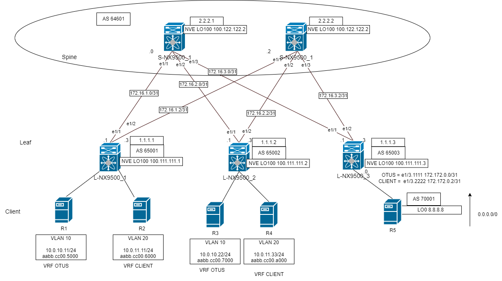
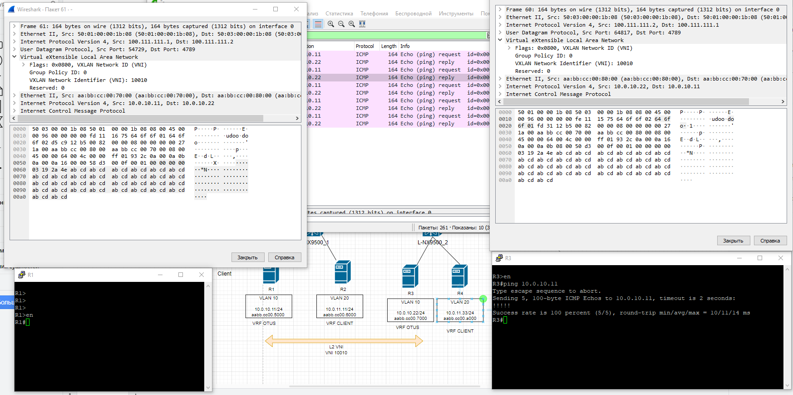
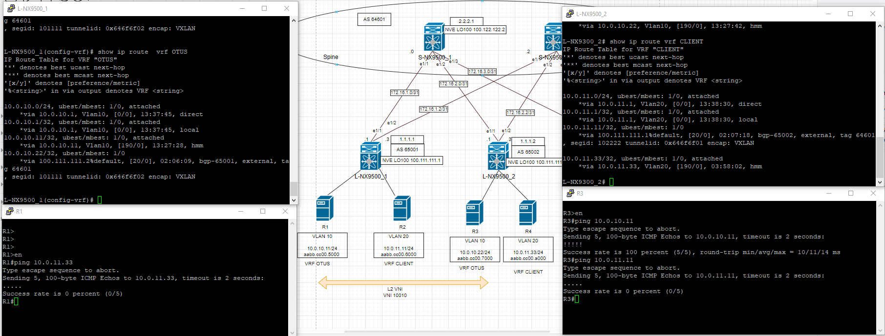
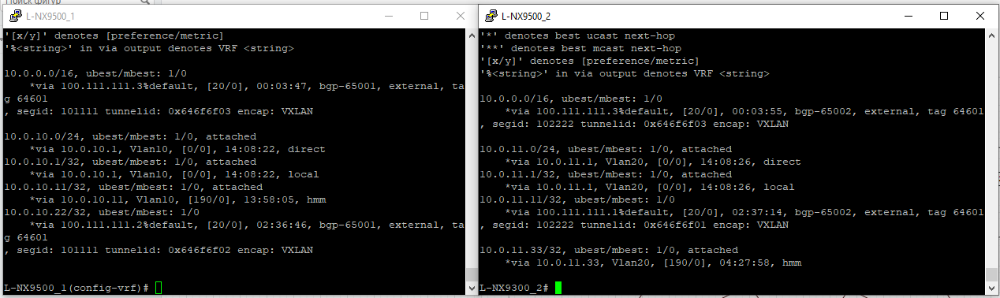
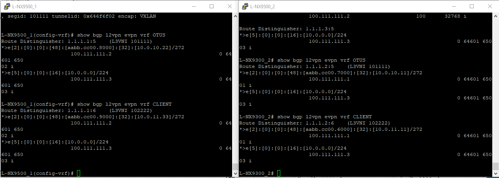
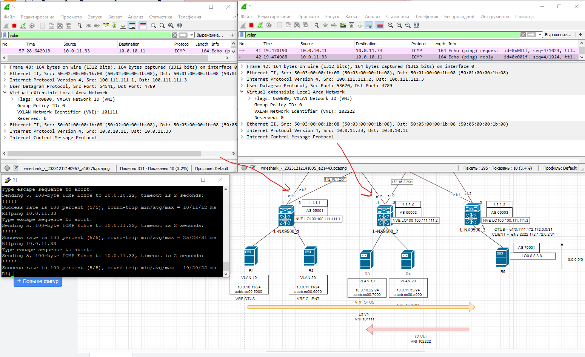
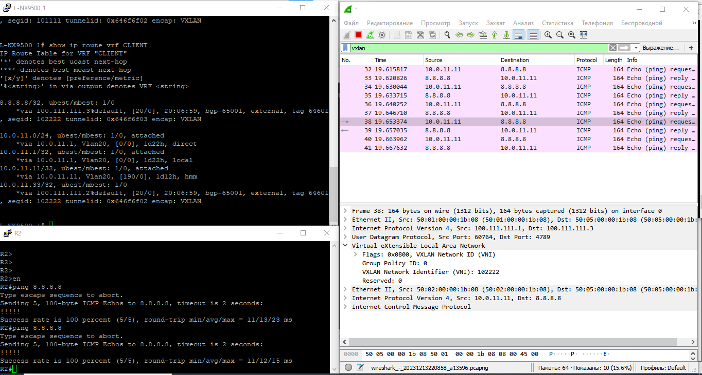

# Лабораторная работ 8.
## Реализовать передачу суммарных префиксов через EVPN route-type 5

Цель:
Анонсировать суммарные префиксы клиентов в Overlay сеть
Настроить маршрутизацию между клиентами через суммарный префикс


План работ:
1) Адресное пространство 
2) Внесём изменения в схему.
3) Сконфигурируем оборудование.


 
## 1. Распределение ip адресов.

Таблица адресов  
|Уровень| Оборудование | Интерфейс  | ip-адрес | Маска |  Маршрут по умолчанию |
|-------|--------------|------------|----------|-------|-----------------------|
|Leaf|L-NX9500_1 |e1/1    |172.16.1.1|255.255.255.254|N/A|
|    |           |e1/2    |172.16.1.3|255.255.255.254|N/A|
|    |           |lo      |1.1.1.1   |255.255.255.255|N/A|
|    |           |lo 100  |100.111.111.1   |255.255.255.255|N/A|
|Leaf|L-NX9500_2 |e1/1    |172.16.2.1|255.255.255.254|N/A|
|    |           |e1/2    |172.16.2.3|255.255.255.254|N/A|
|    |           |lo      |1.1.1.2   |255.255.255.255|N/A|
|    |           |lo 100  |100.111.111.1   |255.255.255.255|N/A|
|Boarder Leaf|L-NX9500_3 |e1/1    |172.16.3.1|255.255.255.254|N/A|
|    |           |e1/2    |172.16.3.3|255.255.255.254|N/A|
|    |           |e1/4    |172.172.0.0|255.255.255.254|N/A|
|    |           |lo      |1.1.1.3   |255.255.255.255|N/A|
|Spine|S-NX9500_1|e1/1    |172.16.1.0|255.255.255.254|N/A|
|     |          |e1/2    |172.16.2.0|255.255.255.254|N/A|
|     |          |e1/3    |172.16.3.0|255.255.255.254|N/A|
|     |          |lo      |2.2.2.1   |255.255.255.255|N/A|
|    |           |lo 100  |100.122.122.1   |255.255.255.255|N/A|
|Spine|S-NX9500_2|e1/1    |172.16.1.2|255.255.255.254|N/A|
|     |          |e1/2    |172.16.2.2|255.255.255.254|N/A|
|     |          |e1/3    |172.16.3.2|255.255.255.254|N/A|  
|     |          |lo      |2.2.2.2   |255.255.255.255|N/A|
|     |          |lo 100  |100.122.122.2   |255.255.255.255|N/A|
|BGW  |R11       |e1/1    |172.16.0.1|255.255.255.254|N/A|


| Hostname | ASN   |router-id        |
|----------|-------|-----------------|
|S-NX9500_1|64601  |2.2.2.1          |
|S-NX9500_2|64601  |2.2.2.2          |
|L-NX9500_1|65001  |1.1.1.1          |
|L-NX9500_2|65002  |1.1.1.2          |
|L-NX9500_3|65003  |1.1.1.3          |  
|R11|65011  |0.0.0.3 W         |  


## 2. Внесём изменения в схему

Анонсируем 8.8.8.8 с BGW.

|VLAN   |  VNI| Network   |  Hostname  |VRF   |
|-------|-----|--------|--------------|-------|
|10     |100010 | 10.0.10.0/24|L-NX9500_1   |OTUS   |
|10     |100010 | 10.0.10.0/24|L-NX9500_2   |OTUS   |
|1111  |101111 |ip forward  |All leaf with VRF OTUS|OTUS |
|20     |100020 |10.0.11.0/24|L-NX9500_1    |CLIENT |
|20     |100020 |10.0.10.0/24|L-NX9500_2    |CLIENT |
|2222   |102222 |ip forward  |All leaf with VRF CLIENT|CLIENT |




## 3. Сконфигурируем оборудование.

Настроим 2 VRF CLIENT и OTUS. Для каждого VRF свой L3_VNI.
Создадим vlan 1111 и SVI. 

На примере L-NX9500_1

```
nv overlay evpn
feature ospf
feature bgp
feature interface-vlan
feature vn-segment-vlan-based
feature bfd
feature nv overlay

fabric forwarding anycast-gateway-mac 0000.0000.0001

vlan 1111
  name L3_VNI_OTUS
  vn-segment 101111
vlan 2222
  name L3_VNI_CLIENT
  vn-segment 102222

vrf context CLIENT
  vni 102222
  rd auto
  address-family ipv4 unicast
    route-target both auto
    route-target both auto evpn
vrf context OTUS
  vni 101111
  rd auto
  address-family ipv4 unicast
    route-target both auto
    route-target both auto evpn
 
 interface Vlan10
  no shutdown
  vrf member OTUS
  ip address 10.0.10.1/24
  fabric forwarding mode anycast-gateway
interface Vlan20
  no shutdown
  vrf member CLIENT
  ip address 10.0.11.1/24
  fabric forwarding mode anycast-gateway

interface Vlan1111
  no shutdown
  vrf member OTUS
  ip forward
interface Vlan2222
  no shutdown
  vrf member CLIENT
  ip forward


interface nve1
  no shutdown
  host-reachability protocol bgp
  source-interface loopback100
  member vni 10010
    ingress-replication protocol bgp
  member vni 10020
    ingress-replication protocol bgp
  member vni 101111 associate-vrf
  member vni 102222 associate-vrf

router bgp 65001
  router-id 1.1.1.1
  timers bgp 3 9
  bestpath as-path multipath-relax
  reconnect-interval 10
  log-neighbor-changes
  address-family l2vpn evpn
    maximum-paths 10
  template peer SPINES
    bfd
    remote-as 64601
    update-source loopback0
    ebgp-multihop 5
    timers 3 9
    address-family l2vpn evpn
      send-community
      send-community extended
      rewrite-evpn-rt-asn
  neighbor 2.2.2.1
    inherit peer SPINES
  neighbor 2.2.2.2
    inherit peer SPINES
evpn
  vni 10010 l2
    rd auto
    route-target import auto
    route-target export auto
  vni 10020 l2
    rd auto
    route-target import auto
    route-target export auto
```  
Теже самые настройки на остальных VTEP.  
При данных настройках выполняется изолирование хостов в разных  Underlay и Overlay и VRF Друг от друга.


L2 VPN работает. R1 и R3 в VRF OTUS взаимодейтсвуют внутри VNI 10010



L3 VPN не работает. Нет маршрутов в VRF. 




### Настроим Централизованный VRF Route-Leaking между VRF

Настроим VRF Context на VTEP, который будет маршрутизировать трафик между двумя VRF.

Импортируем на Boarder LEAF таргеты из L3VNI обоих VRF.

Boarder LEAF
```
nv overlay evpn
feature ospf
feature bgp
feature interface-vlan
feature vn-segment-vlan-based
feature bfd
feature nv overlay

vlan 1111
  name L3_VNI_OTUS
  vn-segment 101111
vlan 2222
  name L3_VNI_CLIENT
  vn-segment 102222


vrf context CLIENT
  vni 102222
  rd auto
  address-family ipv4 unicast
    route-target both auto
    route-target both auto evpn
    route-target import 65003:101111
    route-target import 65003:101111 evpn
vrf context OTUS
  vni 101111
  rd auto
  address-family ipv4 unicast
    route-target both auto
    route-target both auto evpn
    route-target import 65003:102222
    route-target import 65003:102222 evpn
  
interface nve1
  no shutdown
  host-reachability protocol bgp
  source-interface loopback100
  member vni 101111 associate-vrf
  member vni 102222 associate-vrf

router bgp 65003
  router-id 1.1.1.3
  timers bgp 3 9
  bestpath as-path multipath-relax
  reconnect-interval 10
  log-neighbor-changes
  address-family ipv4 unicast
  address-family l2vpn evpn
    maximum-paths 10
    retain route-target all
  template peer SPINES
    bfd
    remote-as 64601
    update-source loopback0
    ebgp-multihop 5
    timers 3 9
    address-family l2vpn evpn
      send-community
      send-community extended
      rewrite-evpn-rt-asn
  neighbor 2.2.2.1
    inherit peer SPINES
  neighbor 2.2.2.2
    inherit peer SPINES
  vrf CLIENT
    address-family ipv4 unicast
      aggregate-address 10.0.0.0/16
  vrf OTUS
    address-family ipv4 unicast
      aggregate-address 10.0.0.0/16
```




Получили агрегированый маршрут 10.0.0.0/16.




В качестве Type-5 маршрута 



Централизованный VRF Route-Leaking настроили. Маршрутизация хостов из разных VRF проходит на Boarder LEAF - L-NX9500_3.
Маршрутизация асинхронная на VRF OTUS Через L3 VNI 101111, на VRF CLIENT через VNI 102222.  

### Настроим VRF для VXLAN Routing и внешние подключения используя BGP.

Для кажждого VRF нужно поднять отдельную BGP сессия в VRF. Для импорта внешних маршртов в VRF.

Настройки на Boarder LEAF
```
interface Ethernet1/3
  speed 1000
  duplex full
  no shutdown

interface Ethernet1/3.1111
  encapsulation dot1q 1111
  vrf member OTUS
  ip address 172.172.0.0/31
  no shutdown

interface Ethernet1/3.2222
  encapsulation dot1q 2222
  vrf member CLIENT
  ip address 172.172.0.2/31
  no shutdown
  
 vrf CLIENT
    address-family ipv4 unicast
    neighbor 172.172.0.3
      remote-as 70001
      address-family ipv4 unicast
  vrf OTUS
    address-family ipv4 unicast
    neighbor 172.172.0.1
      remote-as 70001
      address-family ipv4 unicast

  ```
Настройки на PE

```
interface Loopback0
 ip address 8.8.8.8 255.255.255.255
!
interface Ethernet0/0
 no ip address
!
interface Ethernet0/0.1111
 encapsulation dot1Q 1111
 ip address 172.172.0.1 255.255.255.254
!
interface Ethernet0/0.2222
 encapsulation dot1Q 2222
 ip address 172.172.0.3 255.255.255.254

router bgp 70001
 bgp log-neighbor-changes
 network 8.8.8.8 mask 255.255.255.255
 neighbor 172.172.0.0 remote-as 65003
 neighbor 172.172.0.2 remote-as 65003

```

Маршрут type-5 получили, адрес доступен.



router bgp 65003

