# __Основные протоколы сети интернет__
1. Настроить DHCP в офисе Москва   
1.1. Настроите DHCP сервер в офисе Москва на маршрутизаторах R12 и R13. VPC1 и VPC7 должны получать сетевые настройки по DHCP
2. Настроить синхронизацию времени в офисе Москва  
2.1 Настроите NTP сервер на R12 и R13. Все устройства в офисе Москва должны синхронизировать время с R12 и R13
Все офисы в лабораторной работе должны иметь IP связность
3. Настроить NAT в офисе Москва, C.-Перетбруг и Чокурдах
3.1. Настроите NAT(PAT) на R14 и R15. Трансляция должна осуществляться в адрес автономной системы AS1001  
3.2. Настроите статический NAT для R20
Настроите NAT так, чтобы R19 был доступен с любого узла для удаленного управления 
3.3. Настроите NAT(PAT) на R18. Трансляция должна осуществляться в пул из 5 адресов автономной системы AS2042  
3.4. Настроите статический NAT(PAT) для офиса Чокурдах


## __1. Настроить DHCP в офисе Москва__ 

### 1.1. Настроите DHCP сервер в офисе Москва на маршрутизаторах SW2, SW3


Настроим DHCP на SW3 аналагичные настройки сделаем на SW2

```
interface range e1/0-3
    switchport access vlan 100
    switchport mode access

ip dhcp excluded-address 10.0.0.1 10.0.0.10
ip dhcp pool VLAN100
    network 10.0.0.0 255.255.255.128
    domain-name ccna-lab.com
    default-router 10.0.0.1
    lease 2 12 30
```

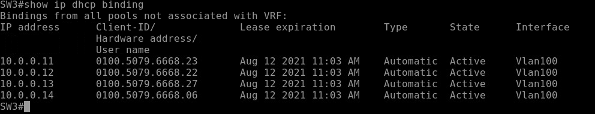

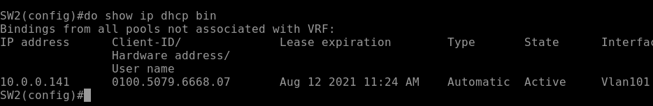

## __2.1 Настроите NTP сервер на R12 и R13. Все устройства в офисе Москва должны синхронизировать время с R12 и R13 __

Настроим корректное время на всех устройствах(вручную) и включим NTP server и числовой слой. Добавим вкачестве NTP server R14, чтобы в случае отставания времени можно было найти false tickers.

Чтобы синхронизировать время с помощью протокола NTP, следует сначала вручную выставить ваше время. Недопустима разница между вашим точным временем и показаниями ваших часов более 1000 секунд. 

 stratum 1
### R12

```
clock set 23:07:40 9 August 2021
ntp master 1
ntp update-calendar
interface range e0/0-3, e1/0
ntp broadcast


```

Настроим клиентов R19, R15, R20

ntp server 10.127.255.18  
ntp server 10.127.255.66  
ntp server 10.127.255.17  

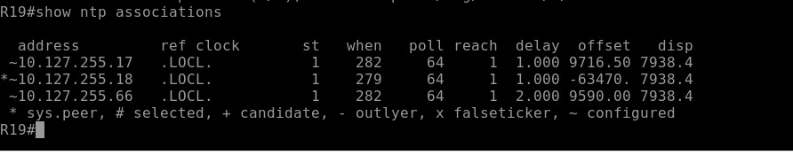

Видим, что NTP как точное время используют локальное время.


Настроим SW4, SW5 как stratum 2

```
SW4(config)#ntp master 2

SW4(config)#ntp update-calendar 
SW4(config)#interface range e0/0-1, e1/0-1
SW4(config-if-range)#ntp broadcast 
SW4(config-if-range)#exit
SW4(config)#ntp server 10.127.255.18  
SW4(config)#ntp server 10.127.255.66  
SW4(config)#ntp server 10.127.255.17
SW4(config)#ntp peer 10.127.255.193
```


Настроим SW2,SW3

ntp server 10.127.255.193 
ntp server 10.127.255.177 
 
 

## __3. Настроить NAT в офисе Москва, C.-Перетбруг и Чокурдах__


### __3.1. Настроите NAT(PAT) на R14 и R15. Трансляция должна осуществляться в адрес автономной системы AS1001__

 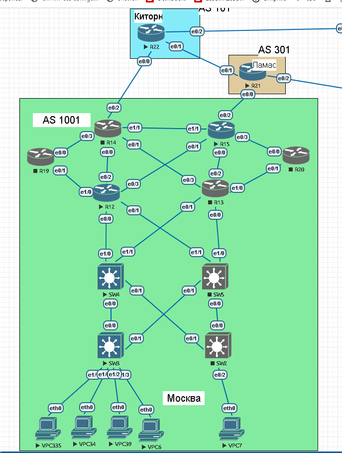

Сеть 10.0.0.0/25 в адрес 5.5.5.5
Сеть 10.0.0.128/25 в адрес 5.5.5.5

На Switch были проблемы с маршрутизацией нужно выключать cef ``no ip cef``

Настроим NAT на R15 


```
in lo5
ip add 5.5.5.5 255.255.255.255
ip nat outside
no sh

interface range e0/0-1
ip nat inside

interface e0/3
ip nat insdie

interface e1/1
ip nat inside

interface e0/2
ip nat outside
inerface lo5
ip nat outside

access-list 6 permit 10.0.0.128 0.0.0.127   
access-list 6 permit 10.0.0.0 0.0.0.127

route-map USERS permit 10
 match ip address 5 6

ip nat inside source route-map USERS interface Loopback5 overload

Анонсируем сеть 5.5.5.0/24
чтобы анонс ушел пиру добавим марщрут в таблицу маршрутизации
ip route 5.5.5.0 255.255.255.0 null0

```

Настроим NAT на R14

Сеть 10.0.0.0/25 в адрес 5.5.5.6
Сеть 10.0.0.128/25 в адрес 5.5.5.6

```
in lo5
ip add 5.5.5.6 255.255.255.255
ip nat outside
no sh

interface range e0/0-1
ip nat inside

interface e0/3
ip nat insdie

interface e1/1
ip nat outisde

interface e0/2
ip nat outside

inerface lo5
ip nat outside

access-list 6 permit 10.0.0.128 0.0.0.127   
access-list 6 permit 10.0.0.0 0.0.0.127

route-map USERS permit 10
 match ip address 5 6

ip nat inside source route-map USERS interface Loopback5 overload

Анонсируем сеть 5.5.5.0/24
чтобы анонс ушел пиру добавим марщрут в таблицу маршрутизации
ip route 5.5.5.0 255.255.255.0 null0

```


Проверяем
_________________________

Из сети 10.0.0.0/25 хост VPC34 имеет доступ в интернет 

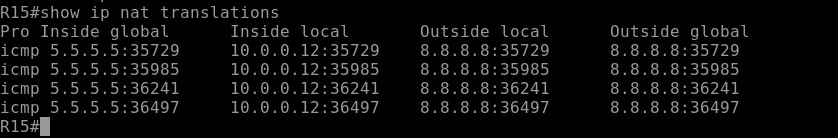
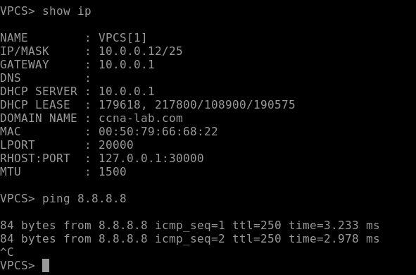

R22 на интерфейсе lo0 ip address 8.8.8.8   

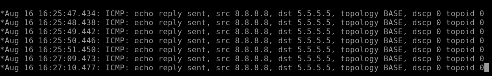


Из сети 10.0.0.128/25 хост VPC7 имеет доступ в интернет 

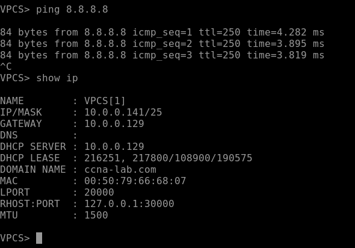

Включили все маршрутизаторы. И так как к R22 ближе R14, который анонсирует такие же сети. То трафик будет в круговую и e1/1 на R15 Нужно настроить как nat outside. И выключил OSPF, чтобы трафик в интернет не шел через этот интерфейс,

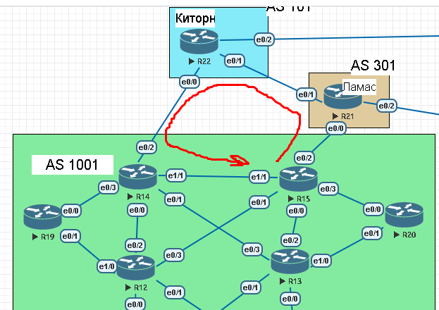

__Выключили R15 пинги от пользователей есть.__

R22(8.8.8.8) debug icmp конечно все TCP сессии разорвуться, но переключение с R14 на R15 было быстрым

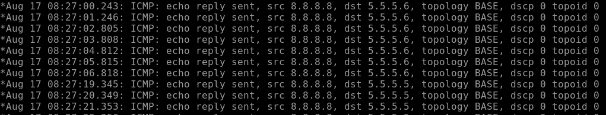

__Выключили R15 пол минут примерно потребовалось чтобы перейти на R14__

__Выключим R21 доступ пропал на 2 минуты приблизительно__

## 3.2. Настройте статический NAT для R20 

Задание: Настроите NAT так, чтобы R19 был доступен с любого узла для удаленного управления 

Для удаленного управления, в рамках теста для простоты будем использовать telnet, в рамках стенда, с последующей реализацией ssh.

Настроим R15 

Статический между 10.127.255.225 и 5.5.5.10 по 23 порту 

Так же как и в предыдущем пункте, создаем loopback маршрут в сторону R14. 

```
!
interface Loopback10
 no shutdown
 ip address 5.5.5.10 255.255.255.255
!
ip nat inside source static tcp 10.127.255.225 23 interface Loopback 10


ip route 5.5.5.11 255.255.255.255 172.16.1.0
```
Доступ с Петербурга есть.

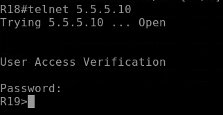

Повторим настройки на R14

```
!
interface Loopback10
 no shutdown
 ip address 5.5.5.11 255.255.255.255
!
ip nat inside source static tcp 10.127.255.225 23 interface Loopback 10 23

ip route 5.5.5.10 255.255.255.255 172.16.1.0
```
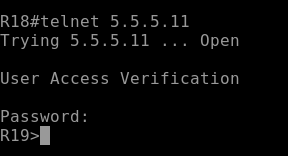

## 3.3. Настроите NAT(PAT) на R18. 

Трансляция должна осуществляться в пул из 5 адресов автономной системы AS2042  

Вводная информация: в Петербурге работает eigrp.
От обоих провайдеров приходит FULL VIEW. Настроена фильтрация BGP от транзитного трафика c помощью prefix-list.

Сеть 10.128.0.0/24 в адрес 42.42.42.42-46

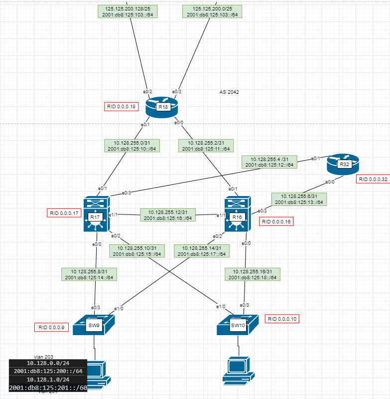

```
router bgp 2042
    network 42.42.42.0 mask 255.255.255.0
    exit

ip route 42.42.42.0 255.255.255.0 null0
! т.к фильтрация с помощью prefix-list добавим новую  сеть
ip prefix-list NOTRANS seq 15 permit 42.42.42.0/24

ip nat pool NAT-POOL-5 42.42.42.42 42.42.42.46 netmask 255.255.255.0

access-list 1 permit 10.128.0.0 0.0.255.255

ip nat inside source list 1 pool NAT-POOL-5 overload

interface e0/2
ip nat outside

interface e0/3
ip nat outside

interface e0/1
ip nat inside

interface e0/0
ip nat inside
```

Доступ есть в интернет, через R24. После падения провайдера потребовалось 2 минуты на восстановление доступа в интернет.

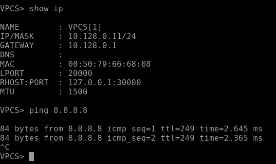
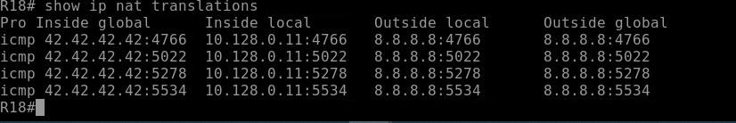

## 3.4. Настроите статический NAT(PAT) для офиса Чокурдах

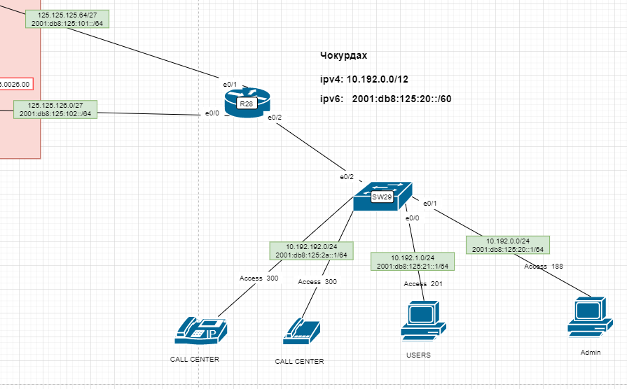

Задание: Необходимо организовать доступ в интернет.

Буду использовать конфигурацию из Лабораторной, так как не сохранил конфигурацию и все настройки остались только в документации:  
https://github.com/rain360z/otus-networks/tree/main/5_lab_PBR_11_less

Вводная информация: На R28 приходит 2 провайдера R25(125.125.125.64/27) и R24(125.125.126.0./27). Приоритетный маршрутизатор R25. В случае его падения весь трафик необходима перебросить на R26.

Настроим R28

```
ip dhcp excluded-address 10.192.1.1 10.192.1.10
ip dhcp pool Client1 
    network 10.192.1.0 255.255.255.0
    domain-name hello.com
    default-router 10.192.1.1

access-list 1 permit 10.192.1.0 0.0.0.255
interface e0/2.201
ip address 10.192.1.1 255.255.255.0
ip nat inside
exit
interface e0/0
ip nat outside
interface e0/1
ip nat outside


ip dhcp excluded-address 10.192.0.1 10.192.0.10
ip dhcp pool Client 
    network 10.192.0.0 255.255.255.0
    domain-name hello.com
    default-router 10.192.0.1

access-list 1 permit 10.192.0.0 0.0.0.255
interface Ethernet0/2.188
 encapsulation dot1Q 188
 ip address 10.192.0.1 255.255.255.0
 ip nat inside
exit
```

Настроим SW29


Исправить
```
interface e0/2
    switchport mode trunk
    switchport trunk allowed vlan 202,188

vlan 188 
    name USERS
vlan 201
    name USERS2
interface e0/0
    switchport mode access 
    switchport access vlan 201

interface e0/1
    switchport mode access 
    switchport access vlan 188
```


Настроим IP SLA на R28

```
ip sla 1
    icmp-echo 125.125.125.65 source-ip 125.125.125.66
    frequency 10
    exit

ip sla 2
    icmp-echo 125.125.126.1 source-ip 125.125.126.2
    frequency 10
    exit

ip sla schedule 1 life forever start-time now
ip sla schedule 2 life forever start-time now

track 1 ip sla 1 reachability

track 2 ip sla 2 reachability

ip route 0.0.0.0 0.0.0.0 125.125.125.65 10 track 1
ip route 0.0.0.0 0.0.0.0 125.125.126.1 20 track 2

track 1
    delay down 11 up 11

track 2
    delay down 11 up 11
```
 
 Рсапределим нагрузку между провайдерами.

```
track 100 list boolean and
    object 1
    object 2
delay down 11 up 11
```
Настроим NAT


```
ip access-list extended VLAN188
    permit icmp 10.192.0.0 0.0.0.255 any
    permit tcp 10.192.0.0 0.0.0.255 any
    permit udp 10.192.0.0 0.0.0.255 any
    exit

ip access-list extended VLAN201
    permit tcp 10.192.1.0 0.0.0.255 any
    permit icmp 10.192.1.0 0.0.0.255 any
    permit udp 10.192.1.0 0.0.0.255 any

 

route-map NAT_ISP2 permit
    match ip address VLAN188 VLAN201
    match interface e0/0

route-map NAT_ISP1 permit
    match ip address VLAN188 VLAN201
    match interface e0/1

ip nat inside source route-map NAT_ISP1 interface e0/1 overload
ip nat inside source route-map NAT_ISP2 interface e0/0 overload
```

Для балансировки трафика через 2 провайдеров настроим PBR.

```
route-map RM_VLAN188

    match ip address VLAN188
    set ip next-hop verify-availability 125.125.126.1 1 track 100
inerface e0/2.188
    p policy route-map RM_VLAN188
```

Проверка
_______________________
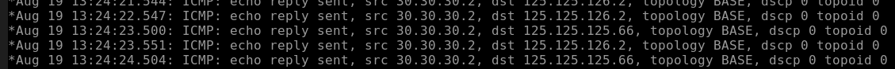