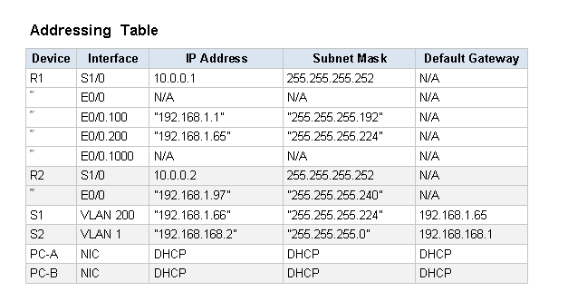
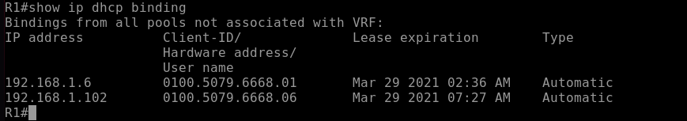
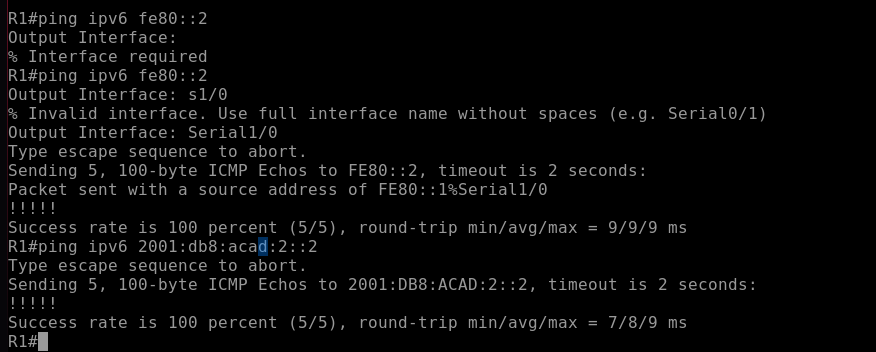
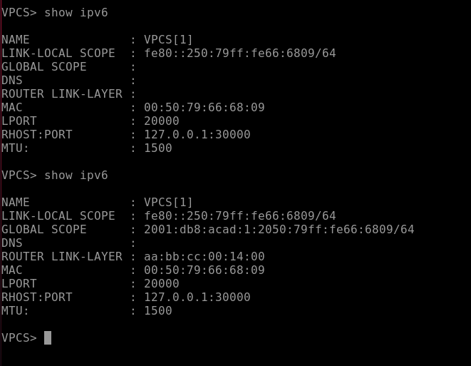
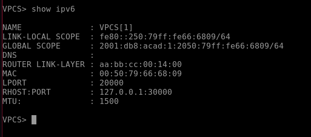
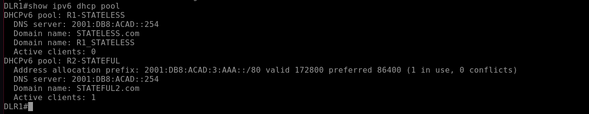

# Настроить DHCPv4


| VLAN	| Name	| Interface Assigned|
|-------|-------|-------------------|
| 1	|N/A	| S2: F0/18| 
| 100	|Clients	|S1: F0/6|
| 200	|Management|	S1: VLAN 200 |
| 999|	Parking_Lot|	S1: F0/1-4, F0/7-24, G0/1-2|
| 1000	|Native	|N/A|


### Задание

### 1 . Создание стенда, базовое конфигурирование оборудования.

#### Шаг 1. Создадим схему адресов и запишем их в таблицу
     Разделим подсеть 192.168.1.0/24 на 3 подсети.  
     +  Subnet A поддерживает 58 узлов  192.168.1.0/26
     +  Subnet B поддерживает 28 узлов  192.168.1.64/27
     +  Subnet C поддерживает 12 узлов  192.168.1.96/28

#### Шаг 2. Подключим сетево оборудование как показанно на схеме.



#### Шаг 3. Базовое конфигурирование маршрутизаторов.

Все файлы изменений приведены здесь.

#### Шаг 4. Настройка межвлановой маршрутизации на R1

 + Включение интерфейса E0/0  
 + Настройка сабынтерфейсов для каждого VLAN всоответствии с таблицей.


#### Шаг 5. Настройка E0/0 На R2, затем маршрутизацию на обоих роутерах
 + Настроим на R1 интерфейс s1/0 в соответствии таблицей адресов и добавим 
маршрут по умолчанию.
```  
    DLR1(config)# interface s1/0
    DLR1(config-if)#ip address 10.0.0.1 255.255.255.252
    DLR1(config-if)# Description "VLAN 1000 to R2"
    DLR1(config-if)# no shutdown
    DLR1(config-if)# exit
    DLR1(config)# ip route 0.0.0.0 0.0.0.0 10.0.0.2
```
Аналогичные настройки добавим на R2

#### Шаг 6. Настройка базовой конфигурации на каждом коммутаторе

#### Шаг 7. Создание VLANs на S1.
 + Создать и назначить требуемые VLANs на S1 
 + Настроить и включить SVI порт S1 и на S2
 + Назначить на неиспользуемых портах S1 VlAN и выключить их. На S2 Не используемые порты отлкючить  

```
    ALS1(config)# vlan 100  
    ALS1(config-if)# name CLIENTS  
    ALS1(config-if)# vlan 200  
    ALS1(config-if)# name MANAGEMENT  
    ALS1(config-if)# vlan 999   
    ALS1(config-if)# name PARKING_LOT  
    ALS1(config-if)# exit  
    ALS1(config)# ip routing  
    ALS1(config)# interface vlan 100  
    ALS1(config-if)# ip address 192.168.1.2 255.255.255.192  
    ALS1(config-if)# interface vlan 200  
    ALS1(config-if)# ip address 192.168.1.66  
    ALS1(config-if)# interface e0/1  
    ALS1(config-if)# switchport mode access  
    ALS1(config-if)# switchport access vlan 200  
    ALS1(config-if)# interface e0/2  
    ALS1(config-if)# switchport mode access  
    ALS1(config-if)# switchport access vlan 100  
    ALS1(config-if)# interface e0/3  
    ALS1(config-if)# switchport mode access  
    ALS1(config-if)# switchport access vlan 999  
```    
    
#### Шаг 8. 

Это стандартный VlAN на любом порту. Где все кадры идут без тэга.

#### Шаг 9. Вручную назначить на S1 интерфейс e0/0 настроить 802.1Q trunk

Нужно выбрать протокол инкапсляции вручную и так же  настроить native vlan


    ALS1(config-if)# interface e0/0
    ALS1(config-if)# switchport trunk encapsulation dot1q
    ALS1(config-if)# switchport mode trunk
    ALS1(config-if)# switchport trunk allowed vlan 100, 200, 1000
    ALS1(config-if)# switchport trunk native vlan 1000

### Часть 2 Конфигурирование и проверка 2 DHCPv4 серверов на R1

#### Шаг 1. Настроить R1 с DHCPv4 пулом для 2 поддерживаемых сабынтерфейсов.
+ Исключить первые 5 используемыъ адресов для кажлого пула адресов.
```
    DLR1(config)# ip dhcp excluded-address 192.168.1.1 192.168.1.5
    DLR1(config)# ip dhcp excluded-address 192.168.1.97 192.168.1.101
    DLR1(config)# ip dhcp excluded-address 192.168.1.65
    DLR1(config)# ip dhcp excluded-address 192.168.1.97
```

+ Создать DHCP пул
+ Установть сеть которую поддерживать DHCP сервер
+ Настроить доменное имя
+ Настроить шлюз пол умолчанию для каждого DHCP пула
+ Назначить время аренды 2 дня 12 часов 30 минут
```
    DLR1(config)# ip dhcp pool R2_Client_LAN
    DLR1(config-config)# network 192.168.1.0 255.255.255.192
    DLR1(config-config)# domain-name ccna-lab.com
    DLR1(config-config)# default-router 192.168.1.1
    DLR1(config-config)# lease 2 12 30
    DLR1(config-config)# ip dhcp pool R2_64
    DLR1(config-config)# network 192.168.1.64 255.255.255.254
    DLR1(config-config)# domain-name ccna2-lab.com
    DLR1(config-config)# default-router 192.168.1.65
    DLR1(config-config)# lease 2 12 30
    DLR1(config-config)# ip dhcp pool SABNET_C
    DLR1(config-config)# network 192.168.1.96 255.255.255.240
    DLR1(config-config)# domain-name ccna_C-lab.com
    DLR1(config-config)# default-router 192.168.1.97
    DLR1(config-config)# lease 2 12 30
```
#### Шаг 2. Проверить конфигурацию DHCP сервера следующими командами:
```show ip dhcp pool```   


```show ip dhcp bindings ```  
  Так как ни кто адрес не получил, привязок нету, то таблица пустая  


```show ip dhcp server statistics```


 

#### Шаг 3. Попробовать получить ip адрес от DHCP на PC-A
``` ipconfig /renew```  
```ipconfig ```

На VPCS: ```dhcp -r```


### Часть 3.  Настроить DHCP reley(трансляцию) на 

#### Шаг 1. Настройка R2 как агента трасляции DHCP для локльной сети на интерфейсе e0/0
+ Настроить r``` ip helper-address ``` 

```
    DLR2(config)# interface s1/0
    DLR2(config-if)#ip helper-address 10.0.0.1

```

#### Шаг 2. Попытаться запросить адрес IP адрес от DHCP для PC-B
+ Запросим IP адрес  


```show ip dhcp bindings ```  
```show ip dhcp server statistics```




# Настроить DHCPv6


Топология    


| Device|	Interface|	IPv6 Address|
|-------|----------------|------------------|
| R1    |	s1/0      |	2001:db8:acad:2::1 /64|
| R1    |	s1/0      | fe80::1|
| R1	|e0/0         |	2001:db8:acad:1::1/64|
| R1	|e0/0       	|fe80::1|
| R2	|G0/0/0         |	2001:db8:acad:2::2/64|
| R2	|G0/0/0	        |fe80::2|
| R2	|G0/0/1         |	2001:db8:acad:3::1 /64|
| R2	|G0/0/1         |	fe80::1|
| PC-A	|	NIC         |	DHCP|
| PC-B	|	NIC         |	DHCP|


#### Шаг 4. Настроить интерфейсы и маршруты на обоих роутерах
Часть 1
 
+ Настроить на роутере и коммутаторах базовые настройки
+ Настроить на интерфейсах роутеров в соответствии с таблицей
+ Проверить доступность



### Часть 2 Проверить назначение адреса с помощью службы SLAAC

После включения компьютера, были сформированны следующие адреса.

Пользователь в VLAN100



Where did the host-id portion of the address come from?

Был сгенирирован c помощью метода Extended Unique Identifier (EUI-64) или случайно сгенерированный

### Часть 3 Настройка и проверка службы DHCPv6 без сохранения состояния.
Создадим DHCPv6 pool на R1. И добавить информацию которую будет передавать DHCPv6  

```
R1(config)# ipv6 dhcp pool R1-STATELESS  
R1(config-dhcp)# dns-server 2001:db8:acad::254  
R1(config-dhcp)# domain-name STATELESS.com 
 
```


Настроим на e0/0 SLAAC DHCPv6 без сохронения. И добавим DHCP pool.

```
R1(config)# interface e0/0
R1(config-if)# ipv6 nd other-config-flag
R1(config-if)# ipv6 dhcp server R1-STATELESS

``` 

Данные от DHCP Сервера не удалось получить.  




### Часть Настройка сервера DHCPv6 с сохранением состояния на R1

Настроим pool DHCPv6 на R1 

```
    DLR1(config)# ipv6 dhcp pool R2-STATEFUL
    DLR1(config-dhcp)# address prefix 2001:db8:acad:3:aaa::/80
    DLR1(config-dhcp)# dns-server 2001:db8:acad::254
    DLR1(config-dhcp)# domain-name STATEFUL.com

```
Назначим созданный pool на интерфейс s1/0

```
    DLR2(config)# interface g0/0/0
    DLR2(config-if)# ipv6 dhcp server R2-STATEFUL

```
### Часть 5. Настройка и проверка ретрансляции DHCPv6 на R2

Шаг 1. Включите PC-B и проверьте адрес SLAAC, который он генерирует.
VPC8 получал ардес из сети 2001:db8:acad:3::/64

Шаг 2. Настройте R2 в качестве агента DHCP-ретрансляции для локальной сети на G0/0/1.

```
DLR2(config) # интерфейс e0/0
DLR2(config-if)# ipv6 nd managed-config-flag
DLR2(config-if)# ipv6 dhcp relay destination 2001:db8:acad:2::1 s1/0

```

Шаг 3. Попытка получить адрес IPv6 из DHCPv6 на PC-B.

Поставил вместо VPC L3 коммутатор.

Получили ip адрес из pool R2-STATEFUL





