# Маршрутизация на основе политик (PBR)

## Цель:
Настроить политику маршрутизации в офисе Чокурдах Распределить трафик между 2 линками

В этой самостоятельной работе мы ожидаем, что вы самостоятельно:

1. Настройте для офиса Лабытнанги маршрут по-умолчанию

2. Настроить политику маршрутизации в офисе Чокурдах Распределить трафик между 2 линками
    + Настроите политику маршрутизации для сетей офиса
    + Распределите трафик между двумя линками с провайдером
    + Настроите отслеживание линка через технологию IP SLA


## Решение


## Схема


### 1. Настройте для офиса Лабытнанги маршрут по-умолчанию
Настроил адресацию. DHCP
Остановился на NAT

Настроим DHCP и PAT on R27

```
     R27(config)# ip dhcp excluded-address 10.208.0.1 10.208.0.10
     R27(config)# ip dhcp pool Client
     R27(config-config)# network 10.208.0.0 255.255.255.0
     R27(config-config)# domain-name hello.com
     R27(config-config)# default-router 10.208.0.1
     R2(config)# ip nat inside source list 1 interface e0/0 overload
     R27(config)# access-list 1 permit 10.208.0.0 0.0.0.255
     R27(config)# interface e0/1.202
     R27(config-if)# ip nat inside
     R27(config-if)# exit
     R27(config)# interface int e0/0
     R27(config-if)# ip nat outside
```

Дефолтный маршрут настроили.

2.  Настроить политику маршрутизации в офисе Чокурдах 

### 2. Политика балансировака и распределение трафика в Чокурдах

1) Дефолтные маршруты в зависимости от доступности провайдера добавляются.

2) Распределение трафика


Распределить трафик между 2 линками:

VLAN 188 будет идти через шлюз провайдера R25(125.125.125.65/27)  
VLAN 201 будет идти через шлюз провайдера R26(125.125.126.1/27)  


##Основные маршурт в интернет

Договоримся с правайдером и настроим IP Service level Agreements(IP SLA) для проверки доступности ресурса с помомощью *ping*

```
R27(config)# ip sla 1
R27(config-ip-sla)# icmp-echo 125.125.125.65 source-ip 125.125.125.66
R27(config-ip-sla-echo)# frequency 10

R27(config)# ip sla 2
R27(config-ip-sla)# icmp-echo 125.125.126.1 source-ip 125.125.126.2
R27(config-ip-sla-echo)# frequency 10

R27(config)# ip sla schedule 1 life forever start-time now
R27(config)# ip sla schedule 2 life forever start-time now

```

Проверка работы ip sla

```
• show ip sla application
• show ip sla configuration
• show Ip sla statistics
• show ip sla responder
• debug ip sla trace <# SLA>
```

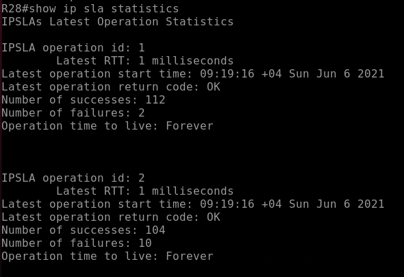

Для того чтобы использовать IP SLA тесты нужно настроить track
```
R27(config)# track 1 ip sla 1 reachability

R27(config)# track 2 ip sla 2 reachability
R27(config)# ip route 0.0.0.0 0.0.0.0 125.125.125.65 10 track 1
R27(config)# ip route 0.0.0.0 0.0.0.0 125.125.126.1 20 track 2
```
В настроках track добавим параметр dalay. В случае если после первого изменения track каждые 11 секунд. Данный параметр задржка перед изменением состояни track. 

```
R27(config)# track 1
R27(config-track)# delay down 11 up 11
```


*При настройке маршрутов по умолчанию сразными метриками при недоступности более приоритетного трафик не шел через альтернативный маршрут.* - пришлось через __track__


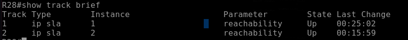

При недоступности R26 марршрут меняется на 

Настроим ip sla до необходимого нам ресурса 8.8.8.8

Для того, чтобы распределить нагрузку нам нужно чтобы 2 канала работали одновременно. настроим track отслеживающий состояние всей sla

```
R27(config)# track 100 list booleean and
R27(config-track)# object 1
R27(config-track)# object 2
R27(config-track)# object 10
R27(config-track)# object 11
R27(config-track)# delay down 11 up 11
```
Настроим Route map для направления влан через ISP1

access

```
R27(config)# route-map RM_VLAN188 permit 10
R27(config-route-map)# match ip address VLAN188
R27(config-route-map)# set ip next-hop verify-availabiliy 125.125.125.65 5 track 100
```
__Проверим работу track 100__

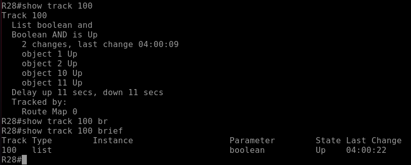

Выключим один интерфейс на  провайдере.

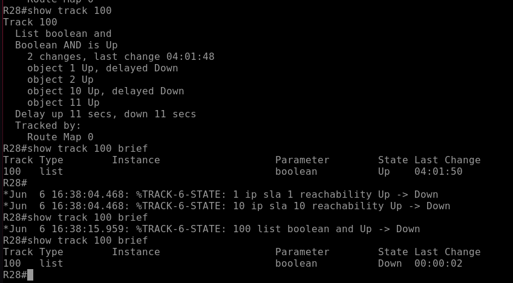

Настроим NAT и проверим 

```
R27(config)# ip access-list extended VLAN188
R27(config-ext-nacl)# permit tcp 10.192.0.0 0.0.0.255 host any

R27(config)# ip access-list extended VLAN201
R27(config-ext-nacl)# permit tcp 10.192.1.0 0.0.0.255 host any

R27(config)# route-map NAT_ISP2 permit
R27(config-route-map)# match ip address VLAN188 VLAN201
R27(config-route-map)# match interface e0/0

R27(config)# route-map NAT_ISP1 permit
R27(config-route-map)# match ip address VLAN188 VLAN201
R27(config-route-map)# match interface e0/1

R27(config)# ip nat inside source route-map NAT_ISP1 interface e0/1 overload
R27(config)# ip nat inside source route-map NAT_ISP2 interface e0/0 overload
```


_____________________________________________________

## Проверка работы 

1. Обаканала работают
2. Не работает ISP 1
3. Не работает ISP 2
4. Не работает ISP 1 и ISP2 потом восст
анавливаются


### 1. Обаканала работают

VLAN 188 (*Перестал работать DHCP) 

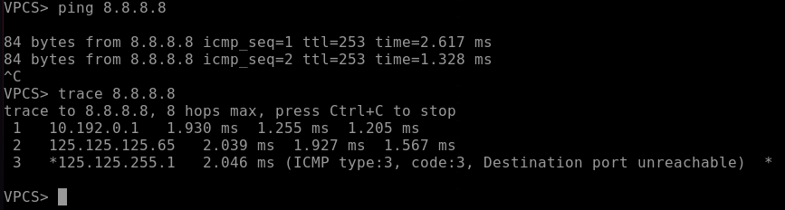 

VLAN 201

 


### 2. Не работает ISP 1

VLAN 188

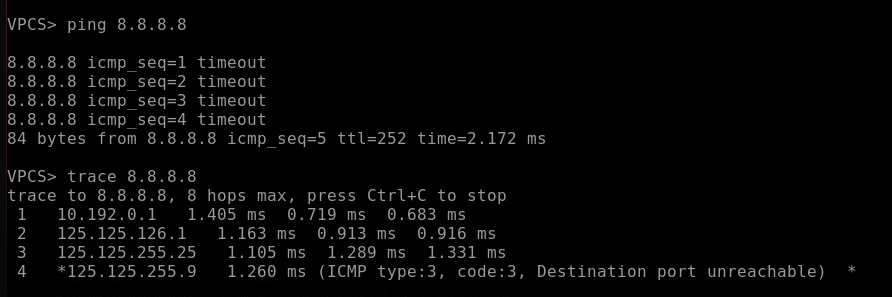 

VLAN 201

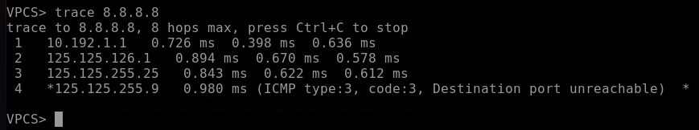

### 3. Не работает ISP 2

VLAN 188

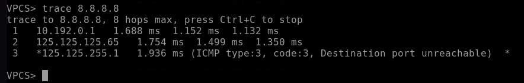 

VLAN 201

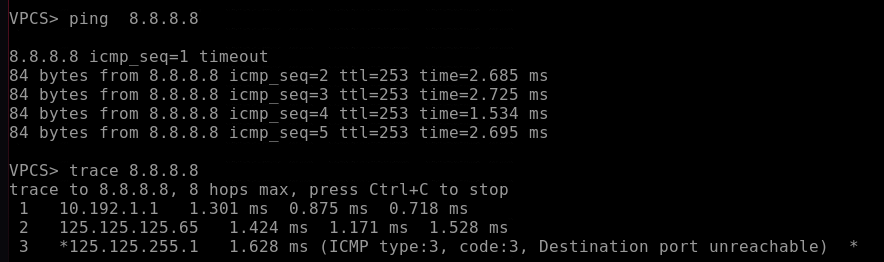

### 4. Не работает ISP 1 и ISP2 потом восстанавливаются

VLAN 188

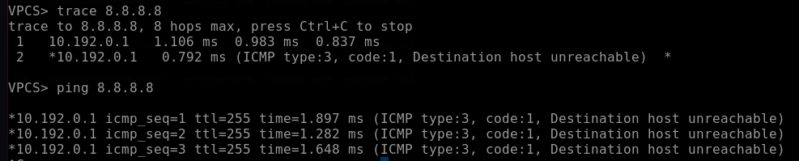 

VLAN 201

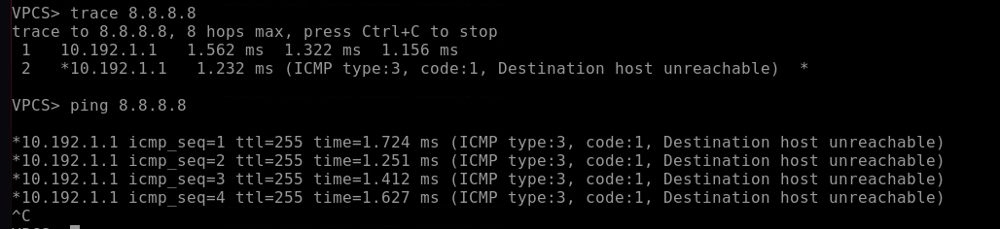

__Интерфейсы поднялись__


VLAN 188

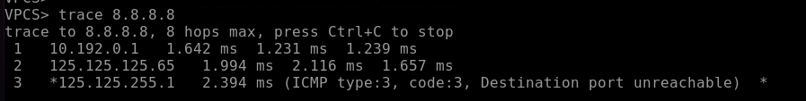 

VLAN 201

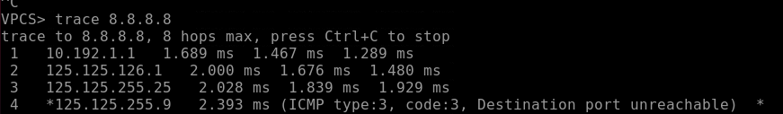
