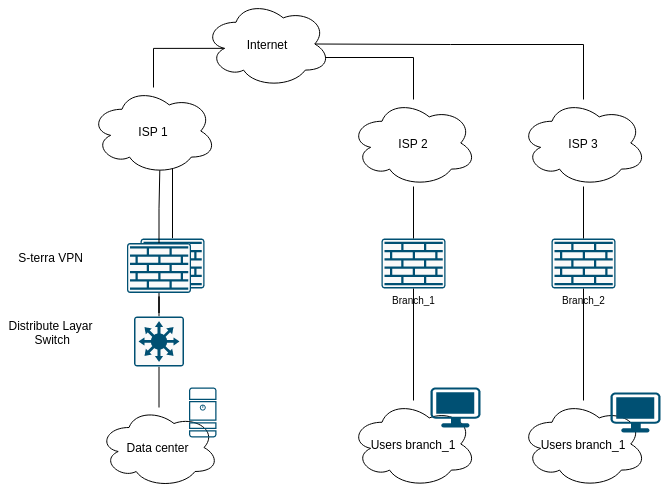
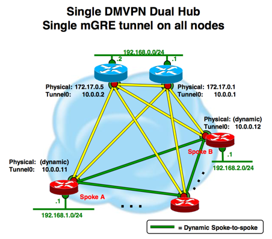
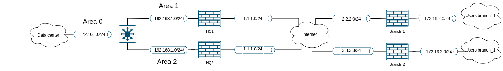
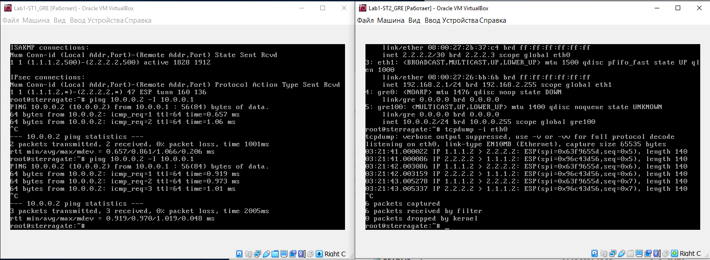
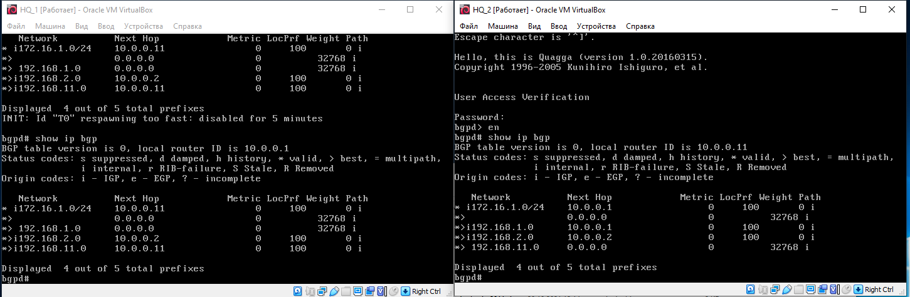

# Лабораторная работа. DMVPN на S-terra 4.2
__Задание.__  
Организовать масштабируемую защищенную сеть с возможностью динамического создания туннелей между узлами используя технологию DMVPN на S-Terra шлюз 4.2.  
Выбрана технология DMVPN по причине большого количества филиалов. 

__Описание.__  

В главном офисе для маршрутизации в локальной сети используют протокол OSPF. Для организации защищенной сети  выделено 2 белых статических ip адреса.  
В филиалах белые статические ip адерса, маршрутизация статическая.  
В роли интернета Ubuntu c 3 сетевыми адаптерами.



Для организации отказоустойчивости в центральном офисе используем топологию DualHub SingleCloud DMVPN.



__Решение.__ 
 
Нам необходимо выполнить следующие шаги:
1) Инициализация криптошлюза. 
2) Настройка IPSec в Cisco-like S-terra.
3) Создание туннеля Point-to-Multipoint туннелей на базе GRE.
4) Настройка NHRP, в пакете OpenNHRP.
5) Настройка iBGP, в пакете Quagga, с интерфейсов туннелей.
6) Настройка локальной сети HQ и проверка отказоусточивости.

Проблемы обнаруженные во время прохождения лабораторной работы:
1. Необходимо добавить opennhrp, quagga в автозагрузку


Cхема сети L2



## 1. Инициализация криптошлюза.

+ Настроить интерфейсы
+ Инициализировать биологический ДСЧ
+ Ввести лицензию
+ Сгенерировать ключевую пару и создать запрос на локальный сертификат.
+ Получить сертификат
+ Импортировать корневой, локальный сертификат

## 2. Настройка IPSec в Cisco-like s-terra.

Перейдем к настройке IPSec
```
crypto isakmp policy 1
 encr gost
 hash gost341112-256-tc26
 authentication gost-sig
 group vko2

crypto ipsec transform-set TSET esp-gost28147-4m-imit
```
Будем захватывать шифровать gre трафик

HQ_1
```
ip access-list extended LISTMGRE
 permit gre host 1.1.1.2 any 

crypto dynamic-map DMAP 1
 match address LISTMGRE
 set transform-set TSET
crypto map CMAP 10 ipsec-isakmp dynamic DMAP

interface FastEthernet0/0
 ip address 1.1.1.2 255.255.255.252
 crypto map CMAP
!
interface FastEthernet0/1
 ip address 192.168.1.1 255.255.255.0
!
interface Tunnel1
 ip address 10.0.0.1 255.255.255.0
 mtu 1400
```
Branch_1
```
ip access-list extended LISTMGRE
 permit gre host 2.2.2.2 any 

crypto dynamic-map DMAP 1
 match address LISTMGRE
 set transform-set TSET
crypto map CMAP 10 ipsec-isakmp dynamic DMAP

interface FastEthernet0/0
 ip address 2.2.2.2 255.255.255.252
 crypto map CMAP
!
interface FastEthernet0/1
 ip address 192.168.2.1 255.255.255.0
!
interface Tunnel1
 ip address 10.0.0.2 255.255.255.0
 mtu 1400
```

## 3. Создание туннеля Point-to-Multipoint туннелей на базе GRE.

Настройка mGRE туннеля на "HQ_1". 

```
auto gre100
iface gre100 inet static
address 10.0.0.1
netmask 255.255.255.0
pre-up ip tunnel add $IFACE mode gre ttl 64 tos inherit
pre-up ip link set $IFACE mtu 1400
post-down ip link del $IFACE

```
Скорее всего нужно будет добавить в настройки mGRE, в реальном стенде.
```
*
pre-up iptables -t mangle -A FORWARD -p tcp --tcp-flags SYN,RST SYN -j TCPMSS --set-mss 1360
*
```

Настройка mGRE туннеля на "Branch_1"

```
auto gre100
iface gre100 inet static
address 10.0.0.2
netmask 255.255.255.0
pre-up ip tunnel add $IFACE mode gre ttl 64 tos inherit
pre-up ip link set $IFACE mtu 1400
post-down ip link del $IFACE
```

DMVPN работает 




## 4. Настройка NHRP, в пакете OpenNHRP.

Настройка протокола NHRP на HQ_1. NHRP позволит составить динамическую таблицу реальных адресов и адресов туннелей.

```
interface gre100
 map 10.0.0.11/24 1.1.1.3
 cisco-authentication secret
 holding-time 600
 non-caching

interface eth0
 shortcut-destination
```

SPOKE

```
interface gre100
 map 10.0.0.1/24 1.1.1.2 register
 map 10.0.0.11/24 1.1.1.3 register
 holding-time 600
 cisco-authentication secret
 non-caching
```


## 5. Настройка iBGP, в пакете Quagga, с интерфейсов туннелей.

Для получения маршуртов внутренней сети организаций, подключенных к нашей защищенной сети, настроим iBGP. 

Предварительные настройки
Настроим конфигурацию Quagga

_сd /etc/quagga/daemons_
```
zebra=yes
bgpd=yes
Если в сети есть ospf
ospfd=yes
```
_vi /etc/quagga/zebra.conf_
```
hostname bgpd
password zebra
```
Вход в bgpd
```
telnet localhost bgpd
```

В s-terra версии 4.3 есть frr и можно поробовать указать диапазон соседей ibgp командой
``bgp listen range 10.0.0.0/24 peer-group DMVPN`` и не нужно будет на HQ добавлять новые филиалы в BGP конфигурацию

Стенд у нас на s-terra версии 4.2, а там нет данной команды, будем указывать соседей вручную.

HQ_1
```
router bgp 65000
 bgp router-id 10.0.0.1
 network 172.16.1.0 mask 255.255.255.0
 neighbor DMVPN peer-group
 neighbor DMVPN remote-as 65000
 neighbor DMVPN neighbor RRC update-source tunnel100
 neighbor 10.0.0.2 peer-group DMVPN
 distance bgp 100 100 100 
```
Branch_1
```
router bgp 65000
 bgp router-id 10.0.0.2
 network 192.168.2.0 mask 255.255.255.0
 neighbor 10.0.0.1 remoute-as 65000
 neighbor 10.0.0.1 update-source tunnel100
 neighbor 10.0.0.11 remoute-as 65000
 neighbor 10.0.0.11 update-source tunnel100
```
Маршруты по iBGP мы получили.


Связь Spoke-to-spoke пока тестировать не будем, из-за отсутствия дополнительной лицензии на S-terra шлюз.

## 6 Настройка локальной сети HQ и проверка отказоусточивости.

В ходе настройки выяснилось, что фильтрация в ospfd не работает.   
У нас iBGP и маршруты прилетающие от филиалов имеют AD 200. Для того, чтобы "RouterDistrubutionLayer" не пулял маршруты с филиалов с меньшей административной дистанцией(AD) на HQ_1 И HQ_2 нужно в настройки AS добавить:

```
distance bgp 100 100 100
```
Предположим, что HQ_1 производителнее, надежнее. Чтобы весь трафик из локльной сети HQ шёл через HQ_1. Изменим стоимость интерфейса в сторону "RouterDistrubutionLayer".

HQ_1

```
router ospf
 ospf router-id 0.0.0.1
 redistribution bgp metric 10
 network 192.168.1.0/24 area 0.0.0.1
```

Чтобы ограничить свободу пользователей можно анонсировать точечные сети или ограничивать доступ access-list.

Определим необходимое время для восстановления канала в рамках лабораторного стенда в VirtualBox.
 + После выхода из строя HQ_1 Канал переключался на HQ_2 через 40 секунд.
 + При перезагрузки Branch_1, сотрудники филиала получат доступ до HQ через 60 секунд

Конец.


